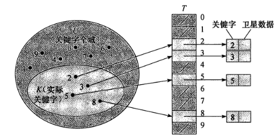
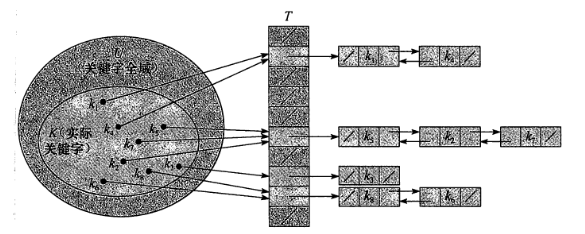

# 6. 哈希表

## 6.1 概述

**哈希表** (hash table) 亦称为 **散列表** 。

哈希表使用平均 $O(1)$ 的时间花费以查找元素。

哈希表是普通数组概念的推广。由于对普通数组可以直接寻址，使得能在 $O(1)$ 时间内访问数组中的任意位置。

## 6.2 直接寻址法

假设要存储一类具有如下特点的对象：

- 带有一个关键字属性。
- 不同的对象具有不同的关键字。

当关键字（可能存入的元素）的全域 $U$ 比较小时，可采用 **直接寻址法** 。

直接寻址法采用一个称为 **直接寻址表** (direct-address table) 的数组，记为 $T[0..m-1]$ ，其中每个位置，或称为 **槽** (slot) ，对应全域 $U$ 中的一个关键字。

可以在槽中存储地址，亦可直接存储对象。

如果全域 $U$ 较大，则不适合采用直接寻址法。这将浪费过大的存储空间。

## 6.3 哈希法

如果全域过大而存储量较小，则可以使用 **哈希函数** 控制存储位置。

这种折叠的方式能倍增内存利用率。

直接寻址法，具有关键字 $k$ 的元素被存放在槽 $k$ 中。而在哈希法中，该元素存放在槽 $h(k)$ 中。$h(x)$ 即一个哈希函数， $h(k)$ 为 $k$ 的 **哈希值** 。

哈希法采用一个称为 **哈希表** (hash table) 的数组，记为 $T[0..m-1]$ 。这里的 $m$ 一般比 $|U|$ 小得多。

哈希法存在 **冲突** (collision) ，即两个关键字可能映射到同一个槽内，即某两个关键字的哈希值相同。应按需求调整或完善哈希函数以解决冲突。

两种常用的冲突解决方案分别为 **链接法** 和 **开放寻址法**。

### 6.3.1 链接法

链接法在槽内存储一个链表，通过扩展槽的容积以避免冲突。

### 6.3.2 开放寻址法
