# 7. 树

## 7.1 概述

**树** (tree) 是一种以分支关系定义的层次结构。

树的结点用对象表示。一般地，树结点包含：

- 关键字或属性 key 。
- 指向其他结点的指针。

指定指向其他结点的指针数量可以转化为特定的数据结构。

- 为 1 时，将形成单链表。
- 为 2 时，将形成二叉树。

对于树形结构，有如下定义：

- **高度与深度 h** 用于衡量树的层数，不同的环境下有不同的顺序、初值定义。
- **度** 每个结点孩子的最大数量。
- **前驱** 给定结点在中序遍历的前一个结点。
- **后继** 给定结点在中序遍历的后一个结点。

通过定义树的构建方式，树将展现不同的特性。

### 7.1.2 二叉树

二叉树 (binary tree) 是一种树形结构，其具有如下属性：

- 度不大于 2 。
- 其子树具有左右之分。

对于二叉树的每个结点，包含如下属性：

- 关键字或属性 key 。
- 指向其他结点的指针。
  - 左孩子 left 。
  - 右孩子 right 。
  - 父结点 p 。

定义如下特殊形态的二叉树：

#### 满二叉树

一棵高度为 $k$ 且有 $2^k - 1$ 个结点的二叉树为 **满二叉树** 。



#### 完全二叉树

对树的结点进行特定规则的连续编号。  
对于某个深度为 $k$ ，包含 $n$ 个结点的二叉树，其结点编号与同样深度的满二叉树的前 $n$ 个结点一一对应，则其为 **完全二叉树** 。


## 7.2 赫夫曼树

赫夫曼树 (Huffman) ，又称最优树，是一类带权路径长度最短的树。

定义如下概念：

- **路径** 从树中一个结点到另一个结点之间的分支构成这两个结点之间的路径。
- **路径长度** 路径上的分支数目。
- **树的路径长度** 从树根到每个结点的路径长度之和。
- **结点的带权路径长度** 从根到某个结点的路径长度 与 结点的圈 的乘积。
- **树的带权路径长度** 所有叶子结点的带权路径长度之和。记作：

$$
WPL = \sum^n_{k=1} {w_k l_k}
$$

对于有 $n$ 个权值为 $\{w_1,w_2,\dots,w_n\}$ 的结点，构造的具有最小带权路径长度 $WPL$ 的二叉树为 **赫夫曼树** 。

### 7.2.1 赫夫曼算法

赫夫曼算法用于构建赫夫曼树。

1. 将所有结点分别构造一棵具有一个结点的树。
1. 选取两棵权值最小的树根结点分别作为左右结点（一般令小在左），并将其权值之和构建新的树根结点。
1. 重复上步骤，直到只有一棵树。

最后剩下的树即赫夫曼树。

## 7.3 二叉搜索树

二叉搜索树即二叉排序树，其结点定义如下：

- 属性
- 左孩子 left
- 右孩子 right

二叉搜索树上的基本操作所花费的时间与这棵树的高度成正比。对于一个有 $n$ 个结点的一棵完全二叉搜索树，这些操作的最坏运行时间为 $\Theta (\lg{n})$

二叉搜索树使用满足 **二叉搜索树性质** 的方式来存储：

设 $x$ 为二叉搜索树中的一个结点。如果 $y$ 是 $x$ 左子树中的一个结点，那么 $y.key < x.key$ ；如果 $y$ 是 $x$ 右子树中的一个结点，那么 $y.key \geqslant x.key$ 。

二叉搜索树定义了如下递归方式以完成遍历，它们以遍历子树根的相对顺序命名：

- **中序遍历** (inorder tree walk)  
  先完成左子树的遍历，再扫描子树根，最后完成右子树的遍历。
- **先序遍历** (preorder tree walk)  
  先扫描子树根，再完成左子树的遍历，最后完成右子树的遍历。
- **后序遍历** (postorder tree walk)  
  先完成左子树的遍历，再完成右子树的遍历，最后扫描子树根。

> 函数签名： `INORDER_TREE_WALK(x)`  
> 复杂度： $\Theta(n)$

```pascal {.line-numbers}
if x!=NULL
    INORDER_TREE_WALK(x.left)
    x.key
    INORDER_TREE_WALK(x.right)
```

### 7.3.1 查找二叉搜索树

#### 二叉搜索树查找包含指定值的结点

> 函数签名： `TREE_SEARCH(x,k)`  
> 复杂度： $O(h)$

```pascal {.line-numbers}
if x == NULL or k == x.key
  return x
if k < x.key
  return TREE_SEARCH(x.left,k)
else
  return TREE_SEARCH(x.right,k)
```

也可以使用 while 循环（迭代）代替递归。

> 函数签名： `ITERATIVE_TREE_SEARCH(x,k)`  
> 复杂度： $O(h)$

```pascal {.line-numbers}
while x != NULL or k != x.key
  if k < x.key
    x = x.left
  else
    x = x.right
return x
```

#### 二叉搜索树查找最大 / 最小值

二叉搜索树的性质保证了最左侧的结点为最小结点，最右侧的结点为最大结点。

> 函数签名： `TREE_MINIMUM(x)`  
> 复杂度： $O(h)$

```pascal {.line-numbers}
while x.left != NULL
  x = x.left
return x
```

> 函数签名： `TREE_MAXIMUM(x)`  
> 复杂度： $O(h)$

```pascal {.line-numbers}
while x.right != NULL
  x = x.right
return x
```

#### 二叉搜索树查找前驱 / 后继

对于某结点的后继若存在，则有如下两种情况：

- 若其右子树非空，则后继为右子树中的最左结点。
- 若其右子树为空，则后继为第一个大于其值的祖先。

前驱为后继的对称算法。

> 函数签名： `TREE_SUCCESSOR(x)`  
> 复杂度： $O(h)$

```pascal {.line-numbers}
if x.right != NULL
  return TREE_MINIMUM(x.right)
while x.p != NULL && x.p.key < x.key
  x = x.p
return x.p
```

也可以使用如下的不访问其值的算法。

> 函数签名： `TREE_SUCCESSOR(x)`  
> 复杂度： $O(h)$

```pascal {.line-numbers}
if x.right != NULL
  return TREE_MINIMUM(x.right)
y = x.p
while y != NULL && y.right == x
  x = y
  y = x.p
return y
```

> 函数签名： `TREE_PRESUCCESSOR(x)`  
> 复杂度： $O(h)$

```pascal {.line-numbers}
if x.left != NULL
  return TREE_MAXIMUM(x.left)
while x.p != NULL && x.p.key > x.key
  x = x.p
return x.p
```

### 7.3.2 修改二叉搜索树

插入与删除结点的方式对维护 **树的属性** 具有 **决定性** 的意义。

#### 二叉搜索树插入

> 函数签名： `TREE_INSERT(T,z)`  
> 复杂度： $O(h)$

```pascal {.line-numbers}
y = NULL
x = T.root
while x != NULL
  y = x
  if z.key < x.key
    x = x.left
  else
    x = x.right
z.p = y
if y == NULL
  T.root = z
elseif z.key < y.key
  y.left = z
else
  y.right = z
```

#### 二叉搜索树删除

相较于插入，二叉搜索树的删除稍显麻烦。

- 如果 $z$ 没有孩子结点，则删除 $z$ 。
- 如果 $z$ 具有一个孩子结点，则将孩子结点提升至删除位置。
- 如果 $z$ 具有两个孩子结点，则：
  - 将 $z$ 的后继（或前驱）结点提升至删除位置。
  - 原 $z$ 的左子树成为新结点的左子树。

  
  


首先定义移动子树函数，用于将一棵 **子树** 替换为另一棵 **子树** 。


> 函数签名： `TRANSPLANT(T,u,v)`  
> 复杂度： $O(h)$

```pascal {.line-numbers}
if T.root = u
  T.root = v
elseif u == u.p.left
  u.p.left = v
else
  u.p.right = v
if v != NULL
  v.p = u.p
```

> 函数签名： `TREE_DELETE(T,Z)`  
> 复杂度： $O(h)$

```pascal {.line-numbers}
if z.left == NULL
  TRANSPLANT(T,z,z.right)
elseif z.right == NULL
  TRANSPLANT(T,z,z.left)
else
  y = TREE_MINIMUM(z.right)
  if y.p != z
    TRANSPLANT(T,y,y.right)
    y.right = z.right
    y.right.p = y
  TRANSPLANT(T,z,y)
  y.left = z.left
  y.left.p = y
```

## 7.4 平衡二叉树

**平衡二叉树** (balanced binary tree) 又称为 AVL 树。

其具有以下性质：

- 其左子树和右子树都是平衡二叉树。
- 其左子树与右子树的深度之差的绝对值不大于 1 。

树的每个结点包含如下属性：

- bf 平衡属性 (balance factor)  
  其值为左子树与右子树的深度之差。
- key
- left
- right
- p

插入时有如下四种情况可能破坏子树平衡性，并对应四种解决方案：

  
  
  


[平衡二叉树 全实现（递归）](../AlgoExtracts/AlgoExtracts.sln)

## 7.5 红黑树

红黑树一种二叉搜索树，其在每个结点上增加了 1 个存储位表示结点的颜色。

通过确保没有一条路径会比其他路径长出 2 倍，因此是近似 **平衡的** 。

树中每个结点包含如下属性：

- color
- key
- left
- right
- p

定义没有子结点的结点的 **左右孩子** 为叶子结点。定义 `null` 为指向叶子结点或外部结点的指针。定义从某个结点 $x$ 出发（不包含自身）到达一个叶子结点的任意一条简单路径上的黑色结点个数称为该结点的 **黑高** (black-height) 。

一棵红黑树满足如下 **红黑性质** ：

- 每个结点是 **红** 或 **黑** 色的。
- 根结点是黑色的。
- 每个叶子结点是黑色的。
- 如果一个结点是红色的，则它的两个子结点都是黑色的。
- 对于每个结点，从该结点到其所有后代的叶子结点的简单路径上，均包含相同数目的黑色结点。

为维护红黑性质，需在修改操作的同时修改颜色与指针结构。

指针结构的修改通过 **旋转** (ratation) 完成。


> 函数签名： `LEFT_ROTATE(T,x)`

```pascal {.line-numbers}
y = x.right
x.right = y.left
if y.left != NULL
  y.left.p = x
y.p = x.p
if x.p == NULL
  T.root = y
elseif x == x.p.left
  x.p.left = y
else
  x.p.right = y
y.left = x
x.p = y
```


### 7.5.1 修改红黑树

#### 红黑树插入

> 函数签名： `RB_INSERT(T,z)`

```pascal {.line-numbers}
y = NULL
x = T.root
while x != NULL
  y = x
  if z.key < x.key
  x = x.left
  else
    x = x.right
z.p = y
if y == NULL
  T.root = z
elseif z.key < y.key
  y.left = z
z.left = NULL
z.right = NULL
z.color = RED
RB_INSERT_FIXUP(T,z)
```

> 函数签名： `RB_INSERT_FIXUP(T,z)`

```pascal {.line-numbers}
while z.p.color == RED
  if z.p == z.p.p.left
    y = z.p.p.right
    if y.color == RED
      z.p.color = BLACK
      y.color = BLACK
      z.p.p.color = RED
      z = z.p.p
    elseif z == z.p.right
      z = z.p
      LEFT_ROTATE(T,z)
    z.p.color = BLACK
    z.p.p.color = RED
    RIGHT_ROTATE(T,z.p.p)
  else
    (与另一分支相对称)
T.root.color = BLACK
```


