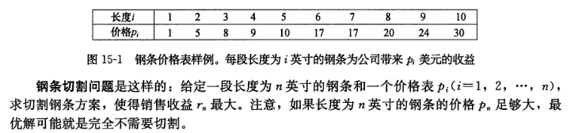

# 14. 动态规划

## 14.1 概述

**动态规划** (dynamic programming) 通过组合子问题的解来求解原问题，与分治法相似。

分治法步骤为：

- 分解
- 解决
- 合并

与之相反，动态规划应用于子问题重叠的情况，即不同的子问题具有公共的子子问题。分治法面对这些问题将浪费时间在相同的子子问题上，而动态规划只解一次，并将其保存。

动态规划方法通常用来求解 **最优化问题** (optimization problem)。这类问题一般具有如下属性：

- 可以有很多可行解，每个解都有一个值。
- 期待寻找一个具有最优值（最大值或最小值）的解，即 **一个最优解** （an optimal solution）。（可能有多个解都达到最优值）。

动态规划的步骤为：

- 刻画一个最优解的结构特征。
- 递归地定义最优解的值。
- 计算最优解的值，通常采用自底向上的方法。
- 利用计算出的信息构造一个最优解。

## 14.2 动态规划原理

适合应用动态规划方法求解的最优化问题应该具备两个要素：

- 最优子结构
- 子问题重叠

### 14.2.1 最优子结构

用动态规划方法求解最优化问题的第一步就是刻画最优解的结构。

如前文所述，如果一个问题的最优解包含其子问题的最优解，我们就称此问题具有 **最优子结构性质** 。

具有此性质的问题极可能适合采用动态规划方法。

寻找最优子结构性质遵循了如下的通用模式：

- 证明问题最优解的第一个组成部分是做出一个选择。
  > 例如，选择钢条第一次切割位置，选择矩阵链的划分位置等。做出这次选择会产生一个或多个待解的子问题。
- 对于一个给定问题，在其可能的第一步选择中，你假定已经知道哪种选择才会得到最优解。  
  你现在并不关心这种选择具体是如何得到的，只是假定已经知道了这种选择。
- 给定可获得最优解的选择后，你确定这次选择会产生哪些子问题，以及如何最好地刻画子问题空间。
- 利用「剪切 粘贴」(cut-and-paste) 技术证明：作为构成原问题最优解的组成部分，每个子问题的解就是它本身的最优解。

  > 证明这一点是利用反证法：
  >
  > - 假定子问题的解不是其自身的最优解，那么我们就可以从原问题的解中「剪切」掉这些非最优解，将最优解「粘贴」进去，从而得到原问题一个更优的解，这与最初的解是原问题最优解的前提假设矛盾。

  如果原问题的最优解包含多个子问题，通常它们都很相似，我们可以将针对一个子问题的「剪切 粘贴」论证方法稍加修改，用于其他子问题。

### 14.2.2 子问题重叠

## 14.3 算法

### 14.3.1 钢条切割问题

钢条切割问题意在展示动态规划的基本方法。

假设存在以下问题：



此问题存在一般递归解法：

> 函数签名： `CUT_ROD(p,n)`  
> 复杂度： $\Theta(2^n)$

```pascal {.line-numbers}
if n == 0
    return 0
q = INT_MIN
for i = 1 to n
    q = max( q , p[i] + CUT_ROD( p , n - i ))
return q
```

#### 14.3.1.1 带备忘的自顶向下法

**带备忘的自顶向下法** (top-down with memoization) 按自然的递归形式编写过程，但过程会保存每个子问题的解（通过数组或哈希表）。

当需要一个子问题的解时，将首先检查是否保存过此解。

此递归过程即具有 **带备忘的** (memoized) 属性。

> 函数签名： `MEMOIZED_CUT_ROD(p,n)`

```pascal {.line-numbers}
let r[n+1]
for i = 0 to n
    r[i] = -INT_MAX
return MEMOIZED_CUT_ROD_AUX(p,n,r)
```

> 函数签名： `MEMOIZED_CUT_ROD_AUX(p,n,r)`

```pascal {.line-numbers}
if r[n] >= 0
    return r[n]
if n == 0
    q = 0
else q = INT_MIN
    for i = 1 to n
        q = max( q , p[i] + MEMOIZED_CUT_ROD_AUX(p,n - 1,r))
r[n] = q
return q
```

#### 14.3.1.2 自底向上法

**自底向上法** (bottom-up method) 一般需要恰当定义子问题「规模」的概念，使任何子问题的求解都只依赖于 **更小的** 子问题的求解。

将子问题按规模排序，按由小到大的顺序进行求解。

> 函数签名： `BOTTOM_UP_CUT_ROD(p,n)`

```pascal {.line-numbers}
let r[n+1]
r[0] = 0
for j = 1 to n
    q = INT_MIN
    for i = 1 to j
        q = max( q , p[i] + r[j - i])
    r[j] = q
return r[n]
```

### 14.3.2 矩阵链乘法问题

**完全括号化** (fully parenthesized) 指具有如下性质的矩阵：

- 是单一矩阵。
- 或是两个完全括号华的矩阵乘积链的积，且已外加括号。

例如，作为矩阵链 $<A_1,A_2,A_3,A_4>$ ，共有如下 5 种完全括号化的矩阵乘积链：

$(A_1(A_2(A_3A_4)))$  
$(A_1((A_2A_3)A_4))$  
$((A_1A_2)(A_3A_4))$  
$((A_1(A_2A_3))A_4)$  
$(((A_1A_2)A_3)A_4)$

**矩阵链乘法问题** (matrix-chain multiplication problem) 可描述如下：给定 $n$ 个矩阵的链，$<A_1,A_2,\dots,A_n>$ ，矩阵 $A_i$ 的规模为 $p_{i-1} \times p_i (1 \leqslant i \leqslant n)$ ，求完全括号化方案，使得计算乘积 $A_1,A_2,\dots,A_n$ 所需标量乘法次数最少。

#### 括号化方案的数量

对于一个 $n$ 个矩阵的链，令 $P(n)$ 表示可供选择的括号化方案的数量。可得到如下递归式：

$$
P(n) =
\begin{cases}
1,&\text{if $n = 1$}\\
\sum \limits_{k=1}^{n-1}{P(k)P(n-k)},&\text{if $n \geqslant 2$}\\
\end{cases}
$$

#### 最优括号化方案的求解

定义 $m[i,j]$ 表示计算矩阵 $A_{i..j}$ 所需标量乘法次数的最小值。

设 $A_{i..j}$ 的最优括号化方案的分割点在矩阵 $A_k$ 和 $A_{k+1}$ 之间，其中 $i\leqslant k<j$ 。

且由于矩阵 $A_i$ 的规模为 $p_{i-1} \times p_i (1 \leqslant i \leqslant n)$ ，易知 $A_{i..k} \times A_{k+1..j}$ 的代价为 $p_{i-1}p_k p_j$ 次标量乘法运算。

综上有：

$$
m[i,j] = m[i,k] + m[k+1,j] + p_{i-1}p_k p_j
$$

实际上 $k$ 未知，则有：

$$
m[i,j] =
\begin{cases}
0   & \text{if $i=j$} \\
\min\limits_{i\leqslant k<j}\{m[i,k] + m[k+1,j] + p_{i-1}p_k p_j\}  & \text{if $i<j$} \\
\end{cases}
$$

> 函数签名： `MATRIX_CHAIN_ORDER(p)`

```pascal {.line-numbers}
n = p.length - 1
let m[n+1][n+1],s[n][n+1]
for i = 1 to n
    m[i][i] = 0
for l = 2 to n              \\ l is the chain length
    for i = 1 to n - l + 1
        j = i + l - 1
        m[i][j] = INT_MAX
        for k = i to j - 1
            q = m[i][k] + m[k+1][j] + p[i-1]p[k]p[j]
            if q < m[i][j]
                m[i][j] = q
                s[i][j] = k
return m,s
```

其中得出了最少标量乘法运算次数表 $m$ 与最优解构造表 $s$ 。
