# 1. 概述

## 1.1 什么是编译

编译的本质是翻译的过程，即分析源语言，根据句子的语义翻译为目标语言，而目标语言与源语言在逻辑上是 **等价的** 。

> 
>
> - 预处理器 (Preprocessor)
>   - 把存储在不同文件中的源程序聚合在一起。
>   - 把被称为宏的缩写语句转换为原始语句。
> - 可重定位 (Relocatable) 指在内存中存放的起始位置 L 是不固定的（相对地址）。

大部分高级语言采用先编译后执行的方式，而有的高级语言则采用「解释」执行的方式。  
实际上，许多编译程序的构造与实现技术同样适用于解释程序。

根据不同的用途和侧重，编译程序还可进一步分类：

- 诊断编译器（Diagnostic Compiler)  
  专门帮助程序开发和调试。
- 优化编译器 (Optimizing Compiler)  
  着重于提高目标代码效率。
- 一遍编译器
- 多遍编译器
- 装入并执行编译器

现在很多编译程序同时提供了调试、优化等多种功能。

> 解释器是另一种常见的语言处理器。从用户角度看，解释器直接利用用户提供的输入执行源程序中指定的操作。  
> Java 结合了编译和解释的过程。首先将 Java 源程序编译为字节码，然后藉由虚拟机进行解释执行。

## 1.2 编译过程

> 

可类比于自然语言的翻译，编程语言的编译分为以下过程：

- 词法分析  
  识别出句子的每个单词。
- 语法分析  
  分析句子的语法结构。
- 语义分析  
  分析句子的正确性。
- 中间代码产生  
  根据句子的含义进行初步翻译。
- 优化  
  对译文进行修饰。
- 目标代码生成  
  生成最终的译文。

除此之外，在自然语言中，还会出现作为对话共识的专有名词，或是二义性引发的误会。因此还需要以下过程：

- 符号表管理  
  管理标识符。标识符即用来指代其他事物的专有名词。
- 错误处理器

### 1.2.1 各分析阶段

#### 1.2.1.1 词法分析

**词法分析** (Lexical analysis) 阶段读入源程序中的字符流，并将这些字符组织成为有意义的词素 (Lexeme) 的序列。

词法分析器产生如下形式的词法单元 (token) 作为输出：`<token-name , attribute-value>`

`token-name` 代表种别码 `attribute-value` 代表属性值

| 单词类型   | 种别                                 | 种别码        |
| ---------- | ------------------------------------ | ------------- |
| 关键字     | `program` `if` `else` `then` $\dots$ | 一词一码      |
| 标识符     | 变量名 函数名 类名 $\dots$           | 多词一码      |
| 常量       | 整型 浮点型 字符型 布尔型 $\dots$    | 一型一码      |
| 算术运算符 | `+` `-` `*` `/` `++` `--` $\dots$    | 一词一码      |
| 关系运算符 | `><` `==` `!=` `>=` `<=` $\dots$     | 一词一码      |
| 逻辑运算符 | `&` `|` `~` $\dots$                  | 一词一码      |
| 界限符     | `;` `(` `)` `=` `{` `}` $\dots$      | 一词一码      |

#### 1.2.1.2 语法分析

**语法分析** (Syntax analysis) 阶段使用由此法分析器生成的各个词法单元的第一个分量来创建树形的中间表示。  
该中间表示给出了词法分析产生的词法单元流的语法结构。一般表示为 **语法树** (Syntax tree)。

#### 1.2.1.3 语义分析

**语义分析** (Semantic analysis) 阶段借助语法树和符号表来检查源程序是否和语言定义的语义一致。  
同时收集类型信息，并把这些信息存放在语法树或符号表中，以便在随后的中间代码生成过程中使用。  
语义分析的一个重要部分是 **类型检查** (type checking)。编译器检查每个运算符是否具有匹配的运算分量。

语义分析的主要任务：  

- 收集标识符的属性信息
  - 种属 (kind)
    - 简单变量、复合变量、函数……
  - 类型 (type)
    - 整型、布尔型、字符型……
  - 存储位置、长度
  - 值
  - 作用域
  - 参数和返回信息
- 语义检查
  - 变量或过程 **未经声明就使用**。
  - 变量或过程名 **重复声明**。
  - **运算分量** 类型不匹配。
  - **操作符** 与 **操作数** 之间的类型不匹配。
    - **数组下标** 不是整数。
    - 对 **非数组变量** 使用数组访问操作符。
    - 对 **非过程名** 使用过程调用操作符。
    - 过程调用的 **参数类型或数目** 不匹配。
    - 函数 **返回类型** 有误。

### 1.2.2 中间代码生成

在把一个源程序翻译成目标代码的过程中，一个编译器可能构造出一个或多个中间表示。  
这些中间表示可以有多种形式。**语法树** 和 **三地址码** 是常用的中间表示形式，它们通常在语法分析和语义分析中使用。

在源程序的语法分析和语义分析完成之后，很多编译器生成一个明确的低级的或类机器语言的中间表示。我们可以把这个表示看作是某个抽象机器的程序。该中间表示应该具有两个重要的性质：

- 易于生成
- 能够被轻松地翻译为目标机器上的语言

### 1.2.3 代码优化

**代码优化** 阶段试图改进中间代码，以便生成更好的目标代码。「更好」通常意味着更快，但是也可能会有其他目标，如更短的或能耗更低的目标代码。

### 1.2.4 代码生成

**代码生成** 阶段以源程序的中间表示形式作为输入，并把它映射到目标语言。

如果目标语言是机器代码，那么就必须为程序使用的每个变量选择寄存器或内存位置。然后，中间指令被翻译成为能够完成相同任务的机器指令序列。  
代码生成的一个至关重要的方面是合理分配寄存器以存放变量的值。

### 1.2.5 符号表管理

编译器的一个基本功能是记录源程序中使用的标识符并收集与每个标识符相关的各种属性信息。

标识符的属性信息长主要包含：

- 标识符的存储位置
- 类型
- 作用域

如果标识符是过程名时，它的属性信息还包括：

- 参数的个数与类型
- 每个参数的传递方法（传参？传值？）
- 返问值的类型

符号表是一个数据结构。每个标识符在符号表中都有一条记录，记录的每个域对应该标识符的属性。  
这种数据结构允许我们快速地找到每个标识符的记录，并在该记永中快速地存储和检索信息。

通常标识符的属性信息将由词法分析后的各阶段陆续写入符号表。

### 1.2.6 错误检测与报告

发现错误即停止运行的编译器不是一个好的编译器。

语法分析和语义分析阶段通常能够处理编译器所能检测到的大部分错误。

- 词法分析阶段能够检测出输入中不能形成源语言任何记号的错误字符串。
- 语法分析阶段可以确定记号流中违反源语言语法规则的错误。
- 语义分析阶段试图检测出具有正确的语法结构但对操作无意义的部分。

### 1.2.7 遍

上述编译过程仅仅是逻辑功能上的一种划分。具体实现时，受不同源语言，设计要求，使用对象和计算机条件（如主存容量）的限制，往往将编译程序组织为若干 **遍**。

**遍** (pass) 指对源程序或源程序的中间结果从头到尾扫描一次，并经过有关的加工处理，生成新的中间结果或目标程序。

#### 遍是实际应用中的粒度单位

一遍既可以只包含一个阶段（优化），也可以包含多个阶段（语法分析、语义分析），还可以将一个阶段分成多个遍。

当一遍中包含若干阶段时，各阶段的工作是穿插进行的。  
例如，我们可以把词法分析，语法分析及语义分析与中间代码产生这三阶段安排成一遍。这时，语法分析器处于核心位置，当它在识别语法结构而需要下一单词符号时，它就调用词法分析器，一旦识别出一个语法单位，它就调用中间代码产生器，完成相应的语义分析并产生相应的中间代码。

#### 遍的划分是因地制宜的

一个编译程序究竟应分成几遍，如何划分，是与源语言、设计要求，硬件设备等诸因素有关的，因此难于统一划定。  
多遍数可能会使整个编译程序的逻辑结构更加清晰一点，但势必增加输入输出所消耗的时间。  
因此，在主存可能的前提下，一般优先采取少遍数的方法。

应当注意的是，并不是每种语言都可以用单遍编译程序实现。

### 1.2.8 编译前端与后端

概念上，我们有时把编译程序划分为编译前端和编译后端。

#### 1.2.8.1 编译前端

前端主要由与源语言有关但与目标机无关的那些部分组成：

- 词法分析
- 语法分析
- 语义分析
- 中间代码产生

有的代码优化工作也可包括在前端。

#### 1.2.8.2 编译后端

后端包括编译程序中与目标机有关的那些部分：

- 代码优化
- 目标代码生成

通常，后端不依赖于源语言而仅仅依赖于中间语言。

可以取编译程序的前端，改写其后端以生成不同目标机上的相同语言的编译程序。

- 如果后端的设计是经过精心考虑的，那么后端的改写将用不了太大工作量，这样就可实现编译程序的目标机改变。

也可以设想将几种源语言编译成相同的中间语言，然后为不同的前端配上相同的后端，这样就可为同一台机器生成不同语言的编译程序。

- 然而，由于不同语言存在某些微妙的区别，因此在这方面所取得的成果还非常有限。

> 为了实现编译程序可改变目标机，通常需要有一种定义良好的中间语言支持。  
> 例如，在著名的 Ada 程序设计环境 APSE 中，使用的是一种称为 Diara 的树形结构的中间语言。
>
> - 一个 Ada 源程序通过前端编译转换为 Diana 中间代码。
> - 再由编译后端把 Diana 中间代码转换为目标代码。
> - 编译前端与不同的编译后端以 Diana 为界面，实现编译程序的目标机改变。
