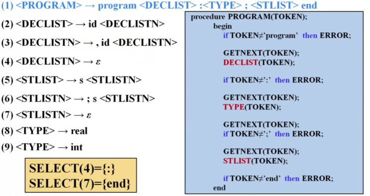
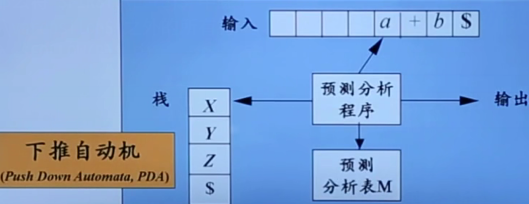

# 4. 语法分析

## 4.1 语法分析简述

### 4.1.1 语法分析器的作用

语法分析器从词法分析器获得一个由词法单元组成的串，并验证这个串可以由源语言的文法生成。

语法分析器能够以易于理解的方式报告语法错误，并且能够从常见的错误中恢复并继续处理程序的其余部分。

从概念上讲，对于良构的程序，语法分析器构造出一棵语法分析树，并把它传递给编译器的其他部分进一步处理。  
但实际上，并不需要显式地构造出这棵语法分析树，因为正如我们将看到的，对源程序的检查和翻译动作可以和语法分析过程交错完成。因此，语法分析器和前端的其他部分可以用一个模块来实现。

处理文法的语法分析器大体上可以分为三种类型：

- 通用的
- 自顶向下的（常用的）
- 自底向上的（常用的）

### 4.1.2 语法错误的处理

一般使用如下两种策略进行错误处理：

- 恐慌模式
- 短语层次恢复

程序可能存在不同层次的错误：

- 词法错误
  > 标识符、关键字或运算符拼写错误。  
  >  没有在字符串文本上正确地加上引号。
- 语法错误
  > 错误的分号位置、括号的多余或缺失。  
  >  一个 `case` 语句的外围没有相应的 `switch` 语句（然而，语法分析器通常允许这种情况出现，当编译器在之后要生成代码时才会发现这个错误）。
- 语义错误
  > 运算符和运算分量之间的类型不匹配。
- 逻辑错误
  > 可以是因程序员的错误推理而引起的任何错误。  
  >  如应该使用比较运算符 `==` 的地方使用了赋值运算符 `=` 。（这样的程序可能是良构的，但是却没有正确反映出程序员的意图）。

实现语法分析器中的错误处理程序应考虑到如下需求：

- 清晰精确地报告出现的错误。
- 能很快地从各个错误中恢复，以继续检测后面的错误。
- 尽可能少地增加处理正确程序时的开销。

### 4.1.3 错误恢复策略

- **恐慌模式的恢复**
  - 语法分析器一旦发现错误就不断丢弃输入中的符号，一次丢弃一个符号，直到找到 **同步词法单元** (synchronizing token) 集合中的某个元素为止。
  - 同步词法单元通常是界限符，比如 `;` 或者 `}` ,它们在源程序中的作用是清晰、无二义的。
  - 编译器的设计者必须为源语言选择适当的同步词法单元。
  - 恐慌模式的错误纠正方法常常会跳过大量输入，不检查被跳过部分的其他错误。
  - 实现简单，且能够保证不会进入无限循环。
- **短语层次的恢复**
  - 当发现一个错误时，语法分析器可以在余下的输入上进行局部性纠正。即其可能将余下输入的某个前缀替换为另一个串，使语法分析器可以继续分析。
  - 常用的局部纠正方法包括将一个逗号替换为分号、删除一个多余的分号或者插入一个遗漏的分号。
  - 如何选择局部纠正方法是由编译器设计者决定的。
  - 必须小心选择替换方法，以避免进入无限循环。
  - 短语层次替换方法已经在多个错误修复型编译器中使用，它可以纠正任何输入串。它主要的不足在于它难以处理实际错误发生在被检测位置之前的情况。
- **错误产生式**
  - 通过预测可能遇到的常见错误，我们可以在当前语言的文法中加入特殊的产生式。
  - 产生式能够产生含有错误的构造，从而基于增加了错误产生式的文法构造得到一个语法分析器。
  - 如果语法分析过程中使用了某个错误产生式，语法分析器就检测到了一个预期的错误。语法分析器能够据此生成适当的错误诊断信息，指出在输入中识别出的错误构造。
- **全局纠正**
  - 在理想情况下，我们希望编译器在处理一个错误输入串时通过最少的改动将其转化为语法正确的串。
  - 有些算法可以选择一个最小的改动序列，得到开销最低的全局性纠正方法。
  - 给定一个不正确的输入 $x$ 和文法 $G$ ，这些算法将找出一个相关串 $y$ 的语法分析树，使得将 $x$ 转换为 $y$ 所需要的插入、删除和改变的词法单元的数量最少。
  - 由于从时间和空间的角度上，实现这些方法一般来说开销太大，因此这些技术当前仅具有理论价值。

请注意，一个最接近正确的程序可能并不是程序员想要的程序。不管怎样，最低开销纠正的概念仍然提供了一个可用于评价错误恢复技术的指标，并已经用于为短语层次的恢复寻找最佳替换串。

## 4.2 自顶向下分析

### 4.2.1 自顶向下分析概念

**自顶向下的分析** (Top-Down Parsing) ：

- 从分析树的顶部（根节点）向底部（叶节点）方向构造分析树。
- 可以看成是从文法开始符号 $S$ 推导出词串 $w$ 的过程。
- 自顶向下语法分析采用 **最左推导** 方式。

> 文法：
>
> $$
> \begin{align*}
> & E \rightarrow E + E \\
> & E \rightarrow E * E \\
> & E \rightarrow ( E ) \\
> & E \rightarrow id    \\
> \end{align*}
> $$
>
> 输入：
>
> $$
> id + ( id + id )
> $$
>
> 分析树：
>
> 
>
> 推导过程：
>
> $$
> \begin{align*}
> E & \Rightarrow E + E \\
>   & \Rightarrow E + ( E ) \\
>   & \Rightarrow E + ( E + E ) \\
>   & \Rightarrow E + ( id + E ) \\
>   & \Rightarrow E + ( id + id ) \\
>   & \Rightarrow id + ( id + id ) \\
> \end{align*}
> $$

### 4.2.2 自顶向下分析方法

在自顶向下的分析中，每次单步分析需考虑两个问题：

- 替换当前句型中的哪个 **非终结符** 。
- 用该非终结符的哪个 **候选式** 进行替换。

因此分析树存在两种推导方式：

- **最左推导**
  - 优先选择最左非终结符。
  - 同路径的归约方式为 **最右归约**。
  - 如果 $S {{\Rightarrow}^{*}}_{lm} \alpha$ ，则称 $\alpha$ 是当前文法的 **最左句型** (left-sentential form) 。
  - 在自顶向下的分析中，一般采用 **最左推导** 的方式。
- **最右推导**
  - 优先选择最右非终结符。
  - 同路径的归约方式为 **最左归约**。
  - 在自底向上的分析中，一般采用 **最左归约** 的方式，因此把 **最左归约** 称为 **规范归约**，**最右推导** 称为 **规范推导**。

最左推导与最右推导具有唯一性。

### 4.2.3 递归向下分析

**递归向下分析** (Recursive-Descent Parsing) 是自顶向下分析的通用形式。

- 由一组 **过程** 组成，每个过程对应一个 **非终结符**。
- 从文法开始符号 $S$ 对应的过程开始，递归调用文法中其它非终结符对应的过程。
- 如果 $S$ 对应的过程体恰好扫描了整个输入串，则成功完成语法分析。

由于对于同一个非终结符可能存在多个产生式，因此通用的递归下降分析技术可能需要 **回溯** (Backtracking)。  
回溯是重复扫描输入的过程，极影响分析效率。

若要避免回溯，即确定选择哪个产生式，需满足以下条件：

- 产生式右部的首个非终结符可见（以此通过输入选择产生式）。
- 非终结符的后继符号集合（以此通过输入排除产生式）。

#### 4.2.3.1 FIRST 和 FOLLOW

$FIRST(\alpha)$ ：  
可从 $\alpha$ 推导得到的串的 **首符号** 的集合。

- $\alpha$ 是任意的文法符号串。
- 允许 $\varepsilon$ 添加至 $FIRST(\alpha)$ 中。
- 分析方法：
  - 如果 $X$ 是一个终结符号，则 $FIRST(\alpha) = X$ 。
  - 如果 $X$ 是一个非终结符号，且 $X \rightarrow Y_1 Y_2 \dots Y_k$ 是一个产生式，若对于某个 $i \leqslant k$ ，$a$ 在 $FIRST(Y_i)$ 中且 $\varepsilon$ 在所有的 $FIRST(Y_1)、FIRST(Y_2)、\dots、FIRST(Y_{i-1})$ 中，则 $a$ 添加至 $FIRST(\alpha)$ 中。
    - 从头开始，若某个非终结符可 $\Rightarrow ^+ \varepsilon$ ，则可将下一个非终结符的 $FIRST(X)$ 加入到集合中。直到遇到不符上述条件的非终结符为止。
  - 如果 $X\rightarrow \varepsilon$ 是一个产生式，那么将 $\varepsilon$ 加入到 $FIRST(X)$ 中。

$FOLLOW(A)$ ：  
可能在某些句型中 **紧跟在 $A$ 右边** 的终结符号的集合。

- 若 $A$ 为开始符号，则 `$` （或 `#`） 将添加至 $FOLLOW(A)$ 中。
- 分析方法：
  - 若存在一个产生式 $A \rightarrow \alpha  B \beta$ ，那么将 $FIRST(\beta)$ 中除了 $\varepsilon$ 之外的所有符号加入 $FOLLOW(B)$ 中。
  - 若存在一个产生式 $A \rightarrow \alpha  B$ ，或存在产生式 $A \rightarrow \alpha  B \beta$ 且 $FIRST( \beta )$ 包含 $\varepsilon$ ，那么将 $FOLLOW(A)$ 中所有符号加入 $FOLLOW(B)$ 中。

#### 4.2.3.2 预测分析

预测分析 (Predictive Parsing) 是 **递归下降分析** 技术的一个特例，其不需要回溯。

预测分析法从文法开始符号出发，在每一步推导过程中根据当前句型的最左非终结符 A 和当前输入符号 a ，选择正确的 A- 产生式。为保证分析的确定性，选出的候选式必须是 **唯一** 的。

通过在输入中向前看 **固定个数** （通常为 1 ）的符号来选择正确的产生式。

可以对某些文法构造出向前看 k 个输入符号的预测分析器，该文法通常称为 **$LL(k)$ 文法类** 。

- 第一个 $L$ 表示 **从左向右扫描输入**。
- 第二个 $L$ 表示 **产生最左推导**。

一个文法 $G$ 是 $LL(1)$ 的，当且仅当 $G$ 的任意两个不同的产生式 $A\rightarrow \alpha | \beta$ 满足一下条件：

- 不存在终结符号 $a$ 使得 $\alpha$ 和 $\beta$ 都能推导出以 $a$ 为开头的串。
- $\alpha$ 和 $\beta$ 中最多只有一个可以推导出空串。
- 如果 $\beta \Rightarrow ^* \varepsilon$ 那么 $\alpha$ 不能推导出任何以 $FOLLOW(A)$ 中某个终结符号开头的串。

前两个条件意味着 $FIRST(\alpha)$ 与 $FIRST(\beta)$ 是不相交的集合。  
第三个条件意味着如果 $\varepsilon$ 在 $FIRST(\beta)$ 中，那么 $FIRST(\alpha)$ 和 $FOLLOW(A)$ 是不相交的集合。

#### 4.2.3.3 构造预测分析表

预测分析表 $M[A,a]$ 是一个二维数组。

- $A$ 为一个非终结符号。
- $a$ 为一个终结符号或特殊符号 $ \$ $。

对于文法 $G$ 的每个产生式 $A\rightarrow \alpha$ 进行如下处理：

- 对于 $FIRST(\alpha)$ 中的每个终结符号 $a$ ，将 $A\rightarrow \alpha$ 加入到 $M[A,a]$ 中。
- 如果 $\varepsilon$ 在 $FIRST(\alpha)$ 中，那么对于 $FOLLOW(A)$ 中的每个终结符号 $b$ ，将 $A\rightarrow \alpha$ 加入到 $M[A,b]$ 中。
- 如果 $\varepsilon$ 在 $FIRST(\alpha)$ 中，且 $ \$ $ 也在 $FOLLOW(A)$ 中，也将 $A\rightarrow \alpha$ 加入到 $M[A,\$]$ 中。

> $
> \begin{aligned}
> E     & \rightarrow TE'                 \\
> E'    & \rightarrow +TE' | \varepsilon  \\
> T     & \rightarrow FT'                 \\
> T'    & \rightarrow *FT' | \varepsilon  \\
> F     & \rightarrow (E) | id            \\
> \end{aligned}
> $
>
> $
> \begin{aligned}
> FIRST(E ) & = \{ \; ( , id \; \}                \\
> FIRST(E') & = \{ \; + , \varepsilon \; \}       \\
> FIRST(T ) & = \{ \; ( , id \; \}                \\
> FIRST(T') & = \{ \; * , \varepsilon \; \}       \\
> FIRST(F ) & = \{ \; ( , id \; \}                \\
> \end{aligned}
> $
>
> $
> \begin{aligned}
> FOLLOW(E ) & = \{ \; \$ , ) \; \}         \\
> FOLLOW(E') & = \{ \; \$ , ) \; \}         \\
> FOLLOW(T ) & = \{ \; + , \$ , ) \; \}     \\
> FOLLOW(T') & = \{ \; + , \$ , ) \; \}     \\
> FOLLOW(F ) & = \{ \; * , + , \$ , ) \}    \\
> \end{aligned}
> $
>
> |      |            产生式            | SELECT  |
> | :--: | :--------------------------: | :-----: |
> | $E$  |     $E \rightarrow TE'$      | $(,id$  |
> | $E'$ |    $E' \rightarrow +TE'$     |   $+$   |
> | $E'$ | $E' \rightarrow \varepsilon$ |  $$,)$  |
> | $T$  |     $T \rightarrow FT'$      | $(,id$  |
> | $T'$ |    $T' \rightarrow *FT'$     |   $*$   |
> | $T'$ | $T' \rightarrow \varepsilon$ | $+,),$$ |
> | $F$  |     $F \rightarrow (E)$      |   $($   |
> | $F$  |      $F \rightarrow id$      |  $id$   |
>
> <table>
>   <tr>
>     <th rowspan="2">非终结符</th>
>     <th colspan="6">输入符号</th>
>   </tr>
>
>   <tr>
>     <th>id</th>
>     <th>+</th>
>     <th>*</th>
>     <th>(</th>
>     <th>)</th>
>     <th>S</th>
>   </tr>
>
>   <tr>
>     <th>E</th>
>     <th>E → TE'</th>
>     <th></th>
>     <th></th>
>     <th>E → TE'</th>
>     <th></th>
>     <th></th>
>   </tr>
>
>   <tr>
>     <th>E'</th>
>     <th></th>
>     <th>E' → +TE'</th>
>     <th></th>
>     <th></th>
>     <th>E' → ε</th>
>     <th>E' → ε</th>
>   </tr>
>   <tr>
>     <th>T</th>
>     <th>T → FT'</th>
>     <th></th>
>     <th></th>
>     <th>T → FT'</th>
>     <th></th>
>     <th></th>
>   </tr>
>   <tr>
>     <th>T'</th>
>     <th></th>
>     <th>T' → ε</th>
>     <th>T' → *FT'</th>
>     <th></th>
>     <th>T' → ε</th>
>     <th>T' → ε</th>
>   </tr>
>
>   <tr>
>     <th>F</th>
>     <th>F → id</th>
>     <th></th>
>     <th></th>
>     <th>F → (E)</th>
>     <th></th>
>     <th></th>
>   </tr>
> </table>

#### 4.2.3.4 递归的预测分析

在 **递归向下分析** 中，编写每一个非终结符对应的函数，通过不断调用到底层非终结符函数，完成语法分析。

- 将非终结符视为函数进行调用验证。
- 将终结符视为字符串常量进行匹配验证。



#### 4.2.3.5 非递归的预测分析

非递归的预测分析不需要为每个非终结符编写递归下降过程，而是根据预测分析表构造一个自动机，也叫 **表驱动的预测分析** 。



最初，语法分析器的格局如下：

- 缓冲区中是 $w \$ $ （$ w$ 为输入字符串）。
- $G$ 的开始符号位于栈顶，栈底为 $S$

```C
* ip=指向 ω 的第一个符号;
X=栈顶符号;

while(X!=$){//栈非空
  if(X==*ip) 栈顶弹出,ip++;
  else if(X 是一个终结符号) error();
  else if(M[X,a] 为空) error();
  else if(M[X,a] =X → Y_1 Y_2 ... Y_k) {
    输出产生式 X → Y_1 Y_2 ... Y_k;
    弹出栈顶符号;
    将 Y_k Y_k-1 ... Y_1 压入栈中，其中 Y_1 位于栈顶;
  }
  令 X=栈顶符号;
}
```

#### 4.2.3.6 预测分析法实现步骤

1. 构造文法。
2. 改造文法：
   - 消除二义性
   - 消除左递归
   - 消除回溯
3. 求每个变量的 FIRST 集和 FOLLOW 集，从而求得每个候选式的 SELECT 集。
4. 检查是否为 LL(1) 文法。若是，构造预测分析表。
5. 对于递归的预测分析，根据预测分析表为每一个非终结符编写一个过程；对于非递归的预测分析，实现表驱动的预测分析算法。

#### 4.2.3.7 预测分析中的错误恢复

- 恐慌模式
  - 忽略输入中的一些符号，直到输入中出现有设计者选定的 **同步词法单元**。
    - 其效果依赖于 **同步集合** 的选取。集合的选取应该使语法分析器能从实际遇到的错误中 **快速恢复** 。
    - 例如可以把 FOLLOW(A) 中所有终结符放入非终结符 A 的同步记号集合。
  - 栈顶的终结符不能被匹配，则弹出栈顶的终结符。

## 4.3 自底向上分析

### 4.3.1 自底向上分析概念

**自底向上的分析** (Down-Top Parsing) ：

- 从分析树的底部（叶节点）向顶部（根节点）方向构造分析树。
- 可以看成是将词串 $w$ 归约为文法开始符号 $S$ 的过程。
- 自底向上语法分析采用 **最左归约** 方式。
- 自底向上语法分析的通用框架：
  - 移入 - 归约分析 (Shift-Reduce Parsing)

### 4.3.2 移入 - 归约分析

在对输入串的一次从左到右扫描过程中，语法分析器重复 **移入**，直到它可以对栈顶的一个文法符号串 $\beta$ 进行 **归约** 为止。

然后，它将 $\beta$ **归约** 为某个产生式的左部。

语法分析器重复以上行为，直到以下情况：  

- 检测到一个语法错误。  
  - **报错** 。
- 栈中包含了开始符号且输入缓冲区为空
  - 停止运行并 **接收** 。  

- **移入** 将下一个输入符号移到栈的顶端
- **归约** 被归约的符号串的 **右端** 必然处于栈顶。语法分析器在栈中确定这个串的 **左端** ，并决定用哪个非终结符来替换这个串。  
- **接收** 宣布语法分析过程成功完成。  
- **报错** 发现一个语法错误，并调用错误恢复子例程。  

### 4.3.3 LR 分析法

$LR$ 文法是最大的、可以构造出相应 **移入 - 归约语法分析器** 的文法类。

$L$ 表示对输入进行从 **左** 到右的扫描。
$R$ 表示反向构造出一个最 **右** 推导序列。  

$LR(k)$ 分析

- 需要向前查看 $k$ 个输入符号的 $LR$ 分析。一般取 $k=0$ 或 $k=1$ ，默认指 1 。  

$LR$ 文法可正确地识别 **句柄**。  

**句柄** 是逐步形成的，用「状态」表示