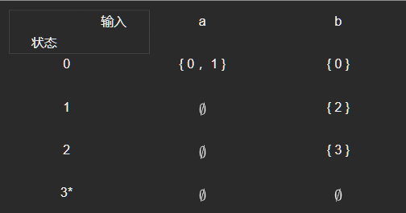

# 3. 词法分析

## 3.1 词法分析简介

### 3.1.1 词法分析的作用

词法分析是编译的第一阶段。

词法分析器的主要任务是：

- 读入源程序的输入字符。
- 将它们组成词素。
- 生成并输出一个词法单元序列，每个词法单元对应于一个词素。

生成的词法单元序列将被输出到语法分析器进行语法分析。

词法分析器通常还要和 **符号表** 进行交互。  
当词法分析器发现了一个标识符的词素时，它要将这个词素添加到符号表中。  
在某些情况下，词法分析器会从符号表中读取有关标识符种类的信息，以确定向语法分析器传送哪个词法单元。

> getNextToken 命令指示词法分析器从其输入中不断读取字符。

除此之外，词法分析还负责：

- 过滤注释与多余的空白符。
- 赋予行号。

### 3.1.2 词法单元、模式和词素

- **词法单元** 由一个词法单元名和一个可选的属性值组成。
  - 词法单元名是一个表示某种词法单位的抽象符号，比如一个特定的关键字，或者代表一个标识符的输入字符序列。
  - 词法单元名是由语法分析器处理的输入符号。
- **模式** 描述了一个词法单元的词素可能具有的形式。
  - 当词法单元是一个关键字时，它的模式就是组成这个关键字的字符序列。
  - 对于标识符和其他词法单元，模式是一个更加复杂的结构，它可以和很多符号串匹配。
- **词素** 是源程序中的一个字符序列，它和某个词法单元的模式匹配。
  - 被词法分析器识别为该词法单元的一个实例。

## 3.2 词法单元归约

**正则表达式** 是一种用来描述词素模式的重要表示方法。

> 虽然正则表达式不能表达出所有可能的模式，但是它们可以高效地描述在处理词法单元时要用到的模式类型。

### 3.2.1 串和语言

**字母表** (alphabet) 是一个有限的 **符号集合** 。  
符号的典型例子包括：

- 字母
- 数位
- 标点符号

> - **二进制字母表** (binary alphabet) {0,1} 。
> - **ASCII 码表** 被用于很多软件系统中。
> - **Unicode 字符集** 包含了大约 100000 个来自世界各地的字符。

某个字母表上的一个 **串** (string) 是该字母表中符号的一个有穷序列。

> 在语言理论中，术语「句子」和「字」常常被当作「串」的同义词。

[串的更多相关定义](language&grammer.md#String)

**语言** (language) 是某个给定字母表上一个任意的可数的串集合。

[语言上的运算](language&grammer.md#LanguageOperate)

### 3.2.2 正则表达式

#### 3.2.2.1 正则表达式的定义

**正则表达式** (Regular Expression ,RE) 是一种用来描述 **正则语言** 的更紧凑的表示方法。

正则表达式可以由 **较小的正则表达式** 按照特定规则递归地构建。  
每个正则表达式 $r$ 定义（表示）一个语言 $L(r)$ ，这个语言也是根据 $r$ 的子表达式所表示的语言 **递归定义** 的。

下面的规则定义了某个字母表 $\Sigma$ 上的正则表达式以及这些表达式所表示的语言：

- 归纳基础
  - 空串 $\varepsilon$ 是一个 RE， $L(\varepsilon)=\{\varepsilon\}$ 。
  - 如果 $a\in \Sigma$ ，则 $a$ 是一个 RE，且 $L(a)=\{a\}$ 。即这个语言仅包含一个长度为 1 的符号串 $a$ 。
- 归纳步骤
  - 假设 $r$ 和 $s$ 都是 RE，表示的语言分别是 $L(r)$ 和 $L(s)$ 。
    - $r|s$ 是一个 RE， $L(r|s)=L(r) \cup L(s)$ 。
    - $rs$ 是一个 RE， $L(rs)=L(r)L(s)$ 。
    - $r^{*}$ 是一个 RE， $L(r^{*})={(L(r))}^{*}$ 。
    - $(r)$ 是一个 RE， $L((r))=L(r)$ 。
      > 运算优先级 $*>连接>|$

> 令 $\Sigma = \{a,b\}$ ，则：
>
> - $L(a|b) = L(a) \cup L(b) = \{a\} \cup \{b\} = \{a,b\}$
> - $L((a|b)(a|b)) =L(a|b)L(a|b)= \{a,b\}\{a,b\} = \{aa,ab,ba,bb\}$
> - $L(a^*) = (L(a))^* = \{a\}^* = \{\varepsilon ,a,aa,aaa,\dots \}$
> - $L((a|b)^{*})) =(L(a|b))^*= \{a,b\}^* = \{\varepsilon ,a,b,aa,ab,\dots,aaa,\dots \}$
> - $L(a|a^{*}b) =\{a,b,ab,aab,aaab,\dots\}$

可以用 RE 定义的语言称为 **正则语言** (Regular language) 或 **正则集合** (Regular set) 。

正则文法与正则表达式是 **等价** 的。

- 对于任何正则文法 G，存在定义同一语言的正则表达式 r。
- 对于任何正则表达式 r，存在生成同一语言的正则文法 G。

#### 3.2.2.2 正则表达式的代数定律

- `|` 是可交换的  
   $r|s=s|r$
- `|` 是可结合的  
   $r|(s|t) = (r|s)|t$
- 连接是可结合的  
   $r(st) = (r s)  t$
- 连接对 `|` 是可分配的  
   $r(s|t) = (rs) | (rt)$
- $\varepsilon$ 是连接的单位元  
   $\varepsilon r = r \varepsilon =r$
- 闭包中一定包含 $\varepsilon$  
   $r^{*} =(r| \varepsilon)^{*}$
- $*$ 具有幂等性  
   $r^{**}=r^{*}$

#### 3.2.2.3 正则定义

通过给正则表达式命名，能够在正则表达式中使用这些符号以方便表示。

设 $\Sigma$ 是基本符号的集合， **正则定义** 是具有如下形式的定义序列：

$$
d_1 \rightarrow r_1 \\
d_2 \rightarrow r_2 \\
\dots \\
d_n \rightarrow r_n \\
$$

其中：

- 每个 $d_i$ 都是一个 **新符号** ，即 $d_i$ 不在符号表中，且 **各不相同**。
- 每个 $r_i$ 是字母表 $\Sigma \cup \{d_1,d_2,\dots,d_{i-1}\}$ 上的 **正则表达式**。

正则定义即通过名字定义，达成 **简单符号** 替代 **复杂正则表达式** 的目的。

> C 语言标识符的正则定义：
>
> $digit \rightarrow 0|1|2|\dots|9$  
> $letter\_ \rightarrow A|B|\dots|Z|a|b|\dots|z|\_$  
> $id \rightarrow letter\_(letter\_|digit)^{*}$

#### 3.2.2.4 正则表达式扩展

- `+` **1 或多实例**
  - 单目后缀运算符 `+` 表示一个正则表达式及其语言的正闭包。
- `?` **0 或 1 实例**
  - 单目后缀运算符 `?` 表示 0 或 1 个出现。
- **字符类**
  - 允许将字符集合 $a_1 | a_2 | \dots a_n$ 缩写为 $[a_1 a_2 \dots a_n]$ 。
  - 允许将符合逻辑的字符序列缩写为 $[a_1 \dots a_n]$

### 3.2.3 有穷自动机

#### 3.2.3.1 有穷自动机定义

**有穷自动机** (Finite Automata ,FA) 是对 **一类处理系统** 建立的 **数学模型** 。

- 这类系统具有一系列 **离散的输入输出信息** 和 **有穷数目的内部状态** 。
  - 状态：概括了对过去输入信息处理的状况。
- 系统只需要根据 **当前所处的状态** 和 **当前面临的输入信息** 就可以决定系统的 **后继行为** 。
- 每当系统处理了当前的输入后，系统的 **内部状态** 也将发生改变。

> 电梯控制装置
>
> - 输入：顾客的乘梯需求（所要到达的层号）。
> - 状态：电梯所处的层数 + 运动方向。
>
> 电梯控制装置 并不需要记住先前全部的服务要求，只需要知道电梯 **当前所处的状态** 以及 **还没有满足的所有服务请求**

#### 3.2.3.2 有穷自动机模型

- **输入带** (input tape)：用来存放输入符号串。
- **读头** (head)：从左向右逐个读取输入符号，只读。
- **有穷控制器** (finite control)：具有有穷个状态数，根据 **当前状态** 和 **当前输入符号** 控制转入 **下一状态**。

FA 可以使用 **转换图** (Transition Graph) 表示。

转换图由以下元素构成：

- 结点：FA 的状态
  - 初始状态：只有一个，由 **start** 表示。
  - 终止状态：可以有多个，由 **双圈** 表示。
- 带标记的有向边  
  对于 **输入 a** ，若存在一个从状态 p 到状态 q 的转换，则在 pq 之间作有向边，并标记上 **a**。

给定输入串 $x$ ，如果存在一个对应于串 $x$ 的从 **初始状态** 到某个 **终止状态** 的转换序列，则称 **串** $x$ 被该 FA **接收**。  
由一个有穷自动机 $M$ 接收的所有串构成的集合称为是该 FA **定义** （接收）的语言，记为 $L(M)$。

#### 3.2.3.3 匹配原则

**最长子串匹配原则** (Longest String Matching Principle)  
当输入串的多个前缀与一个或多个模式匹配时，总是选择 **最长的前缀** 进行匹配。

> 
>
> INPUT : `<=`  
> 前缀 : `<` `<=`  
> 两个前缀都匹配，默认选择最长前缀匹配。

在到达某个终态后，只要输入带上还有符号，FA 就继续前进，以寻找尽可能长的匹配。

#### 3.2.3.4 有穷自动机的分类

- 确定的 FA (Deterministic finite automata ,DFA)
  - $M=(S,\Sigma,\delta,s_{0},F)$
    - $S$ : **有穷状态集**
    - $\Sigma$ : **输入字母表**，即 **输入符号集合**。设 $\varepsilon$ 不是 $\Sigma$ 中的元素。
    - $\delta$ : 将 $S\times \Sigma$ 映射到 $S$ 的 **转换函数**。 $\forall s \in S ,a\in \Sigma ,\delta(s,a)$ 表示从状态 $s$ 出发，沿着标记为 $a$ 的边所能到达的状态。
    - $s_{0}$ : **开始状态** ，$s_0 \in S$
    - $F$ : **接收（终止）状态集合** ， $F \subseteq S$  
        
      可无损转换为转换表：  
      
- 非确定的 FA (Nondeterministic finite automata ,NFA)
  - $M=(S,\Sigma,\delta,s_{0},F)$
    - $S$ : **有穷状态集**
    - $\Sigma$ : **输入字母表**，即 **输入符号集合**。设 $\varepsilon$ 不是 $\Sigma$ 中的元素。
    - $\delta$ : 将 $S\times \Sigma$ 映射到 $2^S$ 的 **转换函数**。 $\forall s \in S ,a\in \Sigma ,\delta(s,a)$ 表示从状态 $s$ 出发，沿着标记为 $a$ 的边所能到达的状态 **集合**。
    - $s_{0}$ : **开始状态** ，$s_0 \in S$
    - $F$ : **接收（终止）状态集合** ， $F \subseteq S$  
        
       可无损转换为转换表：  
      

DFA 与 NFA 具有等价性。

- 对任何 NFA ，存在识别统一语言的 DFA。
- 对任何 DFA ，存在识别统一语言的 NFA。

上图 DFA 与 NFA 图例等价。

- 都识别以 `abb` 结尾的串。
- `r=(a|b)*abb`

正则文法 $\Leftrightarrow$ 正则表达式 $\Leftrightarrow$ FA

- 带有 $\varepsilon$ 边的 NFA
  - $M=(S,\Sigma,\delta,s_{0},F)$
    - $S$ : **有穷状态集**
    - $\Sigma$ : **输入字母表**，即 **输入符号集合**。设 $\varepsilon$ 不是 $\Sigma$ 中的元素。
    - $\delta$ : 将 $S\times ( \Sigma \cup \{\varepsilon \})$ 映射到 $2^S$ 的 **转换函数**。 $\forall s \in S ,a\in \Sigma \cup \{\varepsilon \},\delta(s,a)$ 表示从状态 $s$ 出发，沿着标记为 $a$ 的边所能到达的状态 **集合**。
    - $s_{0}$ : **开始状态** ，$s_0 \in S$
    - $F$ : **接收（终止）状态集合** ， $F \subseteq S$  
      
  - 空边意味着不需满足任何条件即可进入另一状态。

带有与不带有 $\varepsilon$ 边的 FA 具有等价性。

上例等价于：

即 $0^*1^*2^*$

### 3.2.4 从正则表达式到有穷自动机

一般地，我们先将 RE 转换为 NFA，最终转换为 DFA。
