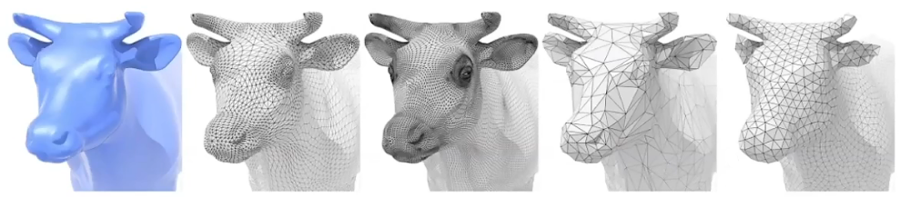

# 6. 几何

图形学中，以几何的定义方式为依据，将几何总体分为两类：

- Implicit **隐式几何**

  - 定义某个数学关系表示某个几何体。
  - $f(x,y,z) = 0$

  > $f(x,y,z) = (2 - \sqrt{x^2+y^2} )^2+z^2 - 1$

  - 易于判断任一点是否在面上。

- Explicit **显式几何**

  - 通过参数映射表示某个几何体。
  - $f:\mathbb{R}^2 \rightarrow \mathbb{R}^3;(u,v) \mapsto (x,y,z)$

  > $f(u,v) = ((2+\cos{u})\cos{v},(2+\cos{u})\sin{v},\sin{u})$

## 6.1 隐式几何

### 6.1.1 构造立体几何法

**构造立体几何法** (CSG,Constructive Solid Geometry) 从属于隐式几何，其扩展了几何体上的集合运算，从而实现更复杂的几何表示。

CSG 在各种 3D 建模软件中得到广泛应用。

### 6.1.2 距离函数

距离函数定义了空间任何一点到物体表面的最小距离。

对于距离函数的融合与传统融合相比，有着独特的表现力。

### 6.1.3 分形几何

**分形几何** 无限复杂且具备自相似结构。

## 6.2 显式几何

显式几何主要有如下表示法：

- 三角形面
- 贝塞尔曲面
- 细分曲面
- NURBS
- 点云
  - 定义一系列点的坐标。
  - 当密度达到一定量级，将形成模型。  
    
- 多面形 Mesh
  - 常用三角形表示。  
    
  - 定义顶点、法线、纹理坐标。

### 6.2.1 曲线

#### Spline 曲线

样条曲线 (Spline) 是一系列控制点定义的曲线，一般分为插值样条与逼近样条。

常用 B 样条曲线。

- 一种针对贝塞尔曲线的加强，使得允许对曲线的局部性修改。

#### 贝塞尔曲线

贝塞尔曲线 (Bézier curve) 通过一系列控制点来定义曲线。

计算机通过贝塞尔曲线算法 (de Casteljau) 绘制（插值）贝塞尔曲线。

如下图展示了二次贝塞尔曲线 (quadratic Bézier) 的生成：

其仅用三点即定义了一条贝塞尔曲线，其中满足数学关系：

$ \dfrac{\lvert b_0 b_0^1 \rvert}{\lvert b_0 b_1\rvert}=  
\dfrac{\lvert b_1 b_1^1 \rvert}{\lvert b_1 b_2\rvert}=  
\dfrac{\lvert b_0^1 b_0^2 \rvert}{\lvert b_0^1 b_1^1\rvert}=  
t $

因此：

$
\begin{aligned}
b_0^1(t) &= (1-t)b_0 +t b_1 \\
b_1^1(t) &= (1-t)b_1 +t b_2 \\
b_0^2(t) &= (1-t)b_0^1 +t b_1^1 \\
         &= (1-t)^2 b_0 +2t(1-t) b_1 +t^2 b_2 \\
\end{aligned}
$

注：此处下标表示此点的计算次数，为点本身的属性，而非表示指数。

推广至 4 点：

推广至 n 点的 n 阶贝塞尔曲线表达式：

$
b^n(t) = b_0^n(t) =  
\sum\limits_{j=0}^n b_j B_j^n (t)\\
B_i^n (t) =
\begin{pmatrix}
n\\i
\end{pmatrix}
t^i(1-t)^{n-i}
\\
$

其中：

- $b_j$ 表示 **控制点** 。
- $B_i^n (t)$ 为 Bernstein 多项式，描述二项分布。
- $\begin{pmatrix}n\\i\end{pmatrix}$ 即 $C_n^i$ 。

易得，贝塞尔曲线具有如下性质：

- $b(0) = b_0,b(1) = b_3$
  - 即贝塞尔曲线必过首尾控制点。
- 对于三次贝塞尔曲线（4 控制点），则：  
  $b'(0) = 3(b_1 - b_0),b'(1) = 3(b_3 - b_2)$
- 仿射变换不影响贝塞尔曲线的结果，但投影变换会。
- 凸包性质：生成的贝塞尔曲线应在所有控制点所形成的 **凸包** 内。
  - 凸包是能够包围所有给定点的最小凸多边形。  
    

#### 高阶贝塞尔曲线

在高阶贝塞尔曲线中，多个控制点的存在将极大影响曲线生成的直观性。

这就意味着难以人为地通过操作控制点将曲线达成预期。

因此将其分段，即分段贝塞尔曲线 (Piecewise bézier) ，每段控制点不超过 4 个。

### 6.2.2 曲面

#### 贝塞尔曲面

类似地，使用贝塞尔曲面定义曲面。

在两个方向上分别应用贝塞尔曲线，即可构成贝塞尔曲面。

#### 网格

图形学中常用多个多边形连接而成的网格表示曲面。

对于网格表示的模型，需要定义许多常用的操作。

- 网格细分 subdivisiion
- 网格简化 simplification
- 网格正规化 regularization
