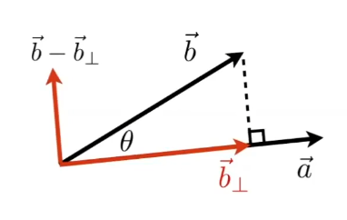
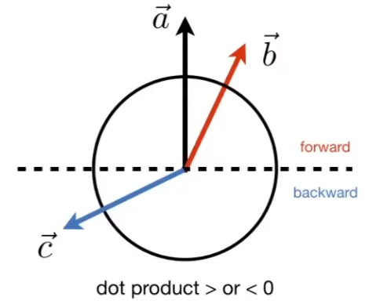
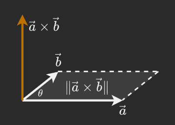
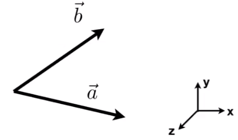
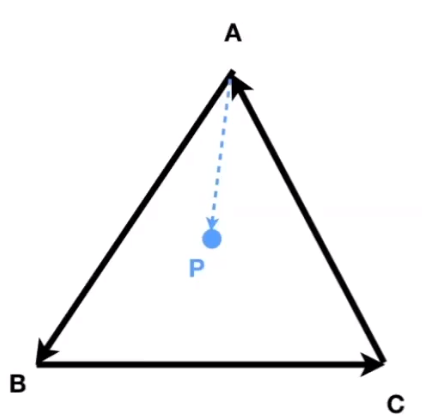

# 2. 向量与线性代数

## 2.1 常用符号表示

$
A=
\begin{pmatrix} x \\ y \\ \end{pmatrix}
$

$
A^T=
\begin{pmatrix} x , y\\ \end{pmatrix} \\
转置矩阵
$

$
\lVert A \rVert = \sqrt{x^2 + y^2} \\
向量位移距离
$

## 2.2 向量运算

### 2.2.1 点乘 Dot Product

#### 点乘定义

$$
\vec{a} \cdot \vec{b} =
    \lVert \vec{a} \rVert \lVert \vec{b} \rVert \cos{\theta}
$$

$
\cos{\theta} =
    \dfrac{\vec{a} \cdot \vec{b}}{\lVert \vec{a} \rVert \lVert \vec{b} \rVert }
$

$
\cos{\theta} =
    \hat{a} \cdot \hat{b} \quad (单位向量情况下)
$

$$
\vec{a} \cdot \vec{b} =
    \begin{pmatrix} x_a \\ y_a \\ \end{pmatrix} \cdot
    \begin{pmatrix} x_b \\ y_b \\ \end{pmatrix} =
    x_a x_b + y_a y_b
$$

#### 点乘运算法则

$
\begin{aligned}
& \vec{a} \cdot \vec{b} =
    \vec{b} \cdot \vec{a} \\
& \vec{a} \cdot( \vec{b} + \vec{c} ) =
    \vec{a} \cdot \vec{b} +\vec{a} \cdot \vec{c}  \\
& (k\vec{a}) \cdot \vec{b} =
    \vec{a} \cdot (k\vec{b}) =
    k(\vec{a} \cdot \vec{b})\\
\end{aligned}
$

#### 点乘用途

- 计算两向量间夹角余弦值。
- 计算两向量间夹角。
- 将一个向量投影到另一向量上。
- 向量分解。

$\vec{b}_{\perp}=k \hat{a}$  
$k=\lVert \vec{b}_{\perp} \rVert=\lVert \vec{b} \rVert \cos{\theta}$

- 判断两向量朝向是否一致。
- 判断两向量接近程度。

### 2.2.2 叉乘 Cross Product

#### 叉乘定义

设：

$$
\vec{c} = \vec{a} \times \vec{b}
$$

则：

$$
\lVert \vec{c} \rVert=
    \lVert \vec{a} \rVert \lVert \vec{b} \rVert \sin{\phi}\\
\vec{c} \perp \vec{a}\\
\vec{c} \perp \vec{b}\\
$$

其方向可由右手定则判断。

$
\vec{a} \times \vec{b} =
    - \vec{b} \times \vec{a}
$

$
\sin{\theta} =
    \dfrac{\lVert \vec{a} \times \vec{b} \rVert}{\lVert \vec{a} \rVert \lVert \vec{b} \rVert }
$

$$
\begin{align*}
    \vec{c} & = \vec{a} \times \vec{b} =
        \begin{vmatrix}
            i&j&k \\
            a_x&a_y&a_z \\
            b_x&b_y&b_z \\
        \end{vmatrix}=
        \begin{pmatrix}
            a_y b_z - b_y a_z\\
            a_z b_x - a_x b_z\\
            a_x b_y - a_y b_x\\
        \end{pmatrix}\\
        & =A^* \vec{b}=
        \begin{pmatrix}
            0 & -z_a & y_a \\
            z_a & 0 & x_a \\
            -y_a & x_a & 0 \\
        \end{pmatrix}
        \begin{pmatrix}
            x_b \\
            y_b \\
            z_b \\
        \end{pmatrix}
\end{align*}
$$

#### 叉乘运算法则

直角坐标系中：

$\vec{x} \times \vec{y} = +\vec{z}$  
$\vec{y} \times \vec{x} = -\vec{z}$  
$\vec{y} \times \vec{z} = +\vec{x}$  
$\vec{z} \times \vec{y} = -\vec{x}$  
$\vec{z} \times \vec{x} = +\vec{y}$  
$\vec{x} \times \vec{z} = -\vec{y}$

$
\vec{a} \times \vec{b} =
    - \vec{b} \times \vec{a}
$

$
\vec{a} \times \vec{a} =
    \vec{0}
$

$
\vec{a} \times (\vec{b} +\vec{c})=
    \vec{a} \times \vec{b} +\vec{a} \times \vec{c}
$

$
\vec{a} \times (k \vec{b}) =
    k(\vec{a} \times \vec{b})
$

#### 叉乘用途

- 构建三维空间中的直角坐标系。
- 判断左 / 右

  - 在 XY 平面中，$\vec{a}$ 旋转至 $\vec{b}$ 是逆时针 / 顺时针旋转（沿夹角）。

  

- 判断内 / 外  
  

### 2.2.3 正交基和坐标系

三维正交直角坐标系是任何一组满足如下性质的三个向量：

$$
\lVert \vec{u}\rVert = \lVert \vec{v}\rVert= \lVert \vec{w}\rVert = 1
$$

$$
\vec{u} \cdot \vec{v} =\vec{v} \cdot \vec{w} = \vec{u} \cdot \vec{w} = 0
$$

$$
\vec{w} = \vec{u} \times \vec{v} \; （右手系）
$$

对于一随机向量 $\vec{p}$ 有：

$\vec{p} = (\vec{p} \cdot \vec{u}) \vec{u}+(\vec{p} \cdot \vec{v}) \vec{v}+(\vec{p} \cdot \vec{w}) \vec{w}$

## 2.3 矩阵运算

### 2.3.1 矩阵间乘法

$
\begin{pmatrix}
    1&3\\
    5&2\\
    0&4\\
\end{pmatrix}
\begin{pmatrix}
    3&6&9&4\\
    2&7&8&3\\
\end{pmatrix}=
\begin{pmatrix}
    9   &9  &33 &13\\
    19  &44 &61 &26\\
    8   &28 &32 &12\\
\end{pmatrix}
$

矩阵乘法行列数将满足一下条件：

$
(M \times N)(N \times P)=(M \times P)
$

$
\begin{matrix}
    \begin{matrix}
        1 & 2\\
        2 & \square\\
    \end{matrix}&
    \begin{pmatrix}
        3&6&9&4\\
        2&7&8&3\\
    \end{pmatrix}\\
    \begin{pmatrix}
        1&3\\
        5&2\\
        0&4\\
    \end{pmatrix}&
    \begin{pmatrix}
        ? &? &? &?\\
        ? &? &? &?\\
        ? &? &? &?\\
    \end{pmatrix}\\
\end{matrix}
$

易见解中的某元素（$i$ 行 $j$ 列）仅与被乘矩阵的第 $i$ 行与乘矩阵的第 $j$ 列有关。

#### 矩阵乘法运算法则

- 不满足交换律  
  $AB$ 与 $BA$ 具有不同意义。
- 结合律  
  $(AB)C = A(BC)$
- 分配率  
  $A(B+C) = AB+AC$

### 2.3.2 矩阵向量乘法

矩阵向量乘法指矩阵与列向量相乘 $(M\times 1)$ 。

用于变换 (transform) 一个向量。

### 2.3.3 矩阵转置

将矩阵的行与列置换。

$$
\begin{pmatrix}
    1&2\\
    3&4\\
    5&6\\
\end{pmatrix} ^T =
\begin{pmatrix}
    1&3&5\\
    2&4&6\\
\end{pmatrix}
$$

#### 矩阵转置运算法则

$(AB)^T = B^T A^T$

### 2.3.4 单位矩阵

在矩阵的乘法中，一种如同数的乘法中的 1 特殊的作用的方阵。

从左上角到右下角的对角线（称为主对角线）上的元素均为 1。 除此以外全都为 0。

$
I_{3\times 3} =
\begin{pmatrix}
    1&0&0\\
    0&1&0\\
    0&0&1\\
\end{pmatrix}
$

#### 单位矩阵运算法则

$AA^{-1} = A^{-1}A = I$  
$(AB)^{-1} = B^{-1}A^{-1}$

### 2.3.5 向量间乘法转换至矩阵乘法

向量间乘法可转换至矩阵乘法。

- 点乘

$
\begin{aligned}
    \vec{a} \cdot \vec{b} &= \vec{a}^T \vec{b}\\
    &=
    \begin{pmatrix}
        x_a&y_a&z_a
    \end{pmatrix}
    \begin{pmatrix}
        x_a\\ y_a\\ z_a \\
    \end{pmatrix}\\
    &=
    \begin{pmatrix}
        x_a x_b+y_a y_b+z_a z_b
    \end{pmatrix}
\end{aligned}
$

- 叉乘

$
\begin{aligned}
    \vec{a} \times \vec{b} &=A^* \vec{b}\\
    &=
    \begin{pmatrix}
        0 & -z_a & y_a \\
        z_a & 0 & x_a \\
        -y_a & x_a & 0 \\
    \end{pmatrix}
    \begin{pmatrix}
        x_b \\
        y_b \\
        z_b \\
    \end{pmatrix}
\end{aligned}
$
