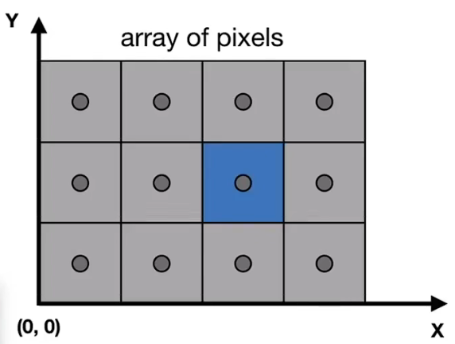
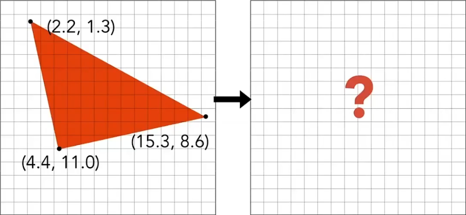
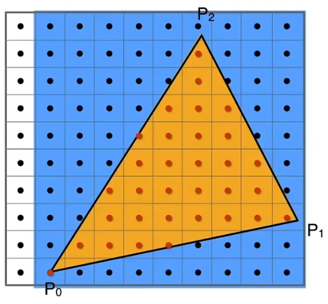
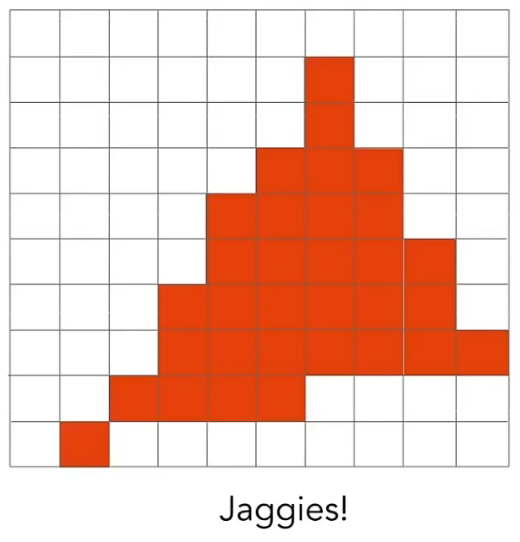

# 4. 光栅化

## 4.1 视口变换

### 4.1.1 屏幕

**屏幕** 定义为：

- 一个像素构成的数组。
  - 其大小定义为 **分辨率**。
- 一种典型的光栅成像设备。

在屏幕上绘制即光栅化。

**像素** (Pixel,picture element) 指：

- 一个拥有独立颜色的最小显示单位。
  - 即一个像素内颜色没有差异。
- 由 RGB 表示 (red , green , blue) 。

一般地，用整数坐标表示像素位置。

此处使用以下规则表示像素位置：

- 使用像素方块的左下角顶点表示其位置。
- 从 (0,0) 起始。

上图中蓝色像素位置：(2,1)

### 4.1.2 视口变换矩阵形式

- 无视 $z$ 。
- 将 $xy$ 面由 $[-1,1]^2$ 缩放并平移至 $[0,width]\times[0,height]^2$。

$
M_\text{viewport} =
\begin{pmatrix}
\frac{\text{width}}{2}&0&0&\frac{\text{width}}{2}\\
0&\frac{\text{height}}{2}&0&\frac{\text{height}}{2}\\
0&0&1&0\\
0&0&0&1\\
\end{pmatrix}
$

## 4.2 光栅化

一般使用 **三角形** 为基础构建面。

> 为什么是三角形？
>
> - 最基础的多边形。
>   - 可以将任意多边形拆解为三角形。
> - 给出三顶点坐标，一定形成一个平面。
> - 三角形内外定义明确。
>   - 使用叉积即可计算点是否在三角形内。
>   - 其他多边形可能有凹凸问题。
> - 三角形差值算法可定义。
>   - 使用三顶点属性即可计算三角形内部任意一点属性。

由于三角形是 **连续** 的，而屏幕是 **离散** 的，因此需要通过特定的方式在屏幕上绘制三角形。

### 4.2.1 采样

**采样** 一个函数，就是将指定参数集带入连续函数，以获取一个解集，即将一个函数离散化。

常用的采样依据：

- **时间** （一维）
- **面积** （二维）
- **方向** （二维）
- **体积** （三维）

对于上图的三角形，采样依据为：

- 判断三角形在方格内的面积是否占方格面积的一半。
- 等价于判断方格中心点是否在三角形内。

$
inside(t,x,y)=
\begin{cases}
1 \quad \text{point(x,y) in triangle t}\\
0 \quad \text{otherwise}\\
\end{cases}
$

一般使用轴向包围盒 (Axis-aligned bounding boxes) 简化范围。

## 4.3 反走样

锯齿是光栅化不可避免的副产物。

锯齿是线在光栅化时产生的失真。

## 4.4 深度缓冲
