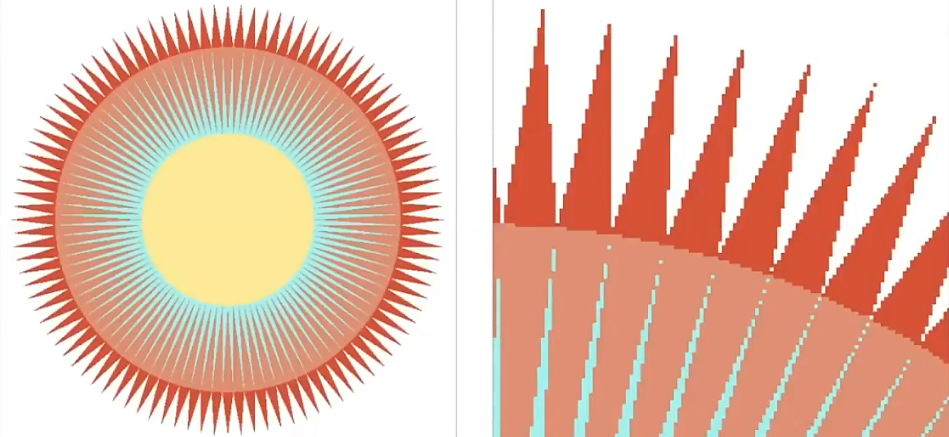
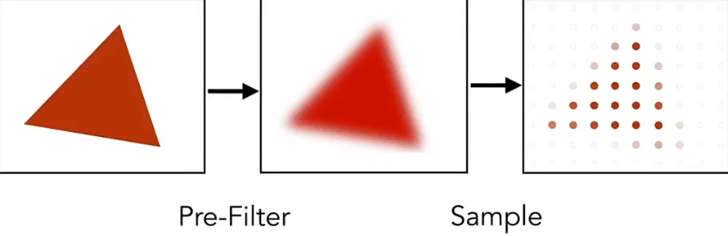
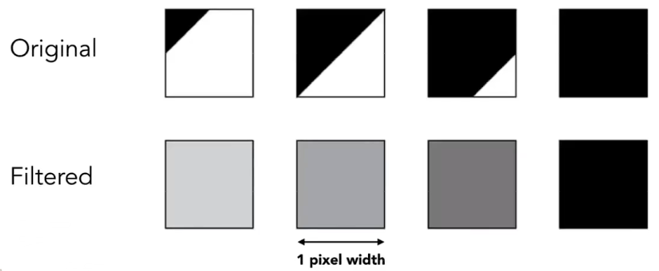

# 4. 光栅化

## 4.1 视口变换

### 4.1.1 屏幕

**屏幕** 定义为：

- 一个像素构成的数组。
  - 其大小定义为 **分辨率**。
- 一种典型的光栅成像设备。

在屏幕上绘制即光栅化。

**像素** (Pixel,picture element) 指：

- 一个拥有独立颜色的最小显示单位。
  - 即一个像素内颜色没有差异。
- 由 RGB 表示 (red , green , blue) 。

一般地，用整数坐标表示像素位置。

此处使用以下规则表示像素位置：

- 使用像素方块的左下角顶点表示其位置。
- 从 (0,0) 起始。

上图中蓝色像素位置：(2,1)

### 4.1.2 视口变换矩阵形式

- 无视 $z$ 。
- 将 $xy$ 面由 $[-1,1]^2$ 缩放并平移至 $[0,width]\times[0,height]^2$。

$
M_\text{viewport} =
\begin{pmatrix}
\frac{\text{width}}{2}&0&0&\frac{\text{width}}{2}\\
0&\frac{\text{height}}{2}&0&\frac{\text{height}}{2}\\
0&0&1&0\\
0&0&0&1\\
\end{pmatrix}
$

## 4.2 光栅化三角形

一般使用 **三角形** 为基础构建面。

> 为什么是三角形？
>
> - 最基础的多边形。
>   - 可以将任意多边形拆解为三角形。
> - 给出三顶点坐标，一定形成一个平面。
> - 三角形内外定义明确。
>   - 使用叉积即可计算点是否在三角形内。
>   - 其他多边形可能有凹凸问题。
> - 三角形差值算法可定义。
>   - 使用三顶点属性即可计算三角形内部任意一点属性。

由于三角形是 **连续** 的，而屏幕是 **离散** 的，因此需要通过特定的方式在屏幕上绘制三角形。

### 4.2.1 采样

**采样** 一个函数，就是将指定参数集带入连续函数，以获取一个解集，即将一个函数离散化。

常用的采样依据：

- **时间** （一维）
- **面积** （二维）
- **方向** （二维）
- **体积** （三维）

对于上图的三角形，采样依据为：

- 判断三角形在方格内的面积是否占方格面积的一半。
- 等价于判断方格中心点是否在三角形内。

$
inside(t,x,y)=
\begin{cases}
1 \quad \text{point(x,y) in triangle t}\\
0 \quad \text{otherwise}\\
\end{cases}
$

一般使用轴向包围盒 (Axis-aligned bounding boxes) 简化范围。

## 4.3 走样

**采样瑕疵** (Sampling Artifacts) 指图形学中不希望或无意的数据更改，包括：

- 走样 (Aliasing)  
  
- 摩尔纹 (Moire Pattern)  
  
  - 去除图像的奇数行与奇数列，使之成为更小的图像。
- 车轮效应 (Wagon wheel effect)
  - 视觉上观测到的转动与实际转动方向不符。
- More...

**走样** (Aliasing) 在图形学中即锯齿，是光栅化不可避免的副产物。

锯齿是线在光栅化时产生的失真，根本原因在于采样精度低于人眼精度。

更多参见 **数字图像处理** 。

### 4.3.1 时域与频域

时域 (time domain) 指相对于 **时间** 的数学函数或信号的分析。频域 (frequency domain) 指相对于 **频率** 的数学函数或信号的分析。

时域图显示信号如何随时间变化，而频域图显示每个给定频段内有多少信号位于一定频率范围内。

傅里叶变换将时域转换为频域。  
逆傅里叶变换与之相对。

_from_wiki.gif>)

对于图像处理，时域不再指时间，而指空间中的位置。

可以使用傅里叶级数展开规律函数，但实际中不允许无限展开，这将产生精度问题。

采样频率应与原函数频率相匹配，否则将出现失真。

### 4.3.2 滤波

滤波 (filtering) 即抹除指定频率的信息。

  

滤波相当于卷积 (convolution)，意味着（加权）平均 (averaging) 。

图像时域上的卷积等价于图 像和卷积核在频域上的乘积。

> 将图像压缩为原图的 $1/3$

- 盒滤波

  

### 4.3.3 走样成因

采样意味着将原函数乘以 **冲激函数** 。

冲激函数是一种奇异函数，（如图 c）。它是对强度极大、作用时间极短暂且积分有限的一类理想化数学模型。冲激函数可用于对连续信号进行线性表达，也可用于求解线性非时变系统的零状态响应。

图 b d f 分别为图 a c e 的频域图。因此实际上对某函数的采样相当于其在频谱上进行复制。

当频谱发生交错时即出现走样。

### 4.3.4 反走样

有如下措施进行反走样：

- 增加采样率。
  - 最好的解决办法。
  - 成本高，限制多。
- 模糊化处理，即低通滤波。  
   

#### 4.3.4.1 模糊化处理

为每个像素进行卷积，即模糊化处理。

将三角形覆盖在方格内的面积换算为方格的整体属性。

实际上，覆盖面积较难计算。因此有如下方式进行计算：

- **MSAA 多重采样抗锯齿** (MultiSampling Anti-Aliasing)
  - 将一个像素分割为更小的单位进行采样。  
    
  - 将带来性能损失，如上图将计算量提高至 4 倍。
  - 实际应用中将采用不规则的分布（而非小正方形）以细分采样点。
- **FXAA 快速近似抗锯齿** (Fast Approximate Anti-Aliasing)
  - 运行于后期处理。
  - 找到锯齿后再抹除锯齿。
- **TAA 时域抗锯齿** (Temporal Anti-Aliasing)
  - 根据上一帧的信息进行采样。

除此之外，超分辨率也可解决采样不足的问题。

- DLSS (Deep Learning Super Sampling)
  - 运用了深度学习以补全缺失信息。

## 4.4 遮挡与可见性

绘制到屏幕时应处理物体的先后遮挡关系。

尝试使用画家算法 (painter's algorithm) ：

- 先绘制远处物体，后绘制近处物体以覆盖。
- 难以描述远近关系。
- 无法处理两两覆盖关系。 

因此引入 **深度缓冲** (Z-buffer) 算法。 

- frame buffer 存储每个像素点的最浅深度。
- depth buffer(z-buffer) 存储每个像素的颜色。

\* 此处 z 深度表示某点到摄像机的距离，永远为非负数。

