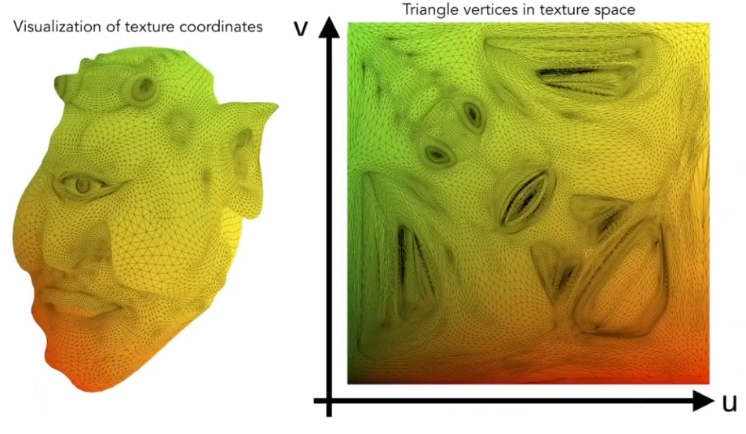

# 5. 着色

**着色** (shading) 指对不同物体应用不同材质。

着色只考虑自身物体的情况，不考虑对其他物体的影响（阴影等）。

## 5.1 简单着色模型


对于 Blinn-Phong 反射模型，其光照主要包含三部分：

- 镜面反射光照
- 漫反射光照
- 间接光照

Blinn-Phong 反射模型是一种简化的模型，不是准确反映现实物理的模型。

考虑一个点 (shading point) 的着色结果，可以将此点认为是一个极小的平面。因此有如下定义：


- 观测方向 v
- 法线 n
- 光线方向 I
- 表面参数
  - 颜色
  - 反光度
  - ...

其中表示方向的向量都是单位向量。

### 5.1.1 漫反射


漫反射将光线均匀地反射到各个方向。

不同的角度可能影响 **光通量** ，即接收光照的有效面积，从而使其变暗。


其中 $cos{\theta} = n \cdot l$

对于点到光源的距离同样将影响光的强度。


因此有：

$
L_d = k_d(I/r^2) max(0,n \cdot l)
$

其中：

- $L_d$ 漫反射亮度
- $k_d$ 漫反射系数
  - 不同材质表面对光能的吸收具有不同的效率。


### 5.1.2 镜面反射

镜面反射光照即 **高光**。

验证是否在着色点发生可见的镜面反射，仅需比较 **半程向量** 与法线向量。

半程向量指观测向量与光线向量的角平分线向量。


$
\begin{aligned}
\vec{h} &= bisector(\vec{v},\vec{l})\\
        &= \frac{\vec{v}+\vec{l}}{\lVert \vec{v}+\vec{l} \rVert}\\
\end{aligned}
$

$
\begin{aligned}
L_s &= k_s (I/r^2)max(0,\cos{\alpha})^p\\
&= k_s (I/r^2)max(0,n\cdot h)^p\\
\end{aligned}
$

其中：

- $L_s$ 镜面反射亮度
- $k_s$ 镜面反射系数
  - 通常认为是白色。
- $p$ 作为指数，用于调整高光的真实性。
  - 如果没有指数调整，高光将呈现的范围过大而显得不真实。
  - 通过指数调整其亮度与面积。  
      
    

### 5.1.3 间接光


间接光即环境光。

由于其他物体的漫反射，一般物体在背光面也不是全黑的。

因此假定间接光接收来自环境的光照强度一致。

$
L_a = k_a I_a
$

其中：

- $L_a$ 环境光亮度
- $k_a$ 环境光系数

综上，

$
\begin{aligned}
L&= L_a + L_d + L_s\\
 &= k_a I_a + k_d (I/r^2) max(0,\vec{n} \times \vec{l}) +k_s (I/r^2)max(0,n\cdot h)^p\\
\end{aligned}
$


## 5.2 着色方式


**着色频率** 指在物体上选定着色点的分布频率。

左侧球：选定了较低的着色频率。中间球：选定了较低的着色频率，但对三角形内部做了差值。右侧球：选定了较高的着色频率。

有如下正规定义：

- **平面着色** Flat shading
  - 对三角形的平面求取法线，以此决定整个三角形的颜色。 
- **顶点着色** Gouraud shading
  - 对三角形的顶点分别求取法线，以此分别决定三个顶点的颜色。
  - 随后对三角形内部进行差值。 
- **片元着色** Phong shading
  - 对三角形的顶点分别求取法线。
  - 随后对三角形内部法线进行差值（使用重心坐标）。
  - 根据每个像素的法线决定颜色。 


三种着色方式的代价与效果随着模型精度的变化而不同。因此选用时应结合实际。

对于点的法线，有如下计算方式：

考虑以此点为顶点的所有三角形的所在平面的法线，对其进行加权平均。


$
\vec{N_v} = \dfrac{\sum_i{\vec{N_i}}}{\lVert \sum_i{\vec{N_i}} \rVert}
$

## 5.3 实时渲染管线

渲染管线 (pipeline) 也称为渲染流水线，是三维模型渲染到二维屏幕上的过程。


### 5.3.1 Shader

现代 GPU 允许用户对渲染管线编程。所操作的可在硬件上运行的语言即 Shader 语言。

Shader 描述每个像素的运作方式。

通过操作不同类型的目标，Shader 分为：

- **顶点着色器** Vertex Shader
  - Shader 操作顶点
- **像素着色器** Fragment/Pixel Shader
  - Shader 操作每个像素

```glsl
uniform sampler2D myTexture;  // program parameter
uniform vec3 lightDir;        // program parameter
varying vec2 uv;    // per fragment value (interp. by rasterizer)
varying vec3 norm;  // per fragment value (interp. by rasterizer)

void diffuseShader(){
  vec3 kd;
  kd = texture2d(myTexture,uv);   // material color from texture
  kd *= clamp(dot(-lightDir,norm),0.0,1.0); // Lambertian shading model
  gl_FragColor = vec4(kd,1.0);    // output fragment color
}
```

## 5.4 纹理映射


纹理映射 (texture mapping) 定义了在物体表面任何一点的基本属性。

图形渲染中，任何一个三维物体的表面都可以二维形式表现。

地球的表面展开：


不规则体的表面展开：


通过指定的展开方式，可以将展开纹理的 2D 坐标系映射到渲染时的 3D 坐标系。



一般约定 $u、v$ 都在 $[0,1]$ 之间。

将纹理坐标系的二维坐标映射到三维模型表面的某个三角形顶点坐标，再通过插值方式计算三角形内部坐标，从而完成纹理映射。

但纹理映射可能发生错误。

### 5.4.1 放大纹理

当模型放大后，使用重心坐标插值时所追溯的 $u,v$ 坐标 (texel,a pixel on a texture) 可能将出现非整数。简单的取整可能呈现不好的效果。


上图分别为四舍五入、双线性插值、双三次插值呈现的效果。

#### 双线性插值

**双线性插值** (bilinear interpolation) 根据临近的 2 点进行采样。


定义线性插值：

$
lerp(x,v_0,v_1) = v_0 + x(v_1-v_0)
$

其中 $0 \leqslant x\leqslant 1$ 。

因此：

$
v_{xy} = lerp(t, lerp(s,u_{01},u_{11}),lerp(s,u_{00},u_{10}))
$

#### 双三次插值

**双三次插值** (bicubic interpolation) 根据临近的 16 点进行采样。

### 5.4.2 缩小纹理

虽然缩小纹理时不会存在非整数问题，但实际效果也可能堪忧。


超采样可以解决，但代价过大。

### 5.4.3 Mipmap

点查询 (point query) 指输入一点后返回此点的值，而范围查询 (range query) 则返回一个范围内的值（如平均值，最值等）。

Mipmap 允许快速、近似地进行正方形范围查询。


Mipmap 生成一系列针对原图的处理图。每张处理后的图像大小相当于处理前的 $1/4$ 。

因此占用的额外存储量不超过 $1/3$ 。

实际应用中，需要计算屏幕上某点在纹理上的表示范围，可使用 Mipmap。


$
D=\log_2{L}\\
L=max\left(
  \sqrt{
    {\left( \dfrac{du}{dx}\right)}^2+
    {\left( \dfrac{dv}{dx}\right)}^2},
  \sqrt{
    {\left( \dfrac{du}{dy}\right)}^2+
    {\left( \dfrac{dv}{dy}\right)}^2}
    \right)
$

因此将在第 $D$ 层 Mipmap 查询颜色。

若 $D$ 为非整数则进行三线性插值，即查询 $D$ 与 $D+1$ 层后进行线性插值。


最终缩小时运用 Mipmap 与三线性插值的效果：


可见远处细节过度模糊 (Overblur)。

使用 **各向异性过滤** (anisotropic filtering) 可缓解此问题。

### 5.4.4 Ripmap

Ripmap 允许快速、近似地进行矩形范围查询。


分析 Mipmap 中存在的问题，使用正方形概括像素点可能存在较大的误差，实际上一点像素可能代表纹理图上的更多非规则四边形。


各向异性过滤优化了对垂直的或水平的类矩形的查询。但其对于斜着的类矩形无法更好地处理。

因此还有更多的各向异性过滤，如 EWA 过滤。

## 5.5 重心坐标

重心坐标用于解决三角形内部的插值问题。

三角形内插值在 shading 中具有广泛应用。


**重心坐标** $(\alpha,\beta,\gamma)$ 是一个齐次坐标，定义在三角形上，满足如下条件：

$
(x,y) = \alpha A + \beta B + \gamma C
$

且

$
\begin{cases}
\alpha + \beta + \gamma = 1 \\
\end{cases}
$

当 $
\alpha \geqslant 0 ,\beta \geqslant 0 ,\gamma \geqslant 0$ 时，点在三角形内。否则只保证在同平面。


对于三角形内任意一点，可通过如下方式计算任意一点的 $\alpha \beta \gamma$ ：

$
\alpha = \dfrac{A_A}{A_A+A_B+A_C}
$  
$
\beta = \dfrac{A_B}{A_A+A_B+A_C}
$  
$
\gamma = \dfrac{A_C}{A_A+A_B+A_C}
$

其中 $A_i$ 表示 所在三角形面积。

当 $\alpha=\frac13, \beta=\frac13, \gamma=\frac13$ 时，此点为三角形 **重心** 。

其次若已知三顶点坐标，可通过如下方式计算任意一点的 $\alpha \beta \gamma$ ：

$
\alpha = \dfrac{-(x-x_B)(y_C-y_B)+(y-y_B)(x_C-x_B)}{-(x_A-x_B)(y_C-y_B)+(y_A-y_B)(x_C-x_B)}\\
$  
$
\beta = \dfrac{-(x-x_C)(y_A-y_C)+(y-y_C)(x_A-x_C)}{-(x_B-x_C)(y_A-y_C)+(y_B-y_C)(x_A-x_C)}\\
$  
$
\gamma = 1- \alpha -\beta \\
$

根据点的重心坐标，可进行插值。

对于三角形三顶点 $A \; B \; C$ 分别有属性 $V_A \; V_B \; V_C$ ，则对于平面内任意一点，其属性：

$V =\alpha V_A + \beta V_B + \gamma V_C$
