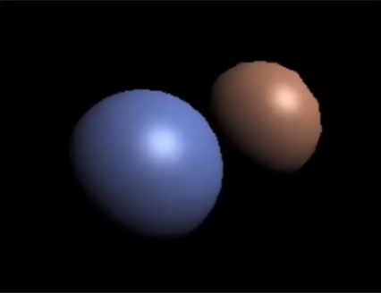

# 5. 着色

**着色** (shading) 指对不同物体应用不同材质。

着色只考虑自身物体的情况，不考虑对其他物体的影响（阴影等）。

## 5.1 简单着色模型

对于 Blinn-Phong 反射模型，其光照主要包含三部分：

- 镜面反射光照
- 漫反射光照
- 间接光照

Blinn-Phong 反射模型是一种简化的模型，不是准确反映现实物理的模型。

考虑一个点 (shading point) 的着色结果，可以将此点认为是一个极小的平面。因此有如下定义：

- 观测方向 v
- 法线 n
- 光线方向 I
- 表面参数
  - 颜色
  - 反光度
  - ...

其中表示方向的向量都是单位向量。

### 5.1.1 漫反射

漫反射将光线均匀地反射到各个方向。

不同的角度可能影响 **光通量** ，即接收光照的有效面积，从而使其变暗。

其中 $cos{\theta} = n \cdot l$

对于点到光源的距离同样将影响光的强度。

因此有：

$
L_d = k_d(I/r^2) max(0,n \cdot l)
$

其中：

- $L_d$ 漫反射亮度
- $k_d$ 漫反射系数
  - 不同材质表面对光能的吸收具有不同的效率。

### 5.1.2 镜面反射

镜面反射光照即 **高光**。

验证是否在着色点发生可见的镜面反射，仅需比较 **半程向量** 与法线向量。

半程向量指观测向量与光线向量的角平分线向量。

$
\begin{aligned}
\vec{h} &= bisector(\vec{v},\vec{l})\\
        &= \frac{\vec{v}+\vec{l}}{\lVert \vec{v}+\vec{l} \rVert}\\
\end{aligned}
$

$
\begin{aligned}
L_s &= k_s (I/r^2)max(0,\cos{\alpha})^p\\
&= k_s (I/r^2)max(0,n\cdot h)^p\\
\end{aligned}
$

其中：

- $L_s$ 镜面反射亮度
- $k_s$ 镜面反射系数
  - 通常认为是白色。
- $p$ 作为指数，用于调整高光的真实性。
  - 如果没有指数调整，高光将呈现的范围过大而显得不真实。
  - 通过指数调整其亮度与面积。  
      
    

### 5.1.3 间接光

间接光即环境光。

由于其他物体的漫反射，一般物体在背光面也不是全黑的。

因此假定间接光接收来自环境的光照强度一致。

$
L_a = k_a I_a
$

其中：

- $L_a$ 环境光亮度
- $k_a$ 环境光系数

综上，

$
\begin{aligned}
L&= L_a + L_d + L_s\\
 &= k_a I_a + k_d (I/r^2) max(0,\vec{n} \times \vec{l}) +k_s (I/r^2)max(0,n\cdot h)^p\\
\end{aligned}
$

## 5.2 着色方式

**着色频率** 指在物体上选定着色点的分布频率。

左侧球：选定了较低的着色频率。中间球：选定了较低的着色频率，但对三角形内部做了差值。右侧球：选定了较高的着色频率。

有如下正规定义：

- **平面着色** Flat shading
  - 对三角形的平面求取法线，以此决定整个三角形的颜色。 
- **顶点着色** Gouraud shading
  - 对三角形的顶点分别求取法线，以此分别决定三个顶点的颜色。
  - 随后对三角形内部进行差值。 
- **片元着色** Phong shading
  - 对三角形的顶点分别求取法线。
  - 随后对三角形内部法线进行差值（使用重心坐标）。
  - 根据每个像素的法线决定颜色。 

三种着色方式的代价与效果随着模型精度的变化而不同。因此选用时应结合实际。

对于点的法线，有如下计算方式：

考虑以此点为顶点的所有三角形的所在平面的法线，对其进行加权平均。

$
\vec{N_v} = \dfrac{\sum_i{\vec{N_i}}}{\lVert \sum_i{\vec{N_i}} \rVert}
$

## 5.3 实时渲染管线
