# 3. 变换

## 3.1 变换概述

变换主要分为三种应用：

- **Modeling** 模型变换
- **Viewing** 视图变换
- **Projection** 投影变换

变换在各种方面都有广泛应用。

## 3.2 2D 变换

### 3.2.1 2D 缩放

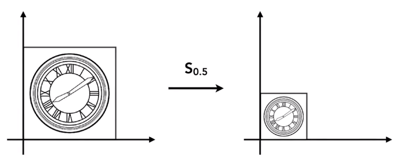

#### 2D 缩放数学形式

对于缩放后的图像上的任一点 $(x',y')$ 在原图像上有与其对应点 $(x,y)$ 满足以下条件：

$$
x' = s_x x\\
y' = s_y y\\
$$

#### 2D 缩放矩阵形式

$$
\begin{bmatrix}
    x'\\ y'\\
\end{bmatrix}=
\begin{bmatrix}
    s_x &0\\0&s_y \\
\end{bmatrix}
\begin{bmatrix}
    x\\ y\\
\end{bmatrix}
$$

- 当 $s_x=s_y$ 时，为等比（锁定纵横比）缩放。
- 当 $s_x <0$ 或 $s_y<0$ 时，为镜像缩放。

### 3.2.2 2D 切变

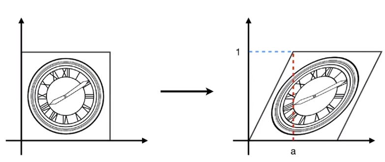

#### 2D 切变数学形式

对于以斜率 $k$ 切变后的图像上的任一点 $(x',y')$ 在原图像上有与其对应点 $(x,y)$ 满足以下条件：

$$
x' = x + kx\\
y' = y\\
$$

#### 2D 切变矩阵形式

$$
\begin{bmatrix}
    x' \\
    y' \\
\end{bmatrix}=
\begin{bmatrix}
    1 &k \\
    0 &1 \\
\end{bmatrix}
\begin{bmatrix}
    x \\
    y \\
\end{bmatrix}
$$

或

$$
\begin{bmatrix}
    x' \\
    y' \\
\end{bmatrix}=
\begin{bmatrix}
    1 &0 \\
    k &1 \\
\end{bmatrix}
\begin{bmatrix}
    x \\
    y \\
\end{bmatrix}
$$

### 3.2.3 2D 旋转

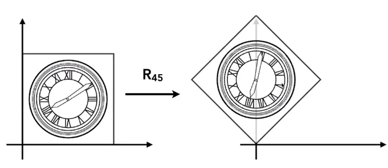

#### 2D 旋转数学形式

对于旋转顺时针 $\theta$ 后的图像上的任一点 $(x',y')$ 在原图像上有与其对应点 $(x,y)$ 满足以下条件：

$$
x' = x \cos{\theta} -y sin{\theta}\\
y' = x \sin{\theta} +y cos{\theta}\\
$$

#### 2D 旋转矩阵形式

$$
\begin{bmatrix}
    x' \\
    y' \\
\end{bmatrix}=
\begin{bmatrix}
    \cos{\theta} & -\sin{\theta} \\
    \sin{\theta} & \cos{\theta} \\
\end{bmatrix}
\begin{bmatrix}
    x \\
    y \\
\end{bmatrix}
$$

> Games101 使用了一下方法求解转换矩阵。首先设：
>
> $
> \begin{bmatrix}
> x' \\
> y' \\
> \end{bmatrix}=
> \begin{bmatrix}
> A & B \\
> C & D \\
> \end{bmatrix}
> \begin{bmatrix}
> x \\
> y \\
> \end{bmatrix}
> $
>
> 然后以矩阵 $(0,1),(1,0)$ 旋转 $\theta$ 为例，带入 $(0,1),(1,0)$ 两点可算出 $A B C D$ 。

### 3.2.4 2D 线性变换

若已知数学形式的转换方程为以下形式：

$
x' = ax +by \\
y' = cx +dy \\
$

则为线性变换，对应的转换矩阵：

$
\begin{bmatrix}
    x' \\
    y' \\
\end{bmatrix}=
\begin{bmatrix}
    a & b \\
    c & d \\
\end{bmatrix}
\begin{bmatrix}
    x \\
    y \\
\end{bmatrix}
$

## 3.3 齐次坐标

### 3.3.1 2D 平移变换

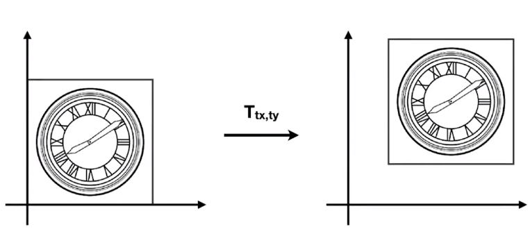

#### 2D 平移数学形式

对于平移 $(t_x,t_y)$ 后的图像上的任一点 $(x',y')$ 在原图像上有与其对应点 $(x,y)$ 满足以下条件：

$$
x' = x + t_x\\
y' = y + t_y\\
$$

#### 2D 平移矩阵形式

平移变换无法直接转换为矩阵乘法形式：

$$
\begin{bmatrix}
    x' \\
    y' \\
\end{bmatrix}=
\begin{bmatrix}
    1 & 0 \\
    0 & 1 \\
\end{bmatrix}
\begin{bmatrix}
    x \\
    y \\
\end{bmatrix}+
\begin{bmatrix}
    t_x \\
    t_y \\
\end{bmatrix}
$$

因此其不是线性变换，但我们不希望平移成为一个特殊情况，因此定义齐次坐标。

### 3.3.2 齐次坐标概念

增加一个维度，以促成「大一统理论」。

设 2D 点坐标 $(x,y,1)^T$  
设 2D 向量 $(x,y,0)^T$

因此线性变换与平移变换的矩阵表示将统一。定义仿射变换：

$$
\begin{pmatrix}
    x' \\
    y' \\
\end{pmatrix}=
\begin{pmatrix}
    a & b \\
    c & d \\
\end{pmatrix}
\begin{pmatrix}
    x \\
    y \\
\end{pmatrix}+
\begin{pmatrix}
    t_x \\
    t_y \\
\end{pmatrix}
$$

齐次坐标下点的仿射变换：

$$
\begin{pmatrix}
    x'\\ y'\\ 1\\
\end{pmatrix}=
\begin{pmatrix}
    a & b & t_x \\
    c & d & t_y \\
    0 & 0 & 1 \\
\end{pmatrix}
\begin{pmatrix}
    x \\ y \\ 1 \\
\end{pmatrix}=
\begin{pmatrix}
    ax + by + t_x \\
    cx + dy + t_y \\
    1 \\
\end{pmatrix}
$$

#### 新增维度的意义

对于平移变换，坐标与向量具有不同的表现。

因此简单来说，用新增维度的 0 或 1 表示可加以区分。

实际上新增维度可被赋予数学意义：

- 向量 + 向量 = 向量
  - 0+0=0
- 点 - 点 = 向量
  - 1-1=0
- 点 + 向量 = 点
  - 1+0=1
- 点 + 点 = **点（扩展）**
  - 1+1=2

定义 3 行 1 列矩阵 $
\begin{pmatrix}
    x\\ y\\ w\\
\end{pmatrix}
$ 为 2D 点 $
\begin{pmatrix}
    x/w\\ y/w\\ 1\\
\end{pmatrix}
$ ，其中 $w \neq 0$

因此实际上，若 $w \neq 0$ ，则 $
\begin{pmatrix}
    wx\\ wy\\ w\\
\end{pmatrix}
$ 都表示同一点。

## 3.4 逆变换

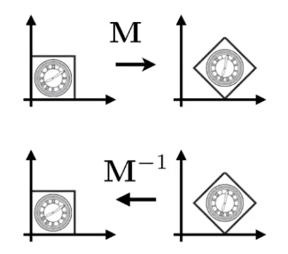

在矩阵意义和几何意义上，逆变换 $M^{-1}$ 是变换 $M$ 的逆。

对于旋转变换的逆变换，恰好为旋转变换的转置变换。

$
R(\theta)=
\begin{pmatrix}
    \cos{\theta}&-\sin{\theta} \\
    \sin{\theta}& \cos{\theta} \\
\end{pmatrix}\\
R(-\theta)=
\begin{pmatrix}
    \cos{-\theta}&-\sin{-\theta} \\
    \sin{-\theta}& \cos{-\theta} \\
\end{pmatrix}=
\begin{pmatrix}
    \cos{\theta}&\sin{\theta} \\
    -\sin{\theta}& \cos{\theta} \\
\end{pmatrix}
$

即

$
R(-\theta)=R(\theta)^{-1}
$

> 如果一个矩阵的逆等于其转置矩阵，则该矩阵为 **正交矩阵**。

## 3.5 组合变换

将图像连续地进行变换 $A_1,A_2,\dots ,A_n$ ，则可描述为矩阵形式：

$$
A_n(...A_2(A_1(x))) =
 A_n\dots A_2 \cdot A_1 \cdot
\begin{pmatrix}
    x \\y \\1 \\
\end{pmatrix}
$$

齐次坐标抹消了组合不同仿射变换的鸿沟，使矩阵表示丰富的组合变换变为可能。

将变换视为组合变换后进行分解可以简化分解过程。

如对于将某图像围绕某点 $c$ 进行旋转，可视为将某图像沿向量 $c$ 进行平移，再围绕某点 $c$ 进行旋转。

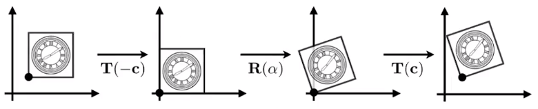

因此有如下解决方案：

$R(\alpha ,c) = T(c)\cdot R(\alpha) \cdot T(-c)$

## 3.6 3D 变换

### 3.6.1 3D 齐次坐标

设 3D 点坐标 $(x,y,z,1)^T$  
设 3D 向量 $(x,y,z,0)^T$

定义 4 行 1 列矩阵 $
\begin{pmatrix}
    x\\ y\\ z\\ w\\
\end{pmatrix}
$ 为 3D 点 $
\begin{pmatrix}
    x/w\\ y/w\\ z/w \\ 1\\
\end{pmatrix}
$ ，其中 $w \neq 0$

### 3.6.2 3D 仿射变换

#### 3D 点的仿射变换

$$
\begin{pmatrix}
    x'\\ y'\\ z'\\ 1\\
\end{pmatrix}=
\begin{pmatrix}
    a & b & c & t_x \\
    d & e & f & t_y \\
    g & h & i & t_z \\
    0 & 0 & 0 & 1 \\
\end{pmatrix}
\begin{pmatrix}
    x \\ y \\ z \\ 1 \\
\end{pmatrix}=
\begin{pmatrix}
    ax + by + cz + t_x \\
    dx + ey + fz + t_y \\
    gx + hy + iz + t_z \\
    1 \\
\end{pmatrix}
$$

#### 3D 点的缩放变换

$
S(s_x,s_y,s_z) =
\begin{pmatrix}
    s_x & 0 & 0 & 0 \\
    0 & s_y & 0 & 0 \\
    0 & 0 & s_z & 0 \\
    0 & 0 & 0 & 1 \\
\end{pmatrix}
$

#### 3D 点的平移变换

$
T(t_x,t_y,t_z) =
\begin{pmatrix}
    1 & 0 & 0 & t_x \\
    0 & 1 & 0 & t_y \\
    0 & 0 & 1 & t_z \\
    0 & 0 & 0 & 1 \\
\end{pmatrix}
$

#### 3D 点的旋转变换

绕任意轴的 3D 旋转都可分解为分别绕 $x$、$y$、$z$ 轴的旋转。

如绕某轴顺时针旋转 $\alpha$ 角的旋转矩阵：

$
R_x(\alpha) =
    \begin{pmatrix}
        1 &0 &0 &0\\
        0 &\cos{\alpha} &-\sin{\alpha} &0\\
        0 &\sin{\alpha} &\cos{\alpha} &0\\
        0 &0 &0 &1\\
    \end{pmatrix}
$

$
R_y(\alpha) =
    \begin{pmatrix}
        \cos{\alpha} &0 &\sin{\alpha} &0\\
        0 &1 &0 &0\\
        -\sin{\alpha} &0 &\cos{\alpha} &0\\
        0 &0 &0 &1\\
    \end{pmatrix}
$

$
R_z(\alpha) =
    \begin{pmatrix}
        \cos{\alpha} &-\sin{\alpha} &0 &0\\
        \sin{\alpha} &\cos{\alpha} &0 &0\\
        0 &0 &1 &0\\
        0 &0 &0 &1\\
    \end{pmatrix}
$

基于此，可使用 **欧拉角** 描述物体的旋转。

欧拉角包含：

- 旋近角 $\psi$
- 章动角 $\theta$
- 自转角 $\varphi$

$$
R_{xyz}(\alpha , \beta , \gamma)=
R_{x}(\alpha)R_{y} (\beta)R_{z} (\gamma)
$$

绕 $n$ 轴（$n$ 过原点）顺时针旋转 $\alpha$ 角的旋转矩阵：

$$
R(n,\alpha) = \\
\cos{(\alpha)} I+(1-\cos{(\alpha)})nn^T+\sin(\alpha)
\begin{pmatrix}
    0&-n_z&n_y\\
    n_z&0&-n_x\\
    -n_y&n_x&0\\
\end{pmatrix}
$$

## 3.7 观测变换

观测变换 (Viewing transformation) 。

### 3.7.1 视图变换

视图变换 (View transformation) 象征着观察角度的变化。

观察者（一般指相机 camera）有如下属性：

- $\vec{e}$ 位置 Position
- $\hat{g}$ 面部朝向 Loot-at / Gaze direction
- $\hat{t}$ 顶部朝向 Up direction

约定：观察者具有固定的属性：

- $\vec{e}=(0,0,0)^T$
- $\hat{g} = (0,0,-1)^T$
- $\hat{t}= (0,1,0)^T$

定义 $M_{\text{view}}$ 以将观察者从当前位置初始化:

- 将 $\vec{e}$ 平移至原点；
- 将 $\hat{g}$ 旋转至 $-Z$；
- 将 $\hat{t}$ 旋转至 $Y$；
- 将 $\hat{g} \times \hat{t}$ 旋转至 $X$；

$
M_{\text{view}}=R_{\text{view}}T_{\text{view}}
$

$
T_{\text{view}}=
\begin{bmatrix}
    1&0&0&-e_x\\
    0&1&0&-e_y\\
    0&0&1&-e_z\\
    0&0&0&1\\
\end{bmatrix}
$

$
R_{\text{view}}=
\begin{bmatrix}
    (\hat{g} \times \hat{t})_x&(\hat{g} \times \hat{t})_y&(\hat{g} \times \hat{t})_z&0\\
    \hat{t}_x&\hat{t}_y&\hat{t}_z&0\\
    (\hat{-g})_x&(\hat{-g})_y&(\hat{-g})_z&0\\
    0&0&0&1\\
\end{bmatrix}
$

$R_{\text{view}}$ 为 $R_{\text{view}}^{-1}$ 逆矩阵，且为旋转矩阵之逆矩阵。

将相机归位，同时可将物体跟随相机变换。

即以观察者属性建立新的坐标系。

### 3.7.2 投影变换

#### 正交投影

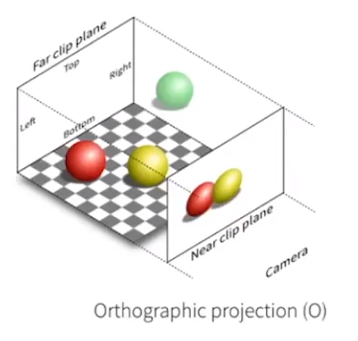

正交投影中，互相平行的线将平行。

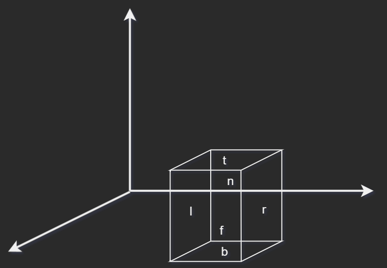  
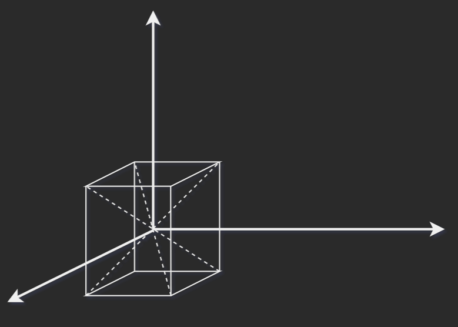  
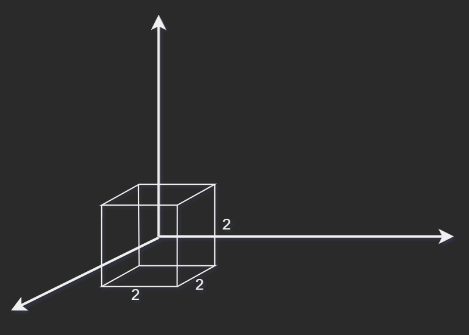

$x = l \equiv \text{left plane}$  
$x = r \equiv \text{right plane}$  
$y = b \equiv \text{bottom plane}$  
$y = t \equiv \text{top plane}$  
$z = n \equiv \text{near plane}$  
$z = f \equiv \text{far plane}$

转换矩阵：

$
M_{\text{ortho}}=
\begin{bmatrix}
\frac{2}{r-l}&0&0&0\\
0&\frac{2}{t-b}&0&0\\
0&0&\frac{2}{n-f}&0\\
0&0&0&1\\
\end{bmatrix}
\begin{bmatrix}
1&0&0&-\frac{r+l}{2}\\
0&1&0&-\frac{t+b}{2}\\
0&0&1&-\frac{n+f}{2}\\
0&0&0&1\\
\end{bmatrix}
$

注：约定正交投影将缩放至规范 (canonical) 立方体（$\begin{bmatrix}-1&1\end{bmatrix}^3$）。渲染时将再缩放回原比例。

右手系中远的 $z$ 反而小，而左手系则正常。

#### 透视投影

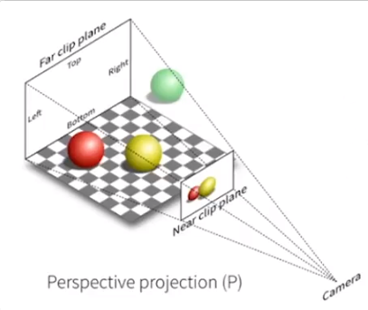

透视投影中，互相平行的线将汇聚至一点。

即 **近大远小** 。

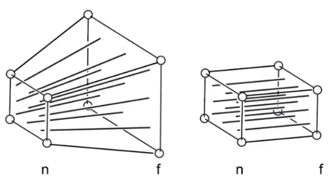

透视投影意味着将截头锥体视场转换为立方体。随后再进行正交投影即可。

规定：

- 近平面保持不变。
- 远平面 $z$ 保持不变。
- 远平面中心点保持不变。

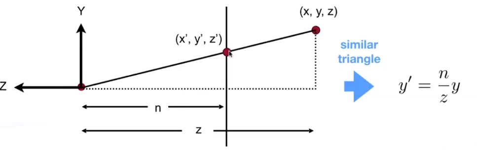

因此

$
y'=\dfrac nz y
$

同理

$
x'=\dfrac nz x
$

$
M_{{persp}\rightarrow{ortho}} =
\begin{bmatrix}
n&0&0&0\\
0&n&0&0\\
0&0&n+f&-nf\\
0&0&1&0\\
\end{bmatrix}
$

$
M_{persp}=M_{ortho}M_{{persp}\rightarrow{ortho}}
$

定义投影变换的视锥：

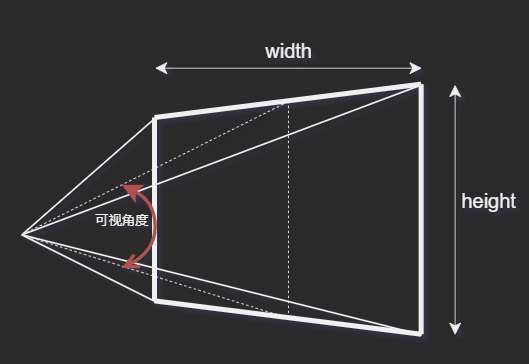

视界宽度： $\text{width}$  
视界高度： $\text{height}$  
纵横比 (aspect ratio)： $\text{width}/\text{height}$  
水平可视角度 (Vertical Field of View)： $\text{visual cone}$

可据此计算 $l$ $r$ $b$ $t$

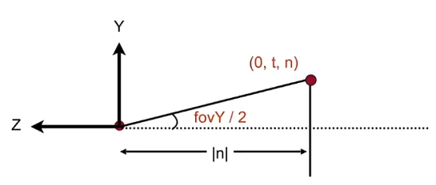

$
\tan{\frac{\text{fovY}}{2}}= \frac{t}{\lvert n \rvert}
$

$
\text{aspect} = \frac{r}{t}
$
