# 3. 数据库设计

## 3.1 数据库设计概述

### 3.1.1 数据库设计的含义

数据库设计指：

- **广义** 数据库设计是指数据库及其应用系统的设计，即设计整个的数据库应用系统。
- **狭义** 数据库设计是指数据库本身的设计，即设计数据库的各级模式并建立数据库，这是数据库应用系统设计的一部分。

**数据库设计** 一般采用广义解释：指根据用户需求研制数据库结构的过程。  
即根据用户的信息需求、处理需求和数据库的处理环境，构造最优的数据库模式，建立数据库及其应用系统，使之能有效的存储数据，满足用户的信息要求和处理要求。

为用户和各种应用系统提供一个信息基础设施和高效率的运行环境，包括：

- **数据的存取效率** 如巨大数据库的查询、存储。
- **存储空间利用率** 冗余字段的处理。
- **系统运行管理效率** 系统运行的方便管理、安全。

数据库设计应与应用系统设计相结合。

### 3.1.2 数据库设计的特点

- 反复性 (interative)
- 试探性 (tenative)
- 多阶段 (multistage)
- 数据库建设需将技术、管理和基础数据相结合。
- 数据库设计需将结构设计与行为设计（用户行为）相结合。
- 数据库设计涉及多学科领域（数据库、开发软件、软件工程、相关领域）。

### 3.1.3 数据库设计的基本步骤

准备工作：

参与设计人员：

- 数据库分析设计人员
  - 数据库设计的核心人员。
  - 自始至终参与数据库设计。
  - 其水平决定了数据库系统的质量。
- 用户
  - 在数据库设计中也是举足轻重的。
  - 主要参加需求分析和数据库的运行维护。
  - 用户积极参与带来的好处。
  - 加速数据库设计。
  - 提高数据库设计的质量。
- 程序员
  - 在系统实施阶段参与进来，负责编制程序。
- 操作员
  - 在系统实施阶段参与进来，准备软硬件环境。

## 3.2 需求分析

### 3.2.1 需求分析的步骤

需求分析任务：

- 通过详细调查现实世界要处理的对象（组织、部门、企业等），充分了解原系统（手工系统或计算机系统）工作概况，明确用户的各种需求。
- 在此基础上确定新系统的功能。新系统必须充分考虑今后可能的扩充和改变，不能仅仅按当前应用需求来设计数据库。

需求分析的重点是调查、收集与分析用户在数据管理中的信息要求、处理要求、安全性与完整性要求。

- 信息要求
  - 用户需要从数据库中获得信息的内容与性质。
  - 由用户的信息要求可以导出数据要求，即在数据库中需要存储哪些数据。
- 处理要求
  - 对处理功能的要求。
  - 对处理的响应时间的要求。
  - 对处理方式的要求(批处理 / 联机处理)。
- 安全性与完整性要求

确定用户最终需求的难点：

- **用户** 缺少计算机知识，开始时无法确定计算机究竟能为自己做什么，不能做什么，因此无法一下子准确地表达自己的需求，他们所提出的需往往不断地变化。
- **设计人员** 缺少用户的专业知识，不易理解用户的真正需求，甚至误解用户的需求。
- **新的硬件、软件技术的出现** 也会使用户需求发生变化。

解决方法：

- 设计人员必须采用有效的方法，与用户不断深入地进行交流，才能逐步得以确定用户的实际需求

需求分析步骤：

- 现系统调查
- 业务及需求分析
- 综合、调整
- 编写需求分析报告

### 3.2.2 需求分析常用调查方法

- 调查组织机构情况。
  - 组织部门的组成情况。
  - 各部门的职责等。
- **调查各部门的业务活动情况**。
  - 各个部门输入和使用什么数据。
  - 如何加工处理这些数据。
  - 输出什么信息。
  - 输出到什么部门。
  - 输出结果的格式是什么。
- **在熟悉业务活动的基础上,协助用户明确对新系统的各种要求**。
  - 信息要求。
  - 处理要求。
  - 完全性与完整性要求。
- 对前面调查的结果进行初步分析。
  - 确定新系统的边界。
  - 确定哪些功能由计算机完成或将来准备让计算机完成。
  - 确定哪些活动由人工完成。由计算机完成的功能就是新系统应该实现的功能。

做需求调查时，往往需要同时采用多种方法：

- 无论使用何种调查方法，都必须有用户的积极参与和配合。
- 设计人员应该和用户取得共同语言，帮助不熟悉计算机的用户建立数据库环境下的共同概念，并对设计工作的最后结果共同承担责任。

常用调查方法：

- 跟班作业。
  - 通过亲身参加业务工作了解业务活动的情况。
  - 能比较准确地理解用户的需求，但比较耗时。
- 开调查会：通过与用户座谈来了解业务活动情况及用户需求。
- 请专人介绍。
- 询问：对某些调查中的问题，可以找专人询问。
- 设计调查表请用户填写。
  - 如果调查表设计合理，则很有效，且易于为用户接受。
- 查阅记录：查阅与原系统有关的数据记录。

### 3.2.3 需求分析的描述

分析和表达用户的需求的常用方法是 **自顶向下的结构化分析方法** (Structured Analysis) ，简称 SA 方法 SA 方法从最上层的系统组织机构入手，采用逐层分解的方式分析系统，并用 **数据流图** 和 **数据字典** 描述系统。

**数据流图** (DFD) 是一种图形化的系统模型。它在一张图中展示信息系统的主要需求，即：输入、输出、过程和数据存储。它描述了数据流动、存储、加工（处理）的逻辑关系。

- 与程序流程图不同，DFD 不表示程序的控制结构，只描述 **数据的流动** 。
- DFD 分成 **多层** 表示, 从而逐步展开数据流和功能的细节。

DFD 分层绘制方法：

- 先画出顶层 DFD 。
- 自顶向下分解各层 DFD 。
  - 分解后的软件成分有相对独立功能。
  - 一次分解不要加入过多细节。
- 按功能情况定，一般深度为 3-5。
- 超过 5 个加工一般进行分解。

**数据字典** (DD,Data Dictionary) 是各类数据描述的集合。数据字典是进行详细的数据收集和数据分析所获得的主要结果，在数据库设计中占有很重要的地位。

数据字典的内容：

- 数据元素（数据项）
- 数据结构
- 数据流（数据的传播途径）
- 数据存储
- 处理过程

其中：

- **数据元素** （数据项）是数据的最小组成单位。
  - 对数据元素的描述
    - 数据项名
    - 数据项含义说明
    - 别名
    - 数据类型
    - 长度
    - 取值范围
    - 取值含义
    - 与其他数据项的逻辑关系
  - 取值范围、与其他数据项的逻辑关系定义了数据的完整性约束条件
- 若干个数据元素可以组成一个 **数据结构** 。
  - 数据结构反映了数据之间的组合关系。
  - 一个数据结构可以由若干个数据项组成，也可以由若干个数据结构组成，或由若干个数据项和数据结构混合组成。
  - 对数据结构的描述
  - 数据结构名
    - 含义说明
    - 组成:{ 数据项或数据结构 }
- **数据流** 是数据结构在系统内传输的路径。
  - 数据字典通过对数据项和数据结构的定义来描述数据流、数据存储的逻辑内容。
  - 对数据流的描述
    - 数据流名
    - 说明
    - 数据流来源  
      说明该数据流来自哪个过程。
    - 数据流去向  
      说明数据流将到哪个过程去。
    - 组成:{ 数据结构 }
    - 平均流量  
      指在单位时间（每天、每周、每月等）里的传输次数。
    - 高峰期流量是指在高峰时期的数据流量
- **数据存储** 是数据结构停留或保存的地方，也是数据流的来源和去向之一。
  - 对数据存储的描述
    - 数据存储名
    - 说明
    - 编号
    - 流入的数据流  
      指出数据来源
    - 流出的数据流  
      指出数据去向
    - 组成:｛数据结构｝
    - 数据量  
      每次存取多少数据，每天（或每小时、每周等）存取几次等信息
    - 存取方式  
      批处理 / 联机处理；检索 / 更新；顺序检索 / 随机检索
- **处理过程** 一般用判定表或判定树来描述。
  - 数据字典中只需要描述处理过程的说明性信息。
  - 加工逻辑说明性信息的描述
    - 加工名
    - 编号
    - 说明
    - 输入:｛数据流｝
    - 输出:｛数据流｝
    - 处理:｛简要说明｝

简要说明：主要说明该处理过程的功能及处理要求

- 功能：该处理过程用来做什么
- 处理要求：处理频度要求（如单位时间里处理多少事务，多少数据量），响应时间要求等
- 处理要求是后面物理设计的输入及性能评价的标准

## 3.3 概念设计

### 3.3.1 概念设计的方法

概念模型是数据库设计的关键。  
概念模型应做到：

- 能够充分反映现实世界的事物。
- 表达自然、直观、易于理解，便于和不熟悉计算机的用户交换意见，用户易于参与。
- 易于修改和扩充。
- 易于向关系、网状、层次等数据模型转换。

常见模型：ER 模型、面向对象模型。  
常用策略：

- 自顶向下 进行需求分析
- 自底向上 设计概念结构
- ER 设计方法

自底向上设计概念结构的步骤：

- 抽象数据并设计局部视图
- 集成局部视图，得到全局概念结构

### 3.3.2 E-R 方法

#### 3.3.2.1 数据抽象与局部视图设计

- 数据抽象
  - 对需求分析阶段收集到的数据进行抽象、分类、组织，形成：
    - 实体
    - 实体的属性，标识实体的码
    - 确定实体之间的联系类型 (1:1,1:n,m:n)
- 局部视图设计
  - 选择局部应用
  - 逐一设计分 E-R 图
- 数据抽象的手段
  - **分类** (Classification)  
    定义某一类概念作为现实世界中一组对象的类型。  
    这些对象具有某些共同的特性和行为。  
    即 **is member of** 。
  - **聚集** (Aggregation)  
    定义某一类型的组成成分。  
    抽象了对象内部类型和成分之间的继承语义。  
    子类继承超类（父类）上定义的所有抽象。  
    即 **is part of** 。
  - **概括** (Generalization)  
    定义类型之间的子集联系。  
    抽象了类型之间的语义。  
    即 **is subset of** 。
- 数据抽象三原则
  - **原子性** 实体可进一步描述，而属性不能。
  - **依赖性** 属性仅单向依赖于某个实体。
  - **一致性** 一个实体由若干属性组成，这些属性之间有着内在的关联性与一致性。

#### 3.3.2.2 集成局部视图

各个局部视图（即分 E-R 图）建立后，需将它们集成为一个整体的数据概念结构即总 E-R 图。  
可分为 **一次集成** 和 **逐步累积式**。

集成包含两个步骤：合并与消除冗余。

合并：

- 解决冲突, 合并分 E-R 图,形成初步 E-R 图
- 冲突：各分 E-R 图存在的不一致。
  - 各个局部应用所面向的问题不同。
  - 由不同设计人员设计各个分 E-R 图之间可能存在不一致。
- 冲突的种类：
  - **属性冲突** 指属性值类型、取值范围或取值集合在不同的 E-R 图中定义不同。
  - **命名冲突** 包括同名异义、异名同义。
  - **同名异义** 不同意义的对象在不同的局部应用中具有相同的名字。
  - **异名同义** 同一意义的对象在不同的局部应用中具有不同的名字。
  - **结构冲突**
  - 同一对象在不同应用中具有不同的抽象。
  - 同一实体在不同分 E-R 图中所包含的属性个数和属性排列次序不完全相同。
  - 实体之间的联系在不同局部视图中呈现不同的类型。

消除冗余：

- 在初步 E-R 图中，可能存在一些冗余的数据和实体间冗余的联系。
- 冗余数据和冗余联系容易破坏数据的完整性，给数据库维护增加困难，应予以消除。
- 消除了冗余后的初步 E-R 图称为基本 E-R 图。
  - **冗余的数据** 指可由基本数据导出的数据。
  - **冗余的联系** 指可由其他联系导出的联系。

消除冗余的方法：

- 分析方法
  - 以数据字典和数据流图为依据。
  - 根据数据字典中关于数据项之间的逻辑关系。
- 规范化理论
  - 函数依赖的概念提供了消除冗余联系的形式化工具。
  - 确定实体间的数据依赖，求其最小覆盖。

### 3.3.3 基本 E-R 模型的扩充

### 3.3.4 扩展 E-R 模型

## 3.4 逻辑设计

- 逻辑结构设计的任务
  - 把概念结构设计阶段设计好的基本 E-R 图转换为与选用。 DBMS 产品所支持的数据模型相符合的逻辑结构。
- 逻辑结构设计的步骤
  - 将概念结构转化为关系模型。
  - 将关系模型向特定 DBMS 支持下的数据模型转换。
  - 对数据模型进行优化。

### 3.4.1 E-R 模型转换为关系模型

#### 3.4.1.1 将实体转换为关系模式

将实体的属性转换为关系的属性。

- 属性域
- 非原子属性
- 弱实体集的转换
  > 某实体集的所有属性都不足以形成主码，这样的实体集称为 **弱实体集** (Weak entity)。  
  > 与此相对，其属性可以形成主码的实体集称为 **强实体集** 。
  - 作为其识别实体的属性：  
    当弱实体集只参与标识联系、并且属性较少时，可将弱实体集作为其依赖的强实体集的属性。
  - 作为单独的实体集：  
    当弱实体集不仅参与标识联系或者属性较多时，通过添加识别实体的主码使其成为单独的实体集。

#### 3.4.1.2 将关系转换为关系模式

将实体的码转换为关系的码。

- **1:1 联系** 转换为一个独立的关系模式，也可以与任意一端对应的关系模式合并。
- **1:n 联系** 转换为一个独立的关系模式，也可以与 n 端对应的关系模式合并。
- **m:n 联系** 转换为一个独立的关系模式。
- **m:n:p 多元联系** 转换为一个独立的关系模式。
- **泛化联系**

  - 方法 1 ：超类与子类实体都创建关系，子类含外键。
  - 方法 2 ：不为超类实体集创建关系，直接为子类实体集创建关系。
    > ![泛化联系][pic-isa]
    >
    > 方法 1 ：
    >
    > 学生 (stuId,stuname)  
    > 研究生 (stuId,group,teacher)  
    > 本科生 (stuId,major)  
    > 硕士生 (stuId,type)  
    > 博士生 (stuId,assistant)
    >
    > 方法 2 ：
    >
    > 研究生 (stuId,stuname,group,teacher)  
    > 本科生 (stuId,stuname,major)  
    > 硕士生 (stuId,type)  
    > 博士生 (stuId,assistant)  

    方法 2 将超类关系合并到其子类，可减少关系连接操作，提高效率。

### 3.4.2 数据模式的优化

得到初步数据模型后，还应该适当地修改、调整数据模型的结构，以进一步提高数据库应用系统的性能，即数据模型的优化。

关系数据模型的优化通常以 **规范化理论** 为指导。

#### 规范化处理

- 需求分析阶段，用数据依赖的概念分析表示各数据之间的联系。  
- 在概念结构设计阶段，用规范化理论为工具，消除 E-R 图中冗余的关系。  
- 在由基本 E-R 模型向关系数据模型转换的过程中，用模式分解的概念和算法指导设计。  

#### 数据库性能优化

- 减少连接运算（减少参与的表 / 减少查询的层次）
- 尽可能使用快照（数据不需要随时都是最新的）
- 节省属性占用的存储空间（如编码大小）

### 3.4.3 设计用户外模式

将 E-R 模式转换为逻辑模型后，还应根据局部应用需求，结合具体 DBMS 的特点，设计用户的外模式。  

定义用户外模式时应该注重的问题：  

- 重定义属性名，即使用更符合用户习惯的别名。  
- 方便查询。简化用户对系统的使用。  
- 提高数据安全性和共享性，针对不同级别的用户定义不同的视图。  
- 提供一定的逻辑数据独立性。视图一般随数据库逻辑模式的调整、扩充而变化。  

## 3.5 物理设计

性能评价参数：

- 存储空间
- 响应时间
- 维护代价

三者常常是相互矛盾的。

## 3.6 数据库实施

## 3.7 数据库运行与维护

[pic-isa]: ..\pic\ISArelationship.svg
