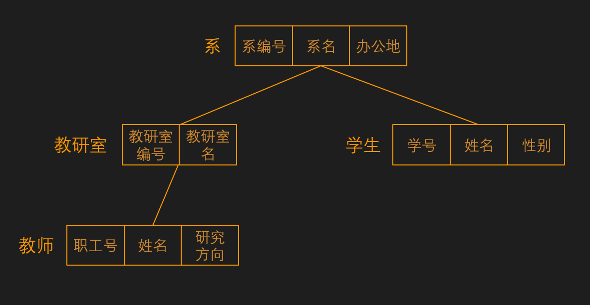
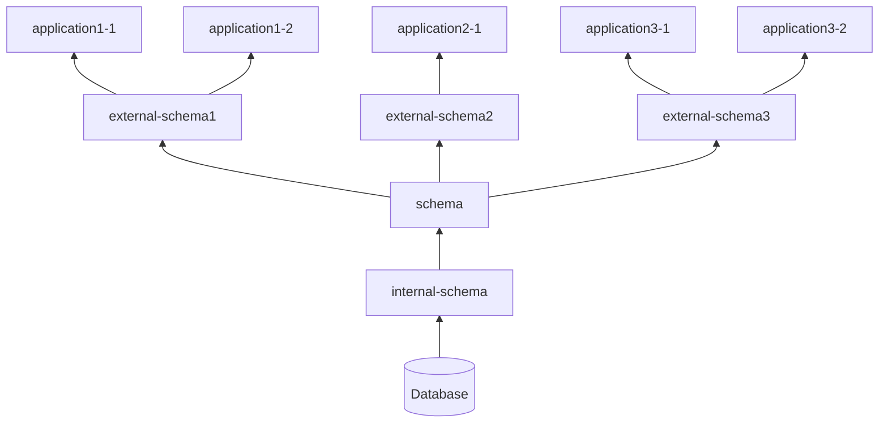
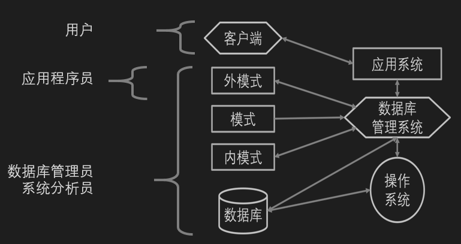

# 1. 概述

## 1.1 数据库系统概述

### 1.1.1 四个基本概念

#### 1.1.1.1 数据 (data)

**数据** 描述事物的符号记录。是数据库中存储的基本对象。  
数据的含义称为数据的语义，数据与语义是不可分的。
> 93 是一个数据
> 语义 1 ：学生某门课的成绩  
> 语义 2 ：某人的体重  
> 语义 3 ：某年级的人数  

数据形式不能完全表达内容，需要有相应**解释**。  
> 语义：学生，姓名，性别出生年份  
> 解释： 李明，男性，在 2000 年 11 月出生。

数据有 **结构性**  

#### 1.1.1.2 数据库 (database)

**数据库** 是 **长期存储** 在计算机内， **有组织** 的， **可共享** 的 **大量数据的集合** 。  

收集并抽取出一个应用所需要的大量数据，借助数据库将其保存，以供进一步加工处理，抽取有用信息，从而转换为价值。  

数据库的基本特征：  

* 数据按一定的 **数据模型** 组织、描述和存储。  
* 可为各种用户 **共享** 、 **冗余度较小** 、 **易扩展** 。  
* 数据库 **独立性** 较高。  

#### 1.1.1.3 数据库管理系统 (DataBase Management System)

**数据库管理系统** 是位于用户应用与操作系统之间的一层数据管理软件。是基础软件，是一个大型复杂的软件系统。  

主要功能：  

* 数据定义  
  * 提供数据定义语言 (DDL)  
  * 定义数据库中的数据对象  
* 数据组织、存储和管理  
  * 分类组织、存储和管理各种数据  
  * 确定数据在存储级别上的结构和存取方式  
  * 实现数据之间的联系  
  * 提供多种存取方法提高存取效率  
* 数据操纵
  * 提供数据操纵语言 (DML)  
  * 实现对数据库的基本操作（增加 删除 修改 查询）  
* 数据库事务管理和运行管理  
  * 数据的安全性、完整性、多用户对数据的并发使用  
  * 发生故障后的系统恢复数据库  
* 数据库建立和维护  
  * 提供使用程序/工具，完成数据库数据批量装载，数据库转储，介质故障恢复，数据库的重组织和性能监视等  
* 其它功能
  * 数据库管理系统与网络中其它软件系统的通信  
  * 数据库管理系统之间的数据转换  
  * 异构数据库之间的互访和互操作  

#### 1.1.1.4 数据库系统

**数据库系统** 是指计算机系统中引入数据库后的系统构成。  

在不引起混淆的情况下，常常把数据库系统简称为数据库。  

数据库系统的构成：  

* 数据库  
* 数据库管理系统  
* 应用程序  
* 数据库管理员 (DataBase Administrator,DBA)

### 1.1.2 数据管理技术

**数据管理** 指对数据进行分类、组织、编码、存储、检索和维护，是数据处理和数据分析的中心问题。  

数据的 **整体结构化** 是数据库的主要特征之一。  
数据用数据模型描述，无需应用程序定义。  

数据面向整个系统，可以被多个用户、多个应用共享应用。  

* 减少数据冗余  
* 避免数据之间的不相容性与不一致性  
* 使系统易于扩充  

数据独立性：  

* **物理独立性** 指用户的应用程序与数据库中的物理存储是相互独立的，当数据的物理存储改变了，应用程序不用改变。  
* **逻辑独立性** 指用户的应用程序与数据库的逻辑结构是相互独立的。数据的逻辑结构改变了，应用程序不用改变。  

## 1.2 数据模型

数据模型是对现实世界数据特征的抽象。  

即 数据模型是对现实世界的 **模拟** 。  

数据模型应满足三方面要求：  

* 能比较真实地模拟现实世界。  
* 容易为人所理解。  
* 便于在计算机上实现。  

数据模型是数据库系统的 **核心** 和 **基础** 。  

### 1.2.1 两类数据模型

数据模型分为两个不同的层次。  

* **概念模型** （信息模型）  
它是按 **用户** 的观点来对数据和信息建模，用于数据库设计。  
* **逻辑模型** 和 **物理模型**  
  * 逻辑模型是按 **计算机系统** 的观点对数据建模。主要包括：网状模型、层次模型、关系模型、面向对象数据模型、对象关系数据模型、半结构化数据模型等。  
  * 物理模型是对数据最底层的抽象。描述数据在系统内（磁盘上）的表示方法和存取方法。  

```Mermaid
graph TB

realworld[现实世界 真实对象]--认识抽象-->infoworld[信息世界 概念模型] --> machworld[机器世界 机器支持的数据模型]
```

### 1.2.2 概念模型

#### 1.2.2.1 概念模型的用途

* 概念模型用于信息世界的建模  
* 现实世界到机器世界的中间层次  
* 数据库设计的有力工具  
* 数据库设计人员和用户之间进行交流的语言  

#### 1.2.2.2 概念模型的基本要求

* 较强的语义表达能力  
* 简单、清晰、易于用户理解  

#### 1.2.2.3 信息世界的基本概念  

* **实体** (entity) 客观存在并可相互区别的事物。可以是具体的人、事、物或抽象的概念。  
* **属性** (attribute) 实体所具有的某一特性，一个实体可以由若干个属性来刻画。  
* **码** (key) 唯一标识实体的属性集称为码。  
* **实体型** (entity type) 用实体名及其属性名集合来抽象和刻画同类实体称为实体型。  
* **实体集** (entity set) 同一类型实体的集合。  
* **联系** (relationship) 现实世界中事物内部以及事物之间的联系在信息世界中反映为实体（型）内部的联系和实体（型）之间的联系。  
  * 实体内部的联系：是指组成实体的各属性之间的联系。  
  * 实体之间的联系：通常是指不同实体集之间的联系。  
  * 实体之间的联系有一对一 (1:1) 、一对多 (1:m) 、多对多 (m:n) 等多种类型。  


#### 1.2.2.4 概念模型的表示方法

实体 - 联系方法 (Entity-Relationship Approach)(E-R 图)

* 用 E-R 图来描述现实世界的概念模型。  
* E-R 方法也称为 E-R 模型。  

### 1.2.3 数据模型的组成要素

数据模型是严格定义的一组概念的集合。  
数据模型精确地描述了系统的静态特性、动态特性和完整性约束条件 (Integrity Constrains) 。  

数据模型由三部分组成：  

* **数据结构** 描述系统的静态特性  
* **数据操作** 描述系统的静态特性  
* **完整性约束**  

#### 1.2.3.1 数据结构

* 刻画数据模型性质的重要方面。  
  * 数据结构的类型来命名数据模型。  
  * 层次结构 层次模型  
  * 网状结构 网状模型  
  * 关系结构 关系模型  
* 描述数据库的组成对象（对象的类型、内容、性质）。  
* 描述对象之间的联系。  

#### 1.2.3.2 数据操作

* 对数据库中各种对象的实例允许执行的操作的集合，包括操作及有关的操作规则。  
* 数据操作的类型  
  * 查询  
  * 更新  
* 数据操作语言
  * 定义数据操作的确切含义、符号、优先级  
  * 实现数据操作的语言  
    * 查询语言 Query Language  
    * 更新语言 DML  

#### 1.2.3.3 数据的完整性约束条件

一组完整性规则的集合  

* 完整性规则：给定的数据模型中数据及其联系所具有的 **制约和依存规则** 。
* 用以限定符合数据模型的数据库状态以及状态的变化，以保证数据的 **正确、有效和相容** 。

数据模型对完整性约束条件的定义

* 反映和规定必须遵守的 **基本的通用的** 完整性约束条件。  
* 提供定义完整性约束条件的机制，以反映 **具体应用** 所涉及的数据必须遵守的 **特定的语义约束条件** 。

### 1.2.4 常用的数据模型

#### 1.2.4.1 层次模型



层次模型 (Hierarchical Model) 是一种 **格式化模型** 。  

格式化模型中数据结构的单位： **基本层次联系** 。  

```Mermaid
graph TB
双亲结点--->|"联系（一对多）"|子女结点
```

层次模型用 **树形结构** 来表示各类实体以及实体间的联系。  

表示方法：  

* 实体型：用记录类型描述  
每个结点表示一个记录类型（实体）  
* 属性：用字段描述  
每个记录类型可包含若干个字段  
* 用结点之间的连线表示记录类型（实体）之间的 **一对多的父子关系** 。  

层次模型的定义：  

满足下面两个条件的基本层次联系的集合为层次模型。  

1. 有且只有一个结点没有双亲结点，则为根结点。  
2. 根以外的其他结点有且只有一个双亲结点。  

没有子结点的结点称为叶结点。  

特点：  

* 结点的双亲是唯一的。  
* 只能直接处理一对多的实体联系。  
* 任何记录值只有按其路径查看。  
* 没有一个子女记录值能够脱离双亲记录值而独立存在。  

数据操作：  

* 查询  
* 插入  
* 删除  
* 更新  

完整性约束条件：  

* 无相应的双亲结点值就不能插入子女结点值。  
* 如果删除双亲结点值，则相应的子女结点值也被同时删除。  
* 更新操作时，应更新所有相应记录,以保证数据的一致性。  

优缺点：  

* 优点  
  * 层次模型的数据结构比较简单清晰。  
  * 查询效率高，性能优于关系模型，不低于网状模型。  
  * 层次数据模型提供了良好的完整性支持。  
* 缺点  
  * 结点之间的多对多联系表示不自然。  
  * 对插入和删除操作的限制多，应用程序的编写比较复杂。  
  * 查询子女结点必须通过双亲结点。  
  * 层次数据库的命令（语言）趋于程序化。  

#### 1.2.4.2 网状模型


网状模型 (Network Model) 是一种 **格式化模型** 。  

网状模型采用网状结构来表示各类实体以及实体间的联系。  

表示方法：（与层次模型相同）  

* 实体型：用记录类型描述  
每个结点表示一个记录类型（实体）  
* 属性：用字段描述  
每个记录类型可包含若干个字段  
* 用结点之间的连线表示记录类型（实体）之间的 **一对多的父子关系** 。  

网状模型的定义：  

满足下面两个条件的基本层次联系的集合为层次模型。  

1. 允许一个以上的结点没有双亲。  
2. 一个结点可以有多于一个的双亲。  

特点：  

* 允许多个结点没有双亲结点。  
* 允许一个结点有多个双亲结点。  
* 允许两个结点之间有多种联系。  
* 要为每个联系命名，并指出与该联系有关的双亲记录和子女记录。  
* 将多对多联系分解成一对多联系，以此间接表示多对多联系。  

数据操作：  

* 导航式查询  
* 插入  
* 删除  
* 更新  

完整性约束条件（不严格）：  

* 允许插入尚未确定双亲结点值的子女结点值。  
* 允许只删除双亲结点值。  
* **支持码** 唯一标识记录的数据项的集合，取唯一值。  
* 保证一个联系中双亲记录与子女记录之间是一对多联系。  
* 可以定义双亲记录和子女记录之间某些约束条件。  

优缺点：  

* 优点  
  * 能够更为直接地描述现实世界，如一个结点可以有多个双亲。  
  * 具有良好的性能，存储效率较高。  
* 缺点  
  * 结构比较复杂，随着应用环境的扩大，数据库的结构就变得越来越复杂，不利于最终用户掌握。  
  * DDL 、 DML 语言复杂，用户不容易使用。  
  * 记录之间联系是通过存储路径实现的，应用程序必须选择存储路径，加重程序员负担。  

#### 1.2.4.3 关系模型

关系数据库系统采用关系模型作为数据的组织方式。  
在 **用户观点** 下，关系模型中数据的逻辑结构是一张二维表。  

> 学号 | 姓名 | 年龄 | 性别 | 院系 | 年级
> :--:|:--:|:--:|:--:|:--:|:--:
> 1983 | 张三 | 19 | 男 | 社会学 | 2019
> 2086 | 李四 | 18 | 男 | 计算机学 | 2020
> 1945 | 王二 | 19 | 女 | 法律 | 2019

关系模型的数据结构：  

* 关系 (relation) 一个关系对应通常说的一张表。  
* 元组 (tuple) 表中一行即为一个元组。  
* 属性(attribute) 表中的一列即为一个属性，给每一个属性起一个名称即属性名。  
* 主码 (key) 也称为码键，表中的某个属性组，它可以唯一确定一个元组。  
* 域 (domain) 是一组具有相同数据类型的值的集合。属性的取值范围即来自此区域。
  > 性别域：男/女 未成年人年龄域：0-18  
* 分量 元组中的一个属性值。  
* 关系模式 对关系的描述。  
  > 关系名（属性 1 、属性 2 、…… 、属性 n ）  
  > 学生  （学号、姓名、年龄、性别、…… ）

关系必须是 **规范化** 的，满足一定的条件。  
最基本的规范条件：关系的每一个分量必须是一个不可分的数据项，不允许「表中有表」。  

数据操作：  

* 查询  
* 插入  
* 删除  
* 更新  

存取路径对用户隐蔽，用户只要指出「找什么」，不必详细说明「怎么找」。  
如此提高了数据的独立性，提高了用户生产效率。  

完整性约束条件：  

* 实体完整性  
* 参照完整性  
* 用户定义完整性  

优缺点：  

* 优点  
  * 建立在严格的数学概念的基础上。  
  * 概念单一。  
    * 实体和各类联系都用关系来表示。  
    * 对数据的检索结果也是关系。  
  * 关系模型的存取路径对用户透明。  
    * 具有更高的数据独立性，更好的安全保密性。  
    * 简化了程序员的工作和数据库开发建立的工作。  
* 缺点  
  * 存取路径对用户透明，查询效率往往不如格式化数据模型。  
  * 为提高性能，必须对用户的查询请求进行优化，增加了开发数据库管理系统的难度。  

#### 1.2.4.4 面向对象数据模型

面向对象数据模型 (Object Oriented Data Model) 是一种 **对象模型** 。  

#### 1.2.4.5 对象关系数据模型

对象关系数据模型 (Object Relational Data Model) 是一种 **对象模型** 。  

#### 1.2.4.6 半结构化数据模型

#### 1.2.4.7 非结构化数据模型、图模型

## 1.3 数据库系统的结构

数据库系统的结构可以两种角度看待： **开发人员角度** 和 **最终用户角度** 。  

### 1.3.1 开发人员角度

从开发人员角度，数据库系统的结构为 **三级模式结构** 。  



**模式** (schema) 是对数据库逻辑结构和特征的描述。是型的描述，不涉及具体值。模式是相对稳定的。  

**实例** (instance) 数据库某一时刻的状态（模式的一个具体值）。同一个模式可以有许多实例。实例随数据库中的数据的更新而变动。  

**模式** 之于 **实例**  
相当于  
**类** 之于 **对象**  

#### 1.3.1.1 三级模式结构  

三级模式是对数据的三个抽象级别。  

* **外模式** (external schema) （子模式/用户模式）  
  * 描述
    * 数据库用户使用的 **局部** 数据的逻辑结构和特征的描述。  
    * 数据库用户的数据视图，是与某一应用有关的数据的逻辑表示。  
  * 与模式的关系
    * 外模式通常是模式的子集，一个模式可以有多个外模式，反映了不同的用户的应用需求、看待数据的方式、对数据保密的要求。  
    * 对模式中某一数据，在不同的外模式中结构、类型、长度、保密级别等都可以不同。  
  * 与应用的关系  
    * 一个外模式可以为多个应用系统所使用，一个应用程序只能使用一个外模式。  
  * 用途
    * 每个用户只能看见和访问所对应的外模式中的数据，简化用户视图。  
    * 保证数据库安全性的一个有力措施。  
* **模式** (schema)  
  * 描述  
    * 数据库中全体数据的逻辑结构和特征的描述。  
    * 所有用户的公共数据视图。  
    * 模式是数据库系统结构的**中心**。  
  * 定义模式  
    * DDL 定义数据的逻辑结构，以某种数据模型为基础。  
      数据记录由哪些数据项构成，数据项的名字、类型、取值范围等。  
    * 定义数据之间的联系。  
    * 定义数据有关的安全性、完整性要求。  
* **内模式** (internal schema) （存储模式）  
  * 描述  
    * 是数据物理结构和存储方式的描述。  
    * 是数据在数据库内部的表示方式。
      * 记录的存储方式（顺序存储/堆存储/ hash 方法存储）。  
      * 索引的组织方式（ B+ 树， Bitmap ， Hash ）。  
      * 数据是否压缩存储。  
      * 数据是否加密。  
      * 数据存储记录结构的规定（定长/变长，记录是否可以跨页存放等）。  
    * 一个数据库 **只有一个** 内模式。  

#### 1.3.1.2 二级映像功能与数据独立性

数据库管理系统内部提供二级映像，以建立三个抽象层次的联系与转换。  

* **外模式/模式映像**
  * 保证数据逻辑独立性  
    * 当模式改变时，数据库管理员对 外模式/模式映像 做相应改变，使外模式保持不变。  
    * 应用程序是依据数据的外模式编写的，应用程序不必修改，保证了数据与程序的逻辑独立性。
* **模式/内模式映像** 定义了数据全局逻辑结构与存储结构之间的对应关系。如，说明某个逻辑记录对应何种存储结构。  
  * 保证数据的物理独立性  
    * 当数据库的存储结构改变了（例如选用了另一种存储结构），数据库管理员修改 模式/内模式映像 ，使模式保持不变。  
    * 模式不变，则应用程序不变。保证了数据与程序的物理独立性，简称数据的物理独立性。  

二级映像功能保证了应用程序的 **稳定性** 。除非应用需求本身发生变化，否则应用程序一般不需要修改。  
以程序为中心 >>>>> 以数据为中心  
具有了数据与程序之间的独立性，使得数据的定义和描述可以从应用程序中分离出去。  

数据的存取由数据库管理系统管理。  

* 简化了应用程序的编制。  
* 大大减少了应用程序的维护和修改。  

### 1.3.2 最终用户角度

* 单用户结构
* 主从式结构
* 分布式结构
* 客户 - 服务器结构
* 浏览器 - 应用服务器 / 数据库服务器结构

## 1.4 数据库系统的组成

### 1.4.1 硬件平台及数据库

数据库系统对硬件资源的要求  

* 足够大的内存  
* 足够大的磁盘或磁盘阵列等外部设备  
* 较高的通道能力，提高数据传送率  

### 1.4.2 软件

数据库系统的相关软件  

* 支持数据库管理系统运行的 **操作系统**  
* 与数据库接口的 **高级语言** 及其 **编译系统**  
* 以数据库管理系统为核心的 **应用开发工具**  
* 为特定应用环境开发的 **数据库应用系统**  

### 1.4.2 人员

开发和使用数据库的人员  

* 数据库管理员  
* 系统分析员和数据库设计人员  
* 应用程序员  
* 最终用户  

  

#### 1.4.2.1 数据库管理员

职责：  

* 数据库构建  
  * 确定信息内容和结构  
  * 存储结构与存储策略设计  
  * 确定数据安全性要求和完整性约束  
* 数据库维护  
  * 周期性转储数据库  
    * 数据  
    * 日志  
  * 系统故障恢复  
  * 介质故障恢复  
  * 监视审计文件  
* 数据库提升  
  * 性能监控和调优  
  * 定期对数据库进行重组织  
  * 需求更新时，数据库需要重构造  

#### 1.4.2.2 系统分析员、数据库设计人员与应用程序员

分析  

* 负责应用系统的需求分析和规范说明  
* 与用户及数据库管理员结合，确定系统的硬软件配置  
* 参与数据库系统的概要设计  

设计  

* 参加用户需求调查和系统分析  
* 确定数据库中的数据  
* 设计数据库各级模式  

程序  

* 设计和编写应用系统的程序模块  
* 进行调试和安装  

### 1.4.2.3 用户

用户指最终用户 (End User)，他们通过应用系统的用户接口使用数据库。  

* 偶然用户  
  * 不经常访问数据库，但每次访问数据库时往往需要不同的数据库信息。  
  * 企业或组织机构的高中级管理人员。  
* 简单用户  
  * 主要工作是查询和更新数据库  
  * 银行的职员、机票预定人员、旅馆总台服务员。  
* 复杂用户  
  * 工程师、科学家、经济学家、科技工作者等。  
  * 直接使用数据库语言访问数据库，甚至能够基于数据库管理系统的应用程序接口编制自己的应用程序。  
  