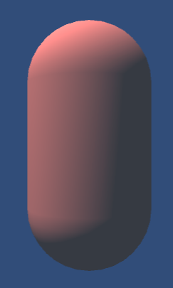
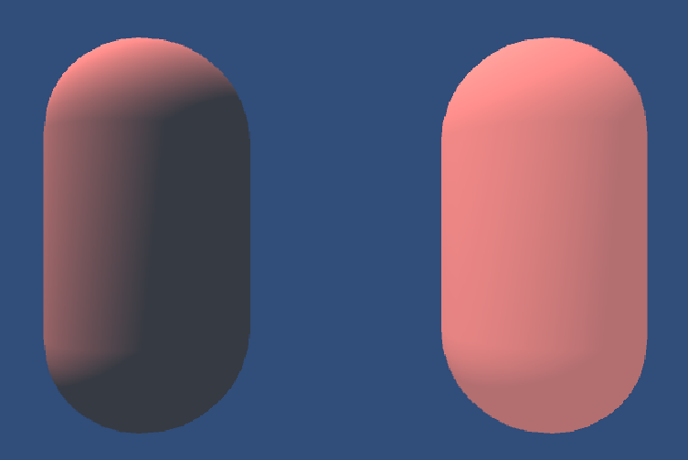
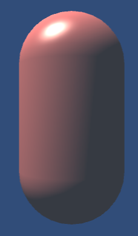
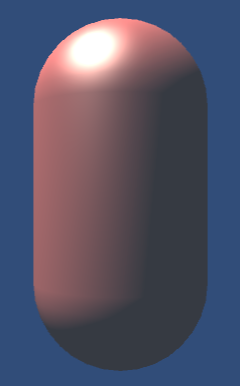

# Unity Shader Note

## 渲染管线

**渲染管线** 即 **渲染流水线** ，是显卡内部处理图形信号且相互独立的并行处理单元。

渲染管线在概念上总体分为三个阶段：

- 应用阶段 (Application Stage)
  - 应用阶段由开发者主导。
  - 开发者将确定：
    - 摄像机位置、场景中的物体、所使用的光源、视角类型等场景数据。
    - 粗粒度剔除，剔除不可见物体。
    - 设置渲染状态，即材质、纹理、所使用的 Shader 等。
  - 此阶段输出 **渲染图元** (rendering primitives) ，即点、线、面等。
- 几何阶段 (Geometry Stage)
  - 几何阶段确定与几何相关的工作，如将顶点坐标变换到屏幕空间。
  - 此阶段输出 **顶点信息** 。
- 光栅化阶段 (Rasterizer Stage)
  - 几何阶段将利用顶点信息绘制屏幕上的像素，以渲染出最终的图像。


实践中，渲染管线将更加细化且复杂。

### 应用阶段

应用阶段大致分为 3 个阶段：

- 加载网格、纹理等数据至显存。
- 设置渲染状态。
- 调用 DrawCall。
  - DrawCall 是一个由 CPU 发起，GPU 接受的命令，其指定一个需要渲染的图元列表。

### 几何阶段与光栅化阶段


上图中，颜色表示了不同阶段的可配置性或可编程性：

- **绿色** 表示该流水线阶段是完全可编程控制的。
- **黄色** 表示该流水线阶段可以配置但不是可编程的。
- **蓝色** 表示该流水线阶段是由 GPU 固定实现的，开发者没有任何控制权。
- **实线** 表示该 Shader 必须由开发者编程实现。
- **虚线** 表示该 Shader 是可选的。

#### 顶点着色器

**顶点着色器** (Vertex Shader) 。

- 输入来自 CPU。
- 处理单位是顶点，这意味着每个输入的顶点都会调用一次顶点着色器。
- 主要工作：
  - 坐标变换
  - 逐顶点光照

坐标变换即对顶点坐标进行某种变换。

顶点着色器必须把顶点坐标从模型空间转换到 **齐次裁剪空间** ，最终得到归一化的设备坐标 (Normalized Device Coordinates,NDC)。

#### 裁剪

**裁剪** (Clipping) 剔除不在摄像机视野的物体。

图元与摄像机视野有 3 种关系：

- 完全在视野内
- 部分在视野内
- 完全在视野外

裁剪将部分在视野内的图元进行处理，形成新的裁剪后图元。

由于已形成 NDC，裁剪变得相对容易：


#### 屏幕映射

**屏幕映射** (Screen Mapping) 将三维的图元坐标转换到二维的屏幕坐标。

屏幕映射仅处理图元坐标的 x 与 y 值，而 z 值将作为深度坐标，与屏幕坐标系形成 **窗口坐标系**。

#### 三角形设置

从此开始进入光栅化阶段。

**三角形设置** (Triangle Setup) 阶段会计算光栅化一个三角形网格所需的信息。

输入三角网格的顶点，输出光栅化三角形网格所需要的信息。

#### 三角形遍历

**三角形遍历** (Triangle Traversal) ，也称为 **扫描变换** (Scan Conversion)，检查每个像素是否被一个三角网格覆盖。如果被覆盖则生成一个 **片元** (fragment)。

三角形遍历阶段会根据上一个阶段的计算结果判断三角形覆盖了哪些像素，并根据顶点信息对覆盖区域进行插值。


一个片元并不是真正意义上的像素，而是包含了很多状态的集合。这些由插值所生成的状态用于后续计算每个像素的最终颜色，状态包括：

- 屏幕坐标
- 深度信息
- 其他从几何阶段输出的顶点信息：
  - 法线
  - 纹理坐标等

#### 片元着色器

**片元着色器** (Fragment Shader) 输入上阶段的片元状态集合，输出片元的输出颜色。

#### 逐片元操作

**逐片元操作** (Per-Fragment Operations) 也称 **输出合并阶段** (Output-Merger)。

这一阶段的主要任务：

- 决定每个片元的可见性。
- 如果片元可见，则合并片元的颜色值和存储在颜色缓冲区的颜色。

片元需要通过模板测试、深度测试等，以判断是否可见。


- 模板测试 Stencil Test
  - 将该片元在模板缓冲区中的模板值与参考值相比较。
  - 用于限制渲染区域。
- 深度测试 Depth Test
  - 将该片元在深度缓冲区的深度值与当前深度值相比较。

通过测试后进行合并操作。

不同物体渲染后可能叠加在相同的像素上，对于不透明物体，可以关闭 **混合** (Blend) 操作。而对于半透明物体，则需要使用混合操作。


## Unity Shader

Unity 提供了 Unity Shader 以提高 Shader 开发效率。

Unity Shader 与材质 (Meterial) 共同配合以渲染对象。

### ShaderLab

Unity Shader 是 Unity 提供的高层级渲染抽象层。


ShaderLab 是一种用于编写 Unity Shader 的说明性语言，描述了显示一个材质所需的所有定义，而不仅仅是着色器代码。

Unity 将根据所使用的平台将 ShaderLab 编译成真正的代码和 Shader 文件。

### Unity Shader 结构

```unityShader {.line-numbers}
// Unity Shader 的基础结构
Shader "ShaderName" {
  Properties {
    // 属性
  }
  SubShader{
    // 显卡 A 使用的子着色器
  }
  SubShader{
    // 显卡 B 使用的子着色器
  }
  Fallback "VertexLit"
}
```

#### Shader Name

line 2 `Shader "ShaderName"`

定义 Shader 名称，可同时定义下拉列表，如 "Custom/ShaderName"

#### 属性块

line 3 `Properties{}`

定义 Shader 属性，这些属性将出现在编辑器的材质面板中。

属性使用如下语法：

`Name ("display name", PropertyType) = DefaultValue`

- `Name` 属性名用于在 Shader 中访问的标识符。
- `display name` Editor 显示名编辑器中的显示名称。
- `PropertyType` 类型编辑器中的类型。
- `DefaultValue` 默认值

```unityShader
Properties {
  _Color ("Color", Color) = (1,1,1,1)
  _Glossiness ("Smoothness", Range(0,1)) = 0.5
}
```

See-also [SL-Properties | Unity][shaderlab-properties]


Unity 支持重载默认的材质编辑面板。

Unity Shaderlab 还支持了一些特殊的纹理属性。

- 纹理平铺和偏移属性名 `float4 {TextureName}_ST`
- 纹理大小属性名 `float4 {TextureName}_TexelSize`
- 纹理 HDR 参数属性名 `float4 {TextureName}_HDR`

这些特殊纹理属性不需要在 `Properties` 块中声明，但

#### SubShader

line 6 `SubShader{}`

定义了 LOD 、一系列 **通道 `Pass`** 以及可选的 **标签 `tags`** 和 **命令 `commands`** 。

每个 Unity Shader 最少 1 个。当 Unity 加载 Unity Shader 时，将扫描所有 SubShader 语义块，然后选择首个可以在目标平台运行的 SubShader，否则使用 Fallback 定义的 Unity Shader。

- **命令** 将 GPU 指令或着色器代码添加到 SubShader。主要分为以下类别：

  - 用于在 GPU 上设置渲染状态的命令。
  - 用于创建具有特定用途的通道。
  - 如果使用旧版「fixed function style」命令，无需编写 HLSL 也可创建着色器程序。

  | 命令名称 | 解释 |
  | --- | --- |
  | AlphaToMask | 设置 alpha-to-coverage 模式 |
  | Blend | 启用和配置 alpha 混合 |
  | BlendOp | 设置 Blend 命令使用的操作 |
  | ColorMask | 设置颜色通道写入掩码 |
  | Conservative | 启用和禁用保守光栅化 |
  | Cull | 设置多边形剔除模式 |
  | Offset | 设置多边形深度偏移 |
  | Stencil | 配置模板测试，以及向模板缓冲区写入的内容 |
  | ZClip | 设置深度剪辑模式 |
  | ZTest | 设置深度测试模式 |
  | ZWrite | 设置深度缓冲区写入模式 |
  | UsePass | 定义一个通道，它从另一个 Shader 对象导入指定的通道的内容 |
  | GrabPass | 创建一个通道，将屏幕内容抓取到纹理中，以便在之后的通道中使用 |

  See-also [Shaderlab Commands | Unity][shaderlab-commands]

  部分命令允许添加到 Pass 中，以对指定而非全部 Pass 生效。

- **标签** 是一个 **键值对**，其键与值都是字符串。  
  Unity 具有一系列预定义的标签，也可以自定义标签。

  | 标签名称 | 说明 |
  | --- | --- |
  | Queue | 向 Unity 告知要用于它渲染的几何体的渲染队列。渲染队列是确定 Unity 渲染几何体的顺序的因素之一 |
  | RenderType | 可覆盖 Shader 对象的行为 可用于着色器替换 |
  | ForceNoShadowCasting | 阻止子着色器中的几何体投射（有时是接收）阴影。确切行为取决于渲染管线和渲染路径 |
  | DisableBatching | 阻止 Unity 将动态批处理应用于使用此子着色器的几何体 |
  | IgnoreProjector | （仅内置渲染管线）向 Unity 告知几何体是否受投影器影响 |
  | PreviewType | 告知 Unity 编辑器如何在材质 Inspector 中显示使用此子着色器的材质 |
  | CanUseSpriteAtlas | 在使用 Legacy Sprite Packer 的项目中使用此子着色器标签可警告用户着色器依赖于原始纹理坐标，因此不应将其纹理打包到图集中 |

  See-also [Shaderlab Tags SubShader | Unity][shaderlab-tags-subshader]  
  See-also [Shaderlab Tags Pass | Unity][shaderlab-tags-pass]

  标签可以通过 C# 访问。

  ```Csharp
  Renderer myRenderer = GetComponent<Renderer>();
  string tagValue = myRenderer.material.GetTag(ExampleTagName, true, "Tag not found");
  ```

- **通道** 定义了一次完整的渲染流程。  
  过多的 `Pass` 数量将造成渲染性能下降。

  Pass 示例：

  ```unityShader
  Pass {
    Name "ExamplePassName" // Pass 名称
    Tags { "ExampleTagKey" = "ExampleTagValue" }

    // Commands

    // HLSL Code
  }
  ```

  通过定义名称可以使用 UsePass 命令在其他 Unity Shader 中使用该 Pass。在内部，Unity 将名称转换为 **大写**。

  通道可使用 **通道标签**，与 **SubShader 标签** 不同，因此 SubShader 中的预定义标签不能与通道预定义标签混用。  
  通道预定义标签包括：

  | 标签名称    | 说明                                         |
  | ----------- | -------------------------------------------- |
  | `LightMode` | 用于所有渲染管线。其他通道标签因渲染管线而异 |

  See-also [Shaderlab Pass Tags | Unity][shaderlab-passtags]

#### Fallback

line 12 `Fallback "name"`

设定回退 shader ，当不存在可用 SubShader 时，调用指定 shader。

设定 `Off` 时取消回退。

#### Catagory

`Catagory{}` 语义块用于定义一个空间，用于将某个命令的生命周期限定在块内。

### Unity Shader 形式

可编程管线的着色器包括：

- 表面着色器
  - 善于处理复杂的光照情况。
  - 损失一定性能。
- 顶点 / 片元着色器
  - 更加灵活的渲染效果。

不可编程管线的着色器包括：

- 固定函数着色器

固定函数着色器为非常老旧的设备提供支持。

#### 表面着色器

**表面着色器 (Surface shader)** 是 Unity 提供的顶点、片元着色器的一层抽象，其提供对光照细节的处理。

表面着色器定义于 SubShader 语义块。建议使用 HLSL 作为 Shader 语言，Unity 内部提供了转换，允许将 HLSL 转换为 HLSLCG。而 CG 本身已经渐渐被淘汰。

Shader 语句由 `HLSLPROGRAM` 起始，由 `ENDHLSL` 结尾。

```unityShader
Shader "Custom/Simple Surface Shader" {
  SubShader {
    Tags { "RenderType" = "Opaque" }

    HLSLPROGRAM
    #pragma surface surf Lambert
    struct Input {
      float4 color : COLOR;
    };
    void surf ( Input IN , inout SurfaceOutput o ) {
      o.Albedo = 1;
    }
    ENDHLSL
  }
  Fallback "Diffuse"
}
```

#### 顶点 / 片元着色器

顶点 / 片元着色器 (Vertex/Fragment Shader) 具有更复杂的功能与更高的灵活性。

顶点 / 片元着色器定义于 Pass 语义块。

```unityShader
Shader "Custom/Simple VertexFragment Shader" {
  SubShader {
    Pass {
      HLSLPROGRAM
      #pragma vertex vert
      #pragma fragment frag

      float4 vert(float4 v : POSITION) : SV_POSITION {
        return mul( UNITY_MATRIX_MVP , v);
      }

      fixed4 frag() : SV_Target {
        return fixed4( 1.0 , 0.0 , 0.0 , 1.0 );
      }

      ENDHLSL
    }
  }
}
```

## Shader 数学基础

[Miscellaneous Math | LearningNote][learningnote-mm]

### Unity Shader 内置变换矩阵


| 名称                  | 说明                           |
| --------------------- | ------------------------------ |
| `UNITY_MATRIX_MVP`    | 从模型空间变换到裁剪空间       |
| `UNITY_MATRIX_MV`     | 从模型空间变换到观察空间       |
| `UNITY_MATRIX_V`      | 从世界空间变换到观察空间       |
| `UNITY_MATRIX_P`      | 从观察空间变换到裁剪空间       |
| `UNITY_MATRIX_VP`     | 从世界空间变换到裁剪空间       |
| `UNITY_MATRIX_T_MV`   | `UNITY_MATRIX_MV` 的转置矩阵   |
| `UNITY_MATRIX_IT_MV`  | `UNITY_MATRIX_MV` 的逆转置矩阵 |
| `unity_ObjectToWorld` | 从模型空间变换到世界空间       |
| `unity_WorldToObject` | 从世界空间变换到模型空间       |

---

### Unity Shader 内置摄像机和屏幕变量

- **Near** 近裁切平面到摄像机的距离。
- **Far** 远裁切平面到摄像机的距离。
- **width** 摄像机渲染目标的像素宽度。
- **height** 摄像机渲染目标的像素高度。

| 名称 | 类型 | 值 |
| --- | --- | --- |
| `_WorldSpaceCameraPos` | `float3` | 摄像机的世界空间位置 |
| `_ProjectionParams` | `float4` | $x=1.0$（如果当前使用翻转投影矩阵进行渲染，则为 $–1.0$），$y=Near$，$z=Far$，$w=\frac{1}{Far}$ |
| `_ScreenParams` | `float4` | $x=width$，$y=height$，$z=1.0 + 1.0/width$，$w=1.0+1.0/height$ |
| `_ZBufferParams` | `float4` | $x = 1− \frac{Far}{Near}$，$y = \frac{Far}{Near}$，$z = \frac{x}{Far}$，$w = \frac{y}{Far}$ |
| `unity_OrthoParams` | `float4` | $x=正交摄像机的宽度$，$y=正交摄像机的高度$，$z$ 未定义，$w$ 在摄像机为正交模式时是 $1.0$，而在摄像机为透视模式时是 $0.0$ |
| `unity_CameraProjection` | `float4x4` | 摄像机的投影矩阵 |
| `unity_CameraInvProjection` | `float4x4` | 摄像机投影矩阵的逆矩阵 |
| unity_CameraWorldClipPlanes[6] | `float4` | 摄像机视锥体平面世界空间方程，按以下顺序：左、右、底、顶、近、远 |

---

### Unity Shader 内置光照变量

| 名称 | 类型 | 值 |
| --- | --- | --- |
| `_LightColor0` (UnityLightingCommon.cginc) | `fix4` | 光源颜色 |
| `_WorldSpaceLightPos0` | `float4` | 平行光：`xyz=光源朝向的反向（顶点坐标的入射方向的负向量）` `w=0`；其他光源：`xyz=光源位置` `w=1` |
| `unity_WorldToLight` (AutoLight.cginc) | `float4x4` | 世界/光源矩阵。用于对剪影和衰减纹理进行采样 |
| `unity_4LightPosX0 \unity_4LightPosY0 \unity_4LightPosZ0` | `float4` | [ForwardBase 通道] 前四个非重要点光源的世界空间位置 |
| `unity_4LightAtten0` | `float4` | [ForwardBase 通道] 前四个非重要点光源的衰减因子 |
| `unity_LightColor` | `half4[4]` | [ForwardBase 通道] 前四个非重要点光源的颜色 |
| `unity_WorldToShadow` | `float4x4[4]` | 世界到阴影矩阵。一个矩阵用于聚光灯，最多四个用于定向光级联 |

更多内置变量 See also [Unity Shader variables | Unity][unityshadervariables]

### Unity Shader 内置辅助函数

Unity Shader 内置辅助函数声明于 `UnityCG.cginc`。

- 通用辅助函数

| 函数签名 | 描述 |
| --- | --- |
| `float3 WorldSpaceViewDir(float4)` | 模型空间顶点至摄像机的世界空间方向 |
| `float3 UnityWorldSpaceViewDir(float3)` | 世界空间顶点至摄像机的世界空间方向 |
| `float3 ObjSpaceViewDir (float4)` | 模型空间顶点至摄像机的模型空间方向 |
| `float3 UnityObjectToWorldDir(float3)` | [normalize]将向量从模型空间转换至世界空间 |
| `float3 UnityWorldToObjectDir(float3)` | [normalize]将法线从世界空间转换至模型空间 |
| `float3 UnityObjectToWorldNormal(float3)` | [normalize]将法线从模型空间转换至世界空间 |

- 仅前向渲染辅助函数
  - 仅在前向渲染时（`ForwardBase` `ForwardAdd`）可用。

| 函数签名                            | 描述                           |
| ----------------------------------- | ------------------------------ |
| `float3 WorldSpaceLightDir(float4)` | 顶点至光源的世界空间方向       |
| `float3 ObjSpaceLightDir(float4)`   | 顶点至光源的模型空间方向       |
| `float3 Shade4PointLights(...)`     | 计算顶点上来自四个点光源的照明 |

---

## HLSL in Shader Lab

### Pragma 指令

Pragma 指令是一种预处理器指令。它们向着色器编译器提供其他类型的预处理器指令未涵盖的其他信息。

#### 表面着色器指令

```unityShader
#pragma surface <surface function> <lighting model> [optional parameters]
```

声明 `<surface function>` 作为表面着色器。

- `<lighting model>` 使用的光照模型。

---

#### 常规着色器指令

```unityShader
#pragma vertex <name>
```

声明函数为顶点着色器。

- 必需的
- `<name>` 函数名称

---

```unityShader
#pragma fragment <name>
```

声明函数为片元着色器。

- 必需的
- `<name>` 函数名称

---

```unityShader
#pragma geometry <name>
```

声明函数为几何着色器。

- 将自动添加 `#pragma require geometry`
- `<name>` 函数名称

---

```unityShader
#pragma hull <name>
```

声明函数为 hull 着色器。

- 将自动添加 `#pragma require tessellation`
- `<name>` 函数名称

---

```unityShader
#pragma domain <name>
```

声明函数为 domail 着色器。

- 将自动添加 `#pragma require tessellation`
- `<name>` 函数名称

---

See Also [Pragma in HLSL | Unity][shaderlab-pragma]

### 语义

语义是附加到着色器输入或输出的字符串，用于传达有关参数预期使用的信息。

着色器阶段之间传递的所有变量都需要语义。

See Also [Semantic in HLSL | Unity][shaderlab-semantic]

## Unity 基础光照


### 漫反射光照模型

#### 兰伯特光照模型

$$
c_\text{diffuse} = (c_\text{light} \cdot m_{\text{diffuse}}) max(0, \hat{n}\cdot \hat{l})
$$

- $c_\text{diffuse}$ 漫反射光的颜色和强度。
- $c_\text{light}$ 入射光线的颜色和强度。
- $m_{\text{diffuse}}$ 材质的漫反射系数。
- $\hat{n}$ 法线。
- $\hat{l}$ 光源方向。

逐顶点 Shader：

```shaderlab
Shader "Custom/Shader-exmp-03" {
    Properties {
        _Diffuse ("Diffuse", Color) = (1, 1, 1, 1)
    }

    SubShader {

        Pass {
            Tags { "LightMode" = "ForwardBase" }

            HLSLPROGRAM
            #pragma vertex vert
            #pragma fragment frag
            #include "UnityCG.cginc"
            #include "Lighting.cginc"

            float4 _Diffuse;

            struct a2v {
                float4 vertex : POSITION;
                float3 normal : NORMAL;
            };

            struct v2f {
                float4 pos : SV_POSITION;
                float3 color : COLOR;
            };

            v2f vert(a2v v) {
                v2f o;
                // Transform the vertex from object space to projection space
                o.pos = mul(UNITY_MATRIX_MVP, v.vertex);

                // Get ambient term
                float3 ambient = UNITY_LIGHTMODEL_AMBIENT.xyz;

                // Transform the normal fram object space to world space
                float3 worldNormal = normalize(mul(v.normal, (float3x3)unity_WorldToObject));
                // Get the light direction in world space
                float3 worldLight = normalize(_WorldSpaceLightPos0.xyz);
                // Compute diffuse term
                float3 diffuse = _LightColor0.rgb * _Diffuse.rgb * saturate(dot(worldNormal, worldLight));

                o.color.xyz = ambient + diffuse;

                return o;
            }

            float4 frag(v2f i) : SV_Target {
                return float4(i.color, 0);
            }
            ENDHLSL
        }
    }

    Fallback "Diffuse"
}
```


逐片元 Shader：

```Shaderlab
Shader "Custom/Shader-exmp-04" {
    Properties {
        _Diffuse ("Diffuse", Color) = (1, 1, 1, 1)
    }

    SubShader {

        Pass {
            Tags { "LightMode" = "ForwardBase" }

            HLSLPROGRAM
            #pragma vertex vert
            #pragma fragment frag
            #include "UnityCG.cginc"
            #include "Lighting.cginc"

            float4 _Diffuse;

            struct a2v {
                float4 vertex : POSITION;
                float3 normal : NORMAL;
            };

            struct v2f {
                float4 pos : SV_POSITION;
                float3 worldNormal : TEXCOORD0;
            };

            v2f vert(a2v v) {
                v2f o;
                // Transform the vertex from object space to projection space
                o.pos = mul(UNITY_MATRIX_MVP, v.vertex);

                o.worldNormal = mul(v.normal, (float3x3)unity_WorldToObject);

                return o;
            }

            float4 frag(v2f i) : SV_Target {
                // 逐片元处理 交界处将获得更加细腻的渲染

                // Get ambient term
                float3 ambient = UNITY_LIGHTMODEL_AMBIENT.xyz;

                // Get the light direction in world space
                float3 worldLight = normalize(_WorldSpaceLightPos0.xyz);

                // Compute diffuse term
                float3 diffuse = _LightColor0.rgb * _Diffuse.rgb * saturate(dot(i.worldNormal, worldLight));

                return float4(ambient + diffuse, 0);
            }
            ENDHLSL
        }
    }

    Fallback "Diffuse"
}
```



#### 半兰伯特光照模型

$$
c_\text{diffuse} = (c_\text{light} \cdot m_{\text{diffuse}}) (\alpha (\hat{n}\cdot \hat{l})+\beta)
$$

- $c_\text{diffuse}$ 漫反射光的颜色和强度。
- $c_\text{light}$ 入射光线的颜色和强度。
- $m_{\text{diffuse}}$ 材质的漫反射系数。
- $\hat{n}$ 法线。
- $\hat{l}$ 光源方向。
- $\alpha$ 缩放倍数。
- $\beta$ 偏移量

半兰伯特光照模型提高了整体亮度，支持了背面的明暗变化。

```unityShader
Shader "Custom/Shader-exmp-05" {
    Properties {
        _Diffuse ("Diffuse", Color) = (1, 1, 1, 1)
    }

    SubShader {

        Pass {
            Tags { "LightMode" = "ForwardBase" }

            HLSLPROGRAM
            #pragma vertex vert
            #pragma fragment frag
            #include "UnityCG.cginc"
            #include "Lighting.cginc"

            float4 _Diffuse;

            struct a2v {
                float4 vertex : POSITION;
                float3 normal : NORMAL;
            };

            struct v2f {
                float4 pos : SV_POSITION;
                float3 worldNormal : TEXCOORD0;
            };

            v2f vert(a2v v) {
                v2f o;
                // Transform the vertex from object space to projection space
                o.pos = mul(UNITY_MATRIX_MVP, v.vertex);

                o.worldNormal = mul(v.normal, (float3x3)unity_WorldToObject);

                return o;
            }

            float4 frag(v2f i) : SV_Target {
                // 逐片元处理 交界处将获得更加细腻的渲染

                // Get ambient term
                float3 ambient = UNITY_LIGHTMODEL_AMBIENT.xyz;

                // Get the light direction in world space
                float3 worldLight = normalize(_WorldSpaceLightPos0.xyz);

                // Compute diffuse term
                float3 diffuse = _LightColor0.rgb * _Diffuse.rgb * (saturate(dot(i.worldNormal, worldLight) * 0.4) + 0.2);

                return float4(ambient + diffuse, 0);
            }
            ENDHLSL
        }
    }

    Fallback "Diffuse"
}
```



### 高光反射模型

#### Phong 光照模型高光部分

$$
c_{\text{specular}} = (c_{\text{light}} \cdot m_{\text{specular}}) max(0,\hat{v}\cdot\hat{r})^{m_\text{gloss}}
$$

- $c_{\text{specular}}$ 高光反射的颜色和强度。
- $c_{\text{light}}$ 入射光线的颜色和强度。
- $m_{\text{specular}}$ 材质的高光反射系数。
- $\hat{v}$ 视角方向。
- $\hat{r}$ 反射方向。
- $m_\text{gloss}$ 高光反射光泽度。
  - 控制材质对于高光反射区域的大小。
  - 值越大，亮点越小。

反射方向计算公式：

$$
\hat{r} = \hat{l} - 2 (\hat{n} \cdot \hat{l}) \hat{n}
$$

```unityShader
Shader "Custom/Shader-exmp-06" {
    Properties {
        // 漫反射强度
        _Diffuse ("Diffuse", Color) = (1, 1, 1, 1)

        // 高光反射强度
        _Specular ("Specular", Color) = (1, 1, 1, 1)

        // 高光区域大小
        _Gloss ("Gloss", Range(8.0, 256)) = 20
    }

    SubShader {

        Pass {
            Tags { "LightMode" = "ForwardBase" }

            HLSLPROGRAM
            #pragma vertex vert
            #pragma fragment frag
            #pragma enable_d3d11_debug_symbols
            #include "UnityCG.cginc"
            #include "Lighting.cginc"

            float4 _Diffuse;
            float4 _Specular;
            float _Gloss;

            struct a2v {
                float4 vertex : POSITION;
                float3 normal : NORMAL;
            };

            struct v2f {
                float4 pos : SV_POSITION;
                float3 worldNormal : TEXCOORD0;
                float3 worldPos : TEXCOORD1;
            };

            v2f vert(a2v v) {
                v2f o;
                // 投影空间位置
                o.pos = mul(UNITY_MATRIX_MVP, v.vertex);

                // 世界空间位置
                o.worldPos = mul(unity_ObjectToWorld, v.vertex).xyz;

                // 法线世界控件方向
                o.worldNormal = mul(v.normal, (float3x3)unity_WorldToObject);

                return o;
            }

            float4 frag(v2f i) : SV_Target {
                // 逐片元处理 交界处将获得更加细腻的渲染

                // 环境光
                fixed3 ambient = UNITY_LIGHTMODEL_AMBIENT.xyz;

                // 法线世界空间方向
                fixed3 worldNormal = normalize(i.worldNormal);

                // 光源世界空间方向
                fixed3 worldLightDir = normalize(_WorldSpaceLightPos0.xyz);

                // 漫反射光
                fixed3 diffuse = _LightColor0.rgb * _Diffuse.rgb * saturate(dot(worldNormal, worldLightDir));

                // 反射光方向
                fixed3 reflectDir = normalize(reflect(-worldLightDir, worldNormal));

                // 视角方向 从点到摄像头的方向
                fixed3 viewDir = normalize(_WorldSpaceCameraPos.xyz - i.worldPos.xyz);

                // 高光反射
                fixed3 specular = _LightColor0.rgb * _Specular.rgb * pow(saturate(dot(viewDir, reflectDir)), _Gloss);

                return fixed4(ambient + diffuse + specular, 1.0);
            }
            ENDHLSL
        }
    }

    Fallback "Diffuse"
}
```



#### Blinn-Phong 光照模型高光部分

$$
\hat{h} = \frac{\hat{v}+\hat{l}}{\lvert\hat{v}+\hat{l}\rvert}\\
c_{\text{specular}} = (c_{\text{light}} \cdot m_{\text{specular}}) max(0,\hat{n}\cdot\hat{h})^{m_\text{gloss}}\\
$$

- $c_{\text{specular}}$ 高光反射的颜色和强度。
- $c_{\text{light}}$ 入射光线的颜色和强度。
- $m_{\text{specular}}$ 材质的高光反射系数。
- $\hat{n}$ 法线。
- $\hat{h}$ 半程向量。
- $m_\text{gloss}$ 高光反射光泽度。
  - 控制材质对于高光反射区域的大小。
  - 值越大，亮点越小。

```unityShader
Shader "Custom/Shader-exmp-07" {
    Properties {
        // 漫反射强度
        _Diffuse ("Diffuse", Color) = (1, 1, 1, 1)

        // 高光反射强度
        _Specular ("Specular", Color) = (1, 1, 1, 1)

        // 高光区域大小
        _Gloss ("Gloss", Range(8.0, 256)) = 20
    }

    SubShader {

        Pass {
            Tags { "LightMode" = "ForwardBase" }

            HLSLPROGRAM
            #pragma vertex vert
            #pragma fragment frag
            #pragma enable_d3d11_debug_symbols
            #include "UnityCG.cginc"
            #include "Lighting.cginc"

            float4 _Diffuse;
            float4 _Specular;
            float _Gloss;

            struct a2v {
                float4 vertex : POSITION;
                float3 normal : NORMAL;
            };

            struct v2f {
                float4 pos : SV_POSITION;
                float3 worldNormal : TEXCOORD0;
                float3 worldPos : TEXCOORD1;
            };

            v2f vert(a2v v) {
                v2f o;
                // 投影空间位置
                o.pos = mul(UNITY_MATRIX_MVP, v.vertex);

                // 世界空间位置
                o.worldPos = mul(unity_ObjectToWorld, v.vertex).xyz;

                // 法线世界控件方向
                o.worldNormal = UnityObjectToWorldNormal(v.normal);

                return o;
            }

            float4 frag(v2f i) : SV_Target {
                // 逐片元处理 交界处将获得更加细腻的渲染

                // 环境光
                fixed3 ambient = UNITY_LIGHTMODEL_AMBIENT.xyz;

                // 法线世界空间方向
                fixed3 worldNormal = normalize(i.worldNormal);

                // 光源世界空间方向
                fixed3 worldLightDir = normalize(UnityWorldSpaceLightDir(i.worldPos));

                // 漫反射光
                fixed3 diffuse = _LightColor0.rgb * _Diffuse.rgb * saturate(dot(worldNormal, worldLightDir));

                // 视角方向 从点到摄像头的方向
                fixed3 viewDir = normalize(UnityWorldSpaceViewDir(i.worldPos));

                // 半程向量
                fixed3 halfDir = normalize(viewDir + worldLightDir);

                // 高光反射
                fixed3 specular = _LightColor0.rgb * _Specular.rgb * pow(saturate(dot(worldNormal, halfDir)), _Gloss);

                return fixed4(ambient + diffuse + specular, 1.0);
            }
            ENDHLSL
        }
    }

    Fallback "Diffuse"
}
```



## 基础纹理

借助 **纹理映射** (texture mapping) 技术，能够以指定纹理中的 **纹素** (texel) 控制模型的颜色。

通常地，美术会将 **纹理映射坐标** (texture-mapping coordinates) 存储在每个顶点上。这些坐标使用一个二维变量 $(u,v)$ 表示，因此也称为 UV 坐标。

纹理坐标范围被归一化到 $[0,1]$ 内，但纹理采样时使用的坐标不一定在 $[0,1]$ 范围内。而在范围外的坐标如何采样则取决于纹理的平铺模式。

在 DirectX 中，纹理坐标原点位于左上角。在 OpenGL 中，纹理坐标原点位于左下角。

在 Unity 中，统一采用 OpenGL 传统的纹理坐标系。

实际上纹理为网格顶点赋予 **信息** ，这种信息不仅仅局限于颜色。

### 单张纹理

单张纹理使用一张纹理来代替物体的漫反射颜色。

```shaderlab
Shader "Custom/Shader-exmp-08" {
    Properties {
        _Color ("Color Tint", Color) = (1, 1, 1, 1)
        _MainTex ("Main Tex", 2D) = "white" { }
        _Specular ("Specular", Color) = (1, 1, 1, 1)
        _Gloss ("Gloss", Range(8.0, 256)) = 20
    }

    SubShader {

        Pass {
            Tags { "LightMode" = "ForwardBase" }

            HLSLPROGRAM
            #pragma vertex vert
            #pragma fragment frag
            #pragma enable_d3d11_debug_symbols

            #include "UnityCG.cginc"
            #include "Lighting.cginc"

            fixed4 _Color;
            sampler2D _MainTex;
            float4 _MainTex_ST;
            fixed4 _Specular;
            float _Gloss;

            struct a2v {
                float4 vertex : POSITION;
                float3 normal : NORMAL;
                float4 texcoord : TEXCOORD0;
            };

            struct v2f {
                float4 pos : SV_POSITION;
                float3 worldNormal : TEXCOORD0;
                float3 worldPos : TEXCOORD1;
                float2 uv : TEXCOORD2;
            };

            v2f vert(a2v v) {
                v2f o;
                // 投影空间位置
                o.pos = mul(UNITY_MATRIX_MVP, v.vertex);

                // 世界空间位置
                o.worldPos = mul(unity_ObjectToWorld, v.vertex).xyz;

                // 法线世界控件方向
                o.worldNormal = UnityObjectToWorldNormal(v.normal);

                // 处理 UV 坐标 伸缩与偏移
                // UnityCG.cginc #define TRANSFORM_TEX(tex,name) (tex.xy * name##_ST.xy + name##_ST.zw)
                o.uv = TRANSFORM_TEX(v.texcoord, _MainTex);

                return o;
            }

            float4 frag(v2f i) : SV_Target {
                fixed3 worldNormal = normalize(i.worldNormal);
                fixed3 worldLightDir = normalize(UnityWorldSpaceLightDir(i.worldPos));

                // 反射率
                fixed3 albedo = tex2D(_MainTex, i.uv).rgb * _Color.rgb;

                // 环境光
                fixed3 ambient = unity_AmbientSky.xyz * albedo;

                // 漫反射光
                fixed3 diffuse = _LightColor0.rgb * albedo * max(0, dot(worldNormal, worldLightDir));

                fixed3 viewDir = normalize(UnityWorldSpaceViewDir(i.worldPos));
                fixed3 halfDir = normalize(worldLightDir + viewDir);

                // 高光
                fixed3 specular = _LightColor0.rgb * _Specular.rgb * pow(max(0, dot(worldNormal, halfDir)), _Gloss);

                return fixed4(ambient + diffuse + specular, 1.0);
            }
            ENDHLSL
        }
    }

    Fallback "Specular"
}
```


### 凹凸映射

凹凸映射 (bump mapping) 使用一张纹理修改模型表面的法线，以便为模型提供更多细节。

凹凸映射不影响顶点本身的信息，因此只能模拟纹理凹凸效果而无法兼顾轮廓细节。

主要有两种方法进行凹凸映射：

- **高度纹理** (height map)  
  其能够模拟 **表面位移** (displacement)，以得到修改后的法线值。
- **法线纹理** (normal map) 其直接存储法线信息。

#### 高度纹理

高度纹理使用 **高度图** 存储 **强度值** (intensity) ，用于标识模型表面局部的海拔高度。

可以通过高度纹理计算表面法线，但成本较高。

#### 法线纹理

法线纹理直接存储法线信息。

法线纹理中存储的分量范围在 $[-1,1]$，而像素分量的范围在 $[0,1]$，因此需要使用映射函数：

$$
\begin{align*}
pixel &= \frac{normal + 1}{2} \\
normal &= pixel \times 2 -1   \\
\end{align*}
$$

法线纹理按照坐标系分为：

- 模型空间法线纹理
- 切线空间法线纹理

对于模型的每个顶点，其有切线空间定义如下：

- 切线空间原点为顶点本身。
- 切线空间 $x$ 轴为顶点切线方向 $t$。
- 切线空间 $y$ 轴为顶点法线及顶点切线叉积，即副切线。
- 切线空间 $z$ 轴为顶点法线方向 $n$。


易得，在切线空间中，原法线向量为 $(0,0,1)$ 。


左侧为模型空间下的法线纹理，右侧为切线空间下的法线纹理。

实践中常使用切线空间下的法线纹理。

分别在切线空间与世界空间下计算光照模型：

```shaderlab
Shader "Custom/Shader-exmp-09" {
    Properties {
        _Color ("Color Tint", Color) = (1, 1, 1, 1)
        _MainTex ("Main Tex", 2D) = "white" { }
        _BumpMap ("Normal Map", 2D) = "bump" { }
        _BumpScale ("Bump Scale", Float) = 1.0
        _Specular ("Specular", Color) = (1, 1, 1, 1)
        _Gloss ("Gloss", Range(8.0, 256)) = 20
    }

    SubShader {
        Pass {
            Tags { "LightMode" = "ForwardBase" }

            HLSLPROGRAM
            #pragma vertex vert
            #pragma fragment frag
            #pragma enable_d3d11_debug_symbols

            #include "UnityCG.cginc"
            #include "Lighting.cginc"

            fixed4 _Color;
            sampler2D _MainTex;
            float4 _MainTex_ST;
            sampler2D _BumpMap;
            float4 _BumpMap_ST;
            float _BumpScale;
            fixed4 _Specular;
            float _Gloss;

            struct a2v {
                float4 vertex : POSITION;
                float3 normal : NORMAL;
                float4 tangent : TANGENT;
                float4 texcoord : TEXCOORD0;
            };

            struct v2f {
                float4 pos : SV_POSITION;
                float4 uv : TEXCOORD0;
                float3 lightDir : TEXCOORD1;
                float3 viewDir : TEXCOORD2;
            };

            v2f vert(a2v v) {
                v2f o;
                o.pos = mul(UNITY_MATRIX_MVP, v.vertex);

                o.uv.xy = v.texcoord.xy * _MainTex_ST.xy + _MainTex_ST.zw;
                o.uv.zw = v.texcoord.xy * _BumpMap_ST.xy + _BumpMap_ST.zw;

                // 计算副切线
                //   副切线方向由 tangent.w 决定
                //  float3 binormal = cross( normalize(v.normal), normalize(v.tangent.xyz) ) * v.tangent.w;
                //  // Construct a matrix which transform vectors from object space to tangent space
                //  float3x3 rotation = float3x3(v.tangent.xyz, binormal, v.normal);
                // 或使用 UnityCG.cginc 中的宏
                TANGENT_SPACE_ROTATION;

                // Transform the light direction from object space to tangent space
                o.lightDir = mul(rotation, ObjSpaceLightDir(v.vertex)).xyz;
                // Transform the view direction from object space to tangent space
                o.viewDir = mul(rotation, ObjSpaceViewDir(v.vertex)).xyz;

                return o;
            }
            fixed4 frag(v2f i) : SV_Target {
                fixed3 tangentLightDir = normalize(i.lightDir);
                fixed3 tangentViewDir = normalize(i.viewDir);

                // Get the texel in the normal map
                fixed4 packedNormal = tex2D(_BumpMap, i.uv.zw);
                fixed3 tangentNormal;

                // 求切线空间法线纹理
                // If the texture is not marked as "Normal map"
                //  tangentNormal.xy = (packedNormal.xy * 2 - 1) * _BumpScale;
                //  tangentNormal.z = sqrt(1.0 - saturate(dot(tangentNormal.xy, tangentNormal.xy)));
                // Or mark the texture as "Normal map", and use the built-in funciton
                tangentNormal = UnpackNormal(packedNormal);
                // 切线空间中原法线向量为 (0,0,1)，因此可使用 xy *= _BumpScale 控制凹凸程度（加重或缓解 xy 值）
                tangentNormal.xy *= _BumpScale;
                tangentNormal.z = sqrt(1.0 - saturate(dot(tangentNormal.xy, tangentNormal.xy)));

                // 反射率
                fixed3 albedo = tex2D(_MainTex, i.uv.xy).rgb * _Color.rgb;

                // 环境光
                fixed3 ambient = UNITY_LIGHTMODEL_AMBIENT.xyz * albedo;

                // 漫反射光
                fixed3 diffuse = _LightColor0.rgb * albedo * max(0, dot(tangentNormal, tangentLightDir));

                fixed3 halfDir = normalize(tangentLightDir + tangentViewDir);

                // 高光
                fixed3 specular = _LightColor0.rgb * _Specular.rgb * pow(max(0, dot(tangentNormal, halfDir)), _Gloss);

                return fixed4(ambient + diffuse + specular, 1.0);
            }
            ENDHLSL
        }
    }

    Fallback "Specular"
}
```

```shaderlab
Shader "Custom/Shader-exmp-10" {
    Properties {
        _Color ("Color Tint", Color) = (1, 1, 1, 1)
        _MainTex ("Main Tex", 2D) = "white" { }
        _BumpMap ("Normal Map", 2D) = "bump" { }
        _BumpScale ("Bump Scale", Float) = 1.0
        _Specular ("Specular", Color) = (1, 1, 1, 1)
        _Gloss ("Gloss", Range(8.0, 256)) = 20
    }

    SubShader {
        Pass {
            Tags { "LightMode" = "ForwardBase" }

            HLSLPROGRAM
            #pragma vertex vert
            #pragma fragment frag
            #pragma enable_d3d11_debug_symbols

            #include "UnityCG.cginc"
            #include "Lighting.cginc"

            fixed4 _Color;
            sampler2D _MainTex;
            float4 _MainTex_ST;
            sampler2D _BumpMap;
            float4 _BumpMap_ST;
            float _BumpScale;
            fixed4 _Specular;
            float _Gloss;

            struct a2v {
                float4 vertex : POSITION;
                float3 normal : NORMAL;
                float4 tangent : TANGENT;
                float4 texcoord : TEXCOORD0;
            };

            struct v2f {
                float4 pos : SV_POSITION;
                float4 uv : TEXCOORD0;
                float4 TtoW0 : TEXCOORD1;
                float4 TtoW1 : TEXCOORD2;
                float4 TtoW2 : TEXCOORD3;
            };

            v2f vert(a2v v) {
                v2f o;
                o.pos = mul(UNITY_MATRIX_MVP, v.vertex);

                o.uv.xy = v.texcoord.xy * _MainTex_ST.xy + _MainTex_ST.zw;
                o.uv.zw = v.texcoord.xy * _BumpMap_ST.xy + _BumpMap_ST.zw;

                float3 worldPos = mul(unity_ObjectToWorld, v.vertex).xyz;
                fixed3 worldNormal = UnityObjectToWorldNormal(v.normal);
                fixed3 worldTangent = UnityObjectToWorldDir(v.tangent.xyz);
                fixed3 worldBinormal = cross(worldNormal, worldTangent) * v.tangent.w;

                // 计算切线空间到世界空间的转换矩阵
                // 为节省空间，将世界坐标放在 o.TtoWx.z 中
                // Put the world position in w component for optimization
                o.TtoW0 = float4(worldTangent.x, worldBinormal.x, worldNormal.x, worldPos.x);
                o.TtoW1 = float4(worldTangent.y, worldBinormal.y, worldNormal.y, worldPos.y);
                o.TtoW2 = float4(worldTangent.z, worldBinormal.z, worldNormal.z, worldPos.z);

                return o;
            }

            fixed4 frag(v2f i) : SV_Target {
                float3 worldPos = float3(i.TtoW0.w, i.TtoW1.w, i.TtoW2.w);

                fixed3 lightDir = normalize(UnityWorldSpaceLightDir(worldPos));
                fixed3 viewDir = normalize(UnityWorldSpaceViewDir(worldPos));

                // Get the normal in tangent space
                fixed3 bump = UnpackNormal(tex2D(_BumpMap, i.uv.zw));
                bump.xy *= _BumpScale;
                bump.z = sqrt(1.0 - saturate(dot(bump.xy, bump.xy)));
                // Transform the normal from tangent space to world space
                bump = normalize(fixed3(dot(i.TtoW0.xyz, bump), dot(i.TtoW1.xyz, bump), dot(i.TtoW2.xyz, bump)));
                // same as:
                //bump = normalize(mul(fixed3x3(i.TtoW0.xyz, i.TtoW1.xyz, i.TtoW2.xyz), bump));

                // 反射率
                fixed3 albedo = tex2D(_MainTex, i.uv.xy).rgb * _Color.rgb;

                // 环境光
                fixed3 ambient = UNITY_LIGHTMODEL_AMBIENT.xyz * albedo;

                // 漫反射光
                fixed3 diffuse = _LightColor0.rgb * albedo * max(0, dot(bump, lightDir));

                fixed3 halfDir = normalize(lightDir + viewDir);

                // 高光
                fixed3 specular = _LightColor0.rgb * _Specular.rgb * pow(max(0, dot(bump, halfDir)), _Gloss);

                return fixed4(ambient + diffuse + specular, 1.0);
            }

            ENDHLSL
        }
    }

    Fallback "Specular"
}
```


两者效果几乎一致。

### 渐变纹理

通过渐变纹理可以为漫反射附加更多样的色调变化。

```shaderlab
Shader "Custom/Shader-exmp-11" {
    Properties {
        _Color ("Color Tint", Color) = (1, 1, 1, 1)
        _RampTex ("Ramp Tex", 2D) = "white" { }
        _Specular ("Specular", Color) = (1, 1, 1, 1)
        _Gloss ("Gloss", Range(8.0, 256)) = 20
    }

    SubShader {
        Pass {
            Tags { "LightMode" = "ForwardBase" }

            HLSLPROGRAM
            #pragma vertex vert
            #pragma fragment frag
            #pragma enable_d3d11_debug_symbols

            #include "UnityCG.cginc"
            #include "Lighting.cginc"

            fixed4 _Color;
            sampler2D _RampTex;
            float4 _RampTex_ST;
            fixed4 _Specular;
            float _Gloss;

            struct a2v {
                float4 vertex : POSITION;
                float3 normal : NORMAL;
                float4 texcoord : TEXCOORD0;
            };

            struct v2f {
                float4 pos : SV_POSITION;
                float3 worldNormal : TEXCOORD0;
                float3 worldPos : TEXCOORD1;
                float2 uv : TEXCOORD2;
            };

            v2f vert(a2v v) {
                v2f o;
                o.pos = mul(UNITY_MATRIX_MVP, v.vertex);

                o.worldNormal = UnityObjectToWorldNormal(v.normal);

                o.worldPos = mul(unity_ObjectToWorld, v.vertex).xyz;

                o.uv = TRANSFORM_TEX(v.texcoord, _RampTex);

                return o;
            }

            fixed4 frag(v2f i) : SV_Target {
                fixed3 worldNormal = normalize(i.worldNormal);
                fixed3 worldLightDir = normalize(UnityWorldSpaceLightDir(i.worldPos));

                fixed3 ambient = UNITY_LIGHTMODEL_AMBIENT.xyz;

                // Use the texture to sample the diffuse color
                fixed halfLambert = 0.4 + 0.6 * dot(worldNormal, worldLightDir);
                fixed3 diffuseColor = tex2D(_RampTex, fixed2(halfLambert, halfLambert)).rgb * _Color.rgb;

                fixed3 diffuse = _LightColor0.rgb * diffuseColor;

                fixed3 viewDir = normalize(UnityWorldSpaceViewDir(i.worldPos));
                fixed3 halfDir = normalize(worldLightDir + viewDir);
                fixed3 specular = _LightColor0.rgb * _Specular.rgb * pow(max(0, dot(worldNormal, halfDir)), _Gloss);

                return fixed4(ambient + diffuse + specular, 1.0);
            }
            ENDHLSL
        }
    }
    Fallback "Specular"
}
```


### 遮罩纹理

遮罩纹理用于削弱某部分的光照效果。

```shaderlab
Shader "Custom/Shader-exmp-12" {
    Properties {
        _Color ("Color Tint", Color) = (1, 1, 1, 1)
        _MainTex ("Main Tex", 2D) = "white" { }
        _BumpMap ("Normal Map", 2D) = "bump" { }
        _BumpScale ("Bump Scale", Float) = 1.0
        _SpecularMask ("Specular Mask", 2D) = "white" { }
        _SpecularScale ("Specular Scale", Float) = 1.0
        _Specular ("Specular", Color) = (1, 1, 1, 1)
        _Gloss ("Gloss", Range(8.0, 256)) = 20
    }
    SubShader {
        Pass {
            Tags { "LightMode" = "ForwardBase" }

            HLSLPROGRAM
            #pragma vertex vert
            #pragma fragment frag

            #include "UnityCG.cginc"
            #include "Lighting.cginc"

            fixed4 _Color;
            sampler2D _MainTex;
            float4 _MainTex_ST;
            sampler2D _BumpMap;
            float _BumpScale;
            sampler2D _SpecularMask;
            float _SpecularScale;
            fixed4 _Specular;
            float _Gloss;

            struct a2v {
                float4 vertex : POSITION;
                float3 normal : NORMAL;
                float4 tangent : TANGENT;
                float4 texcoord : TEXCOORD0;
            };

            struct v2f {
                float4 pos : SV_POSITION;
                float2 uv : TEXCOORD0;
                float3 lightDir : TEXCOORD1;
                float3 viewDir : TEXCOORD2;
            };

            v2f vert(a2v v) {
                v2f o;
                o.pos = UnityObjectToClipPos(v.vertex);

                o.uv.xy = v.texcoord.xy * _MainTex_ST.xy + _MainTex_ST.zw;

                TANGENT_SPACE_ROTATION;
                o.lightDir = mul(rotation, ObjSpaceLightDir(v.vertex)).xyz;
                o.viewDir = mul(rotation, ObjSpaceViewDir(v.vertex)).xyz;

                return o;
            }

            fixed4 frag(v2f i) : SV_Target {
                fixed3 tangentLightDir = normalize(i.lightDir);
                fixed3 tangentViewDir = normalize(i.viewDir);

                fixed3 tangentNormal = UnpackNormal(tex2D(_BumpMap, i.uv));
                tangentNormal.xy *= _BumpScale;
                tangentNormal.z = sqrt(1.0 - saturate(dot(tangentNormal.xy, tangentNormal.xy)));

                fixed3 albedo = tex2D(_MainTex, i.uv).rgb * _Color.rgb;

                fixed3 ambient = UNITY_LIGHTMODEL_AMBIENT.xyz * albedo;

                fixed3 diffuse = _LightColor0.rgb * albedo * max(0, dot(tangentNormal, tangentLightDir));

                fixed3 halfDir = normalize(tangentLightDir + tangentViewDir);
                // Get the mask value
                fixed specularMask = tex2D(_SpecularMask, i.uv).r * _SpecularScale;
                // Compute specular term with the specular mask
                //fixed3 specular = _LightColor0.rgb * _Specular.rgb * pow(max(0, dot(tangentNormal, halfDir)), _Gloss) * specularMask;
                fixed3 specular = 0;

                return fixed4(ambient + diffuse + specular, 1.0);
            }
            ENDHLSL
        }
    }
    FallBack "Specular"
}
```


如上的遮罩纹理仅使用了 r 分量。实践中一般会充分利用纹理的 rgba 四个通道存储不同属性。

## 透明效果

在 Unity 中，主要使用两种方法实现透明效果：

- 透明度测试 (Alpha Test) 当片元的透明度不满足条件（通常是小于某个阈值），那么片元将被舍弃。  
  否则按照不透明物体处理。
  - 允许深度写入。
  - 仅产生两种结果：完全透明或完全不透明。
- 透明度混合 (Alpha Blending) 计算当前片元颜色，并与存储在颜色缓冲中的颜色进行混合。
  - 关闭深度写入。
  - 允许深度测试。
  - 能够达成半透明效果。

### 渲染顺序

由于深度写入被关闭，因此存在透明物体与其他透明物体或不透明物体间的渲染顺序问题。

一般地，渲染引擎会对物体先进行排序，后进行渲染：

- 先渲染所有不透明物体。  
  开启深度测试与深度写入。
- 将半透明物体按与摄像机的距离排序，然后按照从后往前的顺序渲染这些半透明物体。  
  开启深度测试，关闭深度写入。

Unity 使用 **渲染队列** (render queue) 来解决渲染顺序问题。

- 使用整数索引表示渲染队列，越小则越早被渲染。
- 在 `SubShader` 语义块中添加 `Queue Tag` 以定义渲染队列。

  ```shaderlab
  SubShader {
    Tags { "Queue" = "[queueTagName]+[offset]" }
    Pass {
        …
    }
  }
  ```

  - `queueTagName` 预定义渲染队列名称。
  - `offset` 自由设定偏移量，整数。

Unity 预定义了数个渲染队列及其值：

| 名称        | 队列索引 | 含义                 |
| ----------- | -------- | -------------------- |
| Background  | 1000     | 背景                 |
| Geometry    | 2000     | 几何（默认使用的）   |
| AlphaTest   | 2450     | 需要透明度测试的物体 |
| Transparent | 3000     | 透明物体             |
| Overlay     | 4000     | 叠加物体             |

使用 `ZWrite Off` 关闭深度写入。

### 透明度测试

**透明度测试** 当一个片元的透明度不满足条件，则其将被舍弃。否则按照普通的不透明片元处理它。

可以使用 `clip()` 函数进行透明度测试。其相当于：

```Shaderlab
void clip(floatn x){
    if (any(x < 0))
        discard;
}
```

```shaderlab
Shader "Custom/Shader-exmp-13" {
    Properties {
        _Color ("Color Tint", Color) = (1, 1, 1, 1)
        _MainTex ("Main Tex", 2D) = "white" { }
        _Cutoff ("Alpha Cutoff", Range(0, 1)) = 0.5
    }
    SubShader {
        Pass {
            Tags { "LightMode" = "ForwardBase" "Queue" = "AlphaTest" "IgnoreProjector" = "True" "RenderType" = "TransparentCutout" }

            HLSLPROGRAM
            #pragma vertex vert
            #pragma fragment frag

            #include "UnityCG.cginc"
            #include "Lighting.cginc"

            fixed4 _Color;
            sampler2D _MainTex;
            float4 _MainTex_ST;
            fixed _Cutoff;

            struct a2v {
                float4 vertex : POSITION;
                float3 normal : NORMAL;
                float4 texcoord : TEXCOORD0;
            };

            struct v2f {
                float4 pos : SV_POSITION;
                float3 worldNormal : TEXCOORD0;
                float3 worldPos : TEXCOORD1;
                float2 uv : TEXCOORD2;
            };

            v2f vert(a2v v) {
                v2f o;
                o.pos = mul(UNITY_MATRIX_MVP, v.vertex);

                o.worldNormal = UnityObjectToWorldNormal(v.normal);

                o.worldPos = mul(unity_ObjectToWorld, v.vertex).xyz;

                o.uv = TRANSFORM_TEX(v.texcoord, _MainTex);

                return o;
            }


            fixed4 frag(v2f i) : SV_Target {
                fixed3 worldNormal = normalize(i.worldNormal);
                fixed3 worldLightDir = normalize(UnityWorldSpaceLightDir(i.worldPos));

                fixed4 texColor = tex2D(_MainTex, i.uv);

                // Alpha test
                clip(texColor.a - _Cutoff);
                // Equal to
                //  if ((texColor.a - _Cutoff) < 0.0) {
                //      discard;
                //  }

                fixed3 albedo = texColor.rgb * _Color.rgb;

                fixed3 ambient = UNITY_LIGHTMODEL_AMBIENT.xyz * albedo;

                fixed3 diffuse = _LightColor0.rgb * albedo * max(0, dot(worldNormal, worldLightDir));

                return fixed4(ambient + diffuse, 1.0);
            }
            ENDHLSL
        }
    }

    Fallback "Transparent/Cutout/VertexLit"
}
```


### 透明度混合

透明度混合可以实现半透明效果。它会使用当前片元的透明度作为混合因子，与已经存储在颜色缓冲中的颜色值进行混合。

透明度混合需要关闭深度写入，因此需要注意物体渲染顺序。

ShaderLab 提供 Blend 与 BlendOp 命令以设置混合模式，除了透明度混合之外，混合还有很多其他用处。

[SL-Commands-Blend | Unity][shaderlab-commands-blend]  
[SL-Commands-BlendOp | Unity][shaderlab-commands-blendop]

混合方程为：

$$
\text{finalValue}=\text{sourceFactor} \times \text{sourceValue} \; \textcolor{grey}{operation} \; \text{destinationFactor} \times \text{destinationValue}
$$

- **$finalValue$** GPU 写入目标缓存值
- **$sourceFactor$** 源颜色因子，可定义于 Blend 命令
- **$sourceValue$** 源颜色，片元着色器输出值
- **$operation$** Blend Operation，默认为 $+$
- **$destinationFactor$** 目标颜色因子，可定义于 Blend 命令
- **$destinationValue$** 目标颜色，已有的目标缓存值

例如，按照如下语法：

`Blend <source factor> <destination factor>`

写入命令：

`Blend SrcAlpha OneMinusSrcAlpha`

则混合方程为：

$$
\text{finalValue}= \text{SrcAlpha} \times \text{sourceValue} \; \textcolor{grey}{+} \; (1-\text{SrcAlpha}) \times \text{destinationValue}
$$

```shaderlab
Shader "Custom/Shader-exmp-14" {
    Properties {
        _Color ("Main Tint", Color) = (1, 1, 1, 1)
        _MainTex ("Main Tex", 2D) = "white" { }
        _AlphaScale ("Alpha Scale", Range(0, 1)) = 1
    }
    SubShader {
        Pass {
            Tags { "LightMode" = "ForwardBase" "Queue" = "Transparent" "IgnoreProjector" = "True" "RenderType" = "TransparentCutout" }

            ZWrite Off
            Blend SrcAlpha OneMinusSrcAlpha

            HLSLPROGRAM
            #pragma vertex vert
            #pragma fragment frag

            #include "UnityCG.cginc"
            #include "Lighting.cginc"

            fixed4 _Color;
            sampler2D _MainTex;
            float4 _MainTex_ST;
            fixed _AlphaScale;

            struct a2v {
                float4 vertex : POSITION;
                float3 normal : NORMAL;
                float4 texcoord : TEXCOORD0;
            };

            struct v2f {
                float4 pos : SV_POSITION;
                float3 worldNormal : TEXCOORD0;
                float3 worldPos : TEXCOORD1;
                float2 uv : TEXCOORD2;
            };

            v2f vert(a2v v) {
                v2f o;
                o.pos = mul(UNITY_MATRIX_MVP, v.vertex);

                o.worldNormal = UnityObjectToWorldNormal(v.normal);

                o.worldPos = mul(unity_ObjectToWorld, v.vertex).xyz;

                o.uv = TRANSFORM_TEX(v.texcoord, _MainTex);

                return o;
            }


            fixed4 frag(v2f i) : SV_Target {
                fixed3 worldNormal = normalize(i.worldNormal);
                fixed3 worldLightDir = normalize(UnityWorldSpaceLightDir(i.worldPos));

                fixed4 texColor = tex2D(_MainTex, i.uv);

                fixed3 albedo = texColor.rgb * _Color.rgb;

                fixed3 ambient = UNITY_LIGHTMODEL_AMBIENT.xyz * albedo;

                fixed3 diffuse = _LightColor0.rgb * albedo * max(0, dot(worldNormal, worldLightDir));

                return fixed4(ambient + diffuse, texColor.a * _AlphaScale);
            }
            ENDHLSL
        }
    }

    Fallback "Transparent/Cutout/VertexLit"
}
```


但由于关闭了深度写入，当模型本身具有复杂的遮挡关系或包含了复杂的非凸网格时，可能得到错误的透明效果。


### 开启深度写入的透明度混合

一种错误排序的解决方法是使用两个 Pass 来渲染模型。

- 第一个 Pass 开启深度写入，但不输出颜色。
- 第二个 Pass 进行正常的透明度混合。

明显地，这种方式意味着：

物体在屏幕上占据的每个像素颜色仅计算一次。

因此，这种方式无法处理透明物体自身重叠部分的透明效果。

```shaderlab
Shader "Custom/Shader-exmp-15" {
    Properties {
        _Color ("Main Tint", Color) = (1, 1, 1, 1)
        _MainTex ("Main Tex", 2D) = "white" { }
        _AlphaScale ("Alpha Scale", Range(0, 1)) = 1
    }
    SubShader {
        Pass{
            ZWrite On
            ColorMask 0
        }

        Pass {
            Tags { "LightMode" = "ForwardBase" "Queue" = "Transparent" "IgnoreProjector" = "True" "RenderType" = "TransparentCutout" }

            ZWrite Off
            Blend SrcAlpha OneMinusSrcAlpha

            HLSLPROGRAM
            #pragma enable_d3d11_debug_symbols
            #pragma vertex vert
            #pragma fragment frag

            #include "UnityCG.cginc"
            #include "Lighting.cginc"

            fixed4 _Color;
            sampler2D _MainTex;
            float4 _MainTex_ST;
            fixed _AlphaScale;

            struct a2v {
                float4 vertex : POSITION;
                float3 normal : NORMAL;
                float4 texcoord : TEXCOORD0;
            };

            struct v2f {
                float4 pos : SV_POSITION;
                float3 worldNormal : TEXCOORD0;
                float3 worldPos : TEXCOORD1;
                float2 uv : TEXCOORD2;
            };

            v2f vert(a2v v) {
                v2f o;
                o.pos = mul(UNITY_MATRIX_MVP, v.vertex);

                o.worldNormal = UnityObjectToWorldNormal(v.normal);

                o.worldPos = mul(unity_ObjectToWorld, v.vertex).xyz;

                o.uv = TRANSFORM_TEX(v.texcoord, _MainTex);

                return o;
            }

            fixed4 frag(v2f i) : SV_Target {
                fixed3 worldNormal = normalize(i.worldNormal);
                fixed3 worldLightDir = normalize(UnityWorldSpaceLightDir(i.worldPos));

                fixed4 texColor = tex2D(_MainTex, i.uv);

                fixed3 albedo = texColor.rgb * _Color.rgb;

                fixed3 ambient = UNITY_LIGHTMODEL_AMBIENT.xyz * albedo;

                fixed3 diffuse = _LightColor0.rgb * albedo * max(0, dot(worldNormal, worldLightDir));

                return fixed4(ambient + diffuse, texColor.a * _AlphaScale);
            }
            ENDHLSL
        }
    }

    Fallback "Transparent/Cutout/VertexLit"
}
```


### 双面渲染的透明效果

由于默认情况下渲染引擎剔除了物体背面，先前数种透明度渲染都无法透过物体的透明部分看到物体自身，这意味着模型内部的透明混合被忽略了。

Unity 使用 Cull 命令指定物体的渲染图元。

[SL-Commands-Cull | Unity][shaderlab-commnads-cull]

```shaderlab
Cull Back | Front | Off
```

- Back 默认的，剔除背对相机的多边形。称为背面剔除。
- Front 剔除面向相机的多边形。称为正面剔除。
- Off 不剔除。

可以使用透明度混合的双面渲染以提供物体内部的透明处理。其将渲染工作分为两个 Pass，将背面及正面分开渲染。


```shaderlab
Shader "Custom/Shader-exmp-16" {
    Properties {
        _Color ("Main Tint", Color) = (1, 1, 1, 1)
        _MainTex ("Main Tex", 2D) = "white" { }
        _AlphaScale ("Alpha Scale", Range(0, 1)) = 1
    }
    SubShader {
        Pass {
            Tags { "LightMode" = "ForwardBase" "Queue" = "Transparent" "IgnoreProjector" = "True" "RenderType" = "TransparentCutout" }

            ZWrite Off
            Cull Front
            Blend SrcAlpha OneMinusSrcAlpha

            HLSLPROGRAM
            #pragma vertex vert
            #pragma fragment frag
            #pragma enable_d3d11_debug_symbols

            #include "UnityCG.cginc"
            #include "Lighting.cginc"

            fixed4 _Color;
            sampler2D _MainTex;
            float4 _MainTex_ST;
            fixed _AlphaScale;

            struct a2v {
                float4 vertex : POSITION;
                float3 normal : NORMAL;
                float4 texcoord : TEXCOORD0;
            };

            struct v2f {
                float4 pos : SV_POSITION;
                float3 worldNormal : TEXCOORD0;
                float3 worldPos : TEXCOORD1;
                float2 uv : TEXCOORD2;
            };

            v2f vert(a2v v) {
                v2f o;
                o.pos = mul(UNITY_MATRIX_MVP, v.vertex);

                o.worldNormal = UnityObjectToWorldNormal(v.normal);

                o.worldPos = mul(unity_ObjectToWorld, v.vertex).xyz;

                o.uv = TRANSFORM_TEX(v.texcoord, _MainTex);

                return o;
            }


            fixed4 frag(v2f i) : SV_Target {
                fixed3 worldNormal = normalize(i.worldNormal);
                fixed3 worldLightDir = normalize(UnityWorldSpaceLightDir(i.worldPos));

                fixed4 texColor = tex2D(_MainTex, i.uv);

                fixed3 albedo = texColor.rgb * _Color.rgb;

                fixed3 ambient = UNITY_LIGHTMODEL_AMBIENT.xyz * albedo;

                fixed3 diffuse = _LightColor0.rgb * albedo * max(0, dot(worldNormal, worldLightDir));

                return fixed4(ambient + diffuse, texColor.a * _AlphaScale);
            }
            ENDHLSL
        }

        Pass {
            Tags { "LightMode" = "ForwardBase" "Queue" = "Transparent" "IgnoreProjector" = "True" "RenderType" = "TransparentCutout" }

            ZWrite Off
            Cull Back
            Blend SrcAlpha OneMinusSrcAlpha

            HLSLPROGRAM
            #pragma vertex vert
            #pragma fragment frag
            #pragma enable_d3d11_debug_symbols

            #include "UnityCG.cginc"
            #include "Lighting.cginc"

            fixed4 _Color;
            sampler2D _MainTex;
            float4 _MainTex_ST;
            fixed _AlphaScale;

            struct a2v {
                float4 vertex : POSITION;
                float3 normal : NORMAL;
                float4 texcoord : TEXCOORD0;
            };

            struct v2f {
                float4 pos : SV_POSITION;
                float3 worldNormal : TEXCOORD0;
                float3 worldPos : TEXCOORD1;
                float2 uv : TEXCOORD2;
            };

            v2f vert(a2v v) {
                v2f o;
                o.pos = mul(UNITY_MATRIX_MVP, v.vertex);

                o.worldNormal = UnityObjectToWorldNormal(v.normal);

                o.worldPos = mul(unity_ObjectToWorld, v.vertex).xyz;

                o.uv = TRANSFORM_TEX(v.texcoord, _MainTex);

                return o;
            }


            fixed4 frag(v2f i) : SV_Target {
                fixed3 worldNormal = normalize(i.worldNormal);
                fixed3 worldLightDir = normalize(UnityWorldSpaceLightDir(i.worldPos));

                fixed4 texColor = tex2D(_MainTex, i.uv);

                fixed3 albedo = texColor.rgb * _Color.rgb;

                fixed3 ambient = UNITY_LIGHTMODEL_AMBIENT.xyz * albedo;

                fixed3 diffuse = _LightColor0.rgb * albedo * max(0, dot(worldNormal, worldLightDir));

                return fixed4(ambient + diffuse, texColor.a * _AlphaScale);
            }
            ENDHLSL
        }
    }

    Fallback "Transparent/Cutout/VertexLit"
}
```

## Unity 光照

### 渲染路径

渲染路径 (Rendering Path) 决定了光照是如何应用到 Unity Shader 中的。Unity 将根据渲染路径为 Pass 填充光照信息。

- 前向渲染路径 (Forward Rendering Path)
  - 基于一次渲染循环逐个渲染每个物体，逐个处理光照、阴影、透明度等信息。
- 延迟渲染路径 (Deferred Rendering Path)
  - 将几何信息和光照信息分开处理，首先将几何信息渲染到一张纹理中，然后在后续的渲染过程中使用这张纹理来计算光照和阴影等信息。

在 Pass 中，可以使用 LightMode 标签定义 Pass 使用的渲染路径。

```shaderlab
Tags { "LightMode" = "ForwardBase" }
```

LightMode 支持多种标签设置。

[SL-Tags-LightMode SRP | Unity][shaderlab-tag-lightmode-srp]  
[SL-Tags-LightMode URP | Unity][shaderlab-tag-lightmode-urp]

#### 前向渲染路径

一次完整的前向渲染对于每个物体都进行了：

- 计算颜色缓冲区和深度缓冲区
- 比较深度缓冲，若可见则更新颜色

每有一个逐像素光源和一个物体，都需要进行一次完整的渲染流程。

在 Unity 中，前向渲染路径有 3 中光照处理方式：

- 逐顶点光照
- 逐像素光照
- 球谐函数 (Spherical Harmonics, SH) 处理

光源采用哪种光照处理方式取决于其类型和渲染模式：

- 类型
  - 平行光
  - 其他类型光源
- 渲染模式
  - Important
  - Not Important

Unity 选用光照处理方式的判断如下：

- 场景中最亮的 **平行光**，总是 **逐像素处理**。
- 渲染模式被设置为 **Not Important** 的光源，按照 **逐顶点或 SH 处理**。
- 渲染模式被设置为 **Important** 的光源，按照 **逐像素处理**。
- 根据以上规则得到的逐像素光源数量小于 Quality Setting 中的 **逐像素光源数量** ，将提升一些光源为 **逐像素处理**。

通常以如下形式的 Pass 进行计算：


其中出现了 **着色器关键字** 的声明与使用。

[SL-Program Variants | Unity][shaderlab-multipleprogramvariants]

对于前向渲染来说，一个 Unity Shader 通常会定义一个 BasePass（BasePass 也可以定义多次，例如需要双面渲染等情况）以及一个 AdditionalPass。

一个 BasePass 仅会执行一次（定义了多个 BasePass 的情况除外），而一个 AdditionalPass 会根据影响该物体的其他逐像素光源的数目被多次调用，即每个逐像素光源会执行一次 AdditionalPass。

#### 延迟渲染路径

当场景中包含大量实时光源时，前向渲染的性能会快速下降。

延迟渲染使用 G 缓冲 (Germetry-buffer, G-buffer) ，其存储了所计算表面（通常是距离相机最近的表面）的信息，如法线、位置、材质属性等。从性能角度，延迟渲染与场景复杂性无关，而只跟屏幕空间的大小有关。

延迟渲染主要包含两个 Pass：

- 第一个 Pass 用于计算哪些片元可见，更新深度缓冲。
- 第二个 Pass 利用存储于 G-buffer 中的片元信息，进行光照计算。

  
  

### Unity 中的光源类型

每种光源都附带不同的光源属性。常用的光源属性有：

- 位置
- 到达某个点的方向
- 颜色
- 强度
- 衰减

Unity 中共有 4 中光源：

- 平行光  
  - 仅具有方向。
  - 不衰减。
- 点光源  
  - 由一个点向所有方向延伸。
  - 衰减，范围有限。
- 聚光灯  
  - 由一个特定位置，向特定方向延伸。
  - 由一块锥形区域定义。
  - 衰减，范围有限。
- 面光源  
  - 仅在烘焙时发生作用。

### Unity 中的光照衰减

可以使用几种方法获取光照衰减值：

- 使用一张衰减纹理作为查找表。  
  - Unity 默认处理。  
  - 需要预处理获得采样纹理。  
  - 不直观。  
  - 速度较快。  
- 通过数学公式计算
  - Unity 未提供光源的更多信息。

### Unity 中的阴影

Unity 使用 Shadow Map 技术计算阴影。其将摄像机的位置置于与光源重合的位置，计算 **阴影映射纹理** (shadowmap)，这会记录从该光源位置出发、能看到的场景中距离它最近的表面位置。

Unity 使用 LightMode 为 ShadowCaster 的 Pass ，或使用 Fallback 指定的 Unity Shader 中寻找 Pass，从而红区阴影映射纹理。  
如果无法找到，则物体无法投射阴影。
  

[shaderlab-properties]: https://docs.unity3d.com/Manual/SL-Properties.html
[shaderlab-commands]: https://docs.unity3d.com/Manual/shader-shaderlab-commands.html
[shaderlab-tags-subshader]: https://docs.unity3d.com/cn/current/Manual/SL-SubShaderTags.html
[shaderlab-tags-pass]: https://docs.unity3d.com/cn/current/Manual/SL-PassTags.html
[shaderlab-passtags]: https://docs.unity3d.com/cn/current/Manual/SL-PassTags.html
[learningnote-mm]: ../../../ComputerGraphics/index/miscellaneousMath.md
[unityshadervariables]: https://docs.unity3d.com/cn/current/Manual/SL-UnityShaderVariables.html
[shaderlab-pragma]: https://docs.unity3d.com/cn/current/Manual/SL-PragmaDirectives.html
[shaderlab-semantic]: https://learn.microsoft.com/zh-cn/windows/win32/direct3dhlsl/dx-graphics-hlsl-semantics
[shaderlab-commands-blend]: https://docs.unity3d.com/Manual/SL-Blend.html
[shaderlab-commands-blendop]: https://docs.unity3d.com/Manual/SL-BlendOp.html
[shaderlab-commnads-cull]: https://docs.unity3d.com/Manual/SL-Cull.html
[shaderlab-tag-lightmode-srp]: https://docs.unity3d.com/cn/current/Manual/shader-predefined-pass-tags-built-in.html
[shaderlab-tag-lightmode-urp]: https://docs.unity3d.com/Packages/com.unity.render-pipelines.universal@11.0/manual/urp-shaders/urp-shaderlab-pass-tags.html#urp-pass-tags-lightmode
[shaderlab-multipleprogramvariants]: https://docs.unity3d.com/cn/current/Manual/SL-MultipleProgramVariants.html
