# Unity 特性

## UnityEngine 特性

[Unity 官方手册 | UnityEngine Attribute](https://docs.unity3d.com/ScriptReference/AddComponentMenu.html)

### `ColorUsage`

```Csharp
ColorUsageAttribute(bool showAlpha, [int order])
ColorUsageAttribute(bool showAlpha, bool hdr, [int order])
```

允许在检视器中使用 ColorGUI 调整颜色，仅适用于 `Color` 类型。

- `showAlpha` 是否使用 alpha 通道
- `hdr` 是否使用 hdr

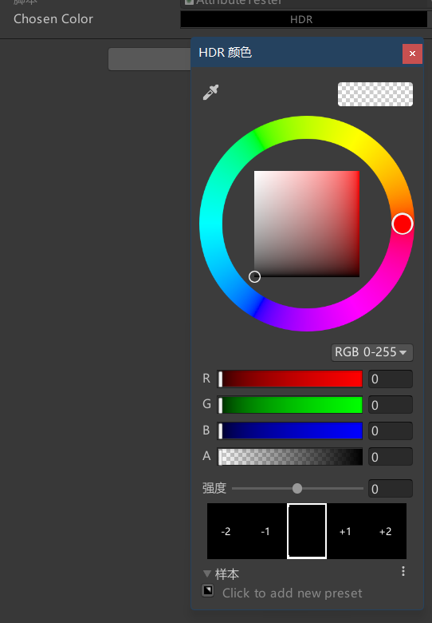

---

### `ContextMenu`

```Csharp
ContextMenu(string itemName, bool isValidateFunction, [int priority])
```

将方法添加到组件的上下文菜单。

- `itemName` 上下文菜单名称
- `isValidateFunction` 是否为验证方法
- `priority` 定义在菜单中的顺序

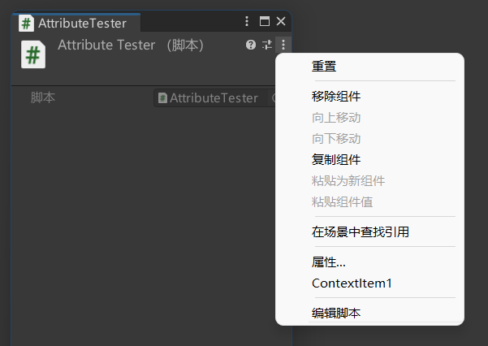

验证方法被要求是一个返回 bool 类型的方法，以下时机将调用验证方法：

- 打开组件上下文菜单时。
- 选择上下文菜单中的相同 `itemName` 条目时。

仅当相同 `itemName` 的验证方法返回 `true` 时才允许选择对应 `itemName` 的上下文条目。  
验证方法仅对脚本中最后一个相同 `itemName` 的方法有效。

---

### `ContextMenuItem`

```Csharp
ContextMenuItemAttribute(string name, string function, [int order])
```

为字段添加上下文菜单，其将调用指定名称的函数。

- `name` 上下文菜单名称
- `function` 函数名称

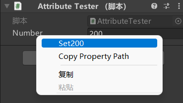

---

### `CreateAssetMenu`

```Csharp
CreateAssetMenuAttribute(string fileName,string menuName, [int order])
```

为 ScriptableObject 添加创建菜单。

- `fileName` 创建资产的文件名
- `menuName` 创建子菜单的条目名


---

### `CustomGridBrush`

```Csharp
CustomGridBrushAttribute([bool hideAssetInstances, bool hideDefaultInstance, bool defaultBrush, string defaultName])
```

将类定义为笔刷，以允许在选择笔刷时使用。

- `hideAssetInstances` 在 Tile Palette 窗口中隐藏此画笔的所有资产实例
- `hideDefaultInstance` 在 Tile Palette 窗口中隐藏画笔的默认实例
- `defaultBrush` 是否替换 Unity 内置画笔作为调色板窗口中的默认画笔
- `defaultName` 默认实例的名称

---

### `Delayed`

使变量延迟序列化。在编译器中改变值时，仅当手动按下 `enter` 或失去焦点时变化才会生效。

---

### `DisallowMultipleComponent`

阻止相同类型的 MonoBehaviour 被添加到同一个 GameObject 。

---

### `ExecuteAlways`

使 MonoBehaviour 实例运行于播放模式与编辑模式。

默认的 MonoBehaviours 仅在播放模式下执行，并且仅当它们被挂载于用户场景的主舞台的游戏对象上时。

在不属于 GameScene 的 Object ，Unity Event 可能将不按照预期被调用：

- `Update` 仅当场景发生变化时被调用。
- `OnGUI` 仅当游戏视图接收到它不使用的「非仅限编辑器」的事件（例如 `EventType.ScrollWheel`）并且不转发到编辑器的键盘快捷键系统（例如 `EventType.KeyDown` `EventType.KeyUp`）时被调用。转发到 Game 视图的事件将排队且不能保证立即得到处理。
- `OnRenderObject` 和其他渲染回调函数当 Scene 视图或 `Game` 视图的每次重绘时被调用。

---

### `GradientUsage`

```Csharp
GradientUsageAttribute(bool hdr, [int order])
GradientUsageAttribute(bool hdr, ColorSpace colorSpace, [int order])
```

允许在检视器中使用 GradientGUI 调整渐变，仅适用于 `Gradient` 类型。

- `hdr` 是否使用 hdr
- `colorSpace` 颜色空间

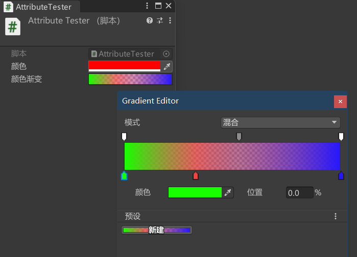

---

### `Header`

```Csharp
HeaderAttribute(string header)
```

在检视器中的字段上方添加标题。

- `header` 标题文本

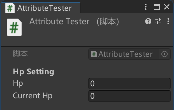

---

### `HelpURL`

```Csharp
HelpURLAttribute(string url)
```

为类型添加文档 URL。

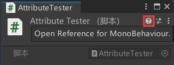

---

### `HideInInspector`

使字段在检视器中隐藏。

---

### `Icon`

```Csharp
IconAttribute(string path)
```

为脚本添加图标。

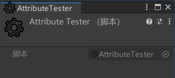

---

### `InspectorName`

```Csharp
InspectorNameAttribute(string displayName)
```

设置枚举值在检视器中的显示名称，仅适用于枚举值。

- `displayName` 显示名称

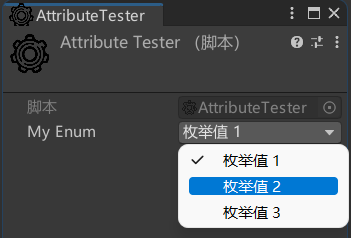

---

### `Min`

```Csharp
MinAttribute(float min)
```

设置字段约束最小值。

---

### `Multiline`

```Csharp
MultilineAttribute(int lines = 3)
```

允许在检视器中使用多行文本 GUI 设置字段，适用于 `string` 类型

- `lines` 最大行数

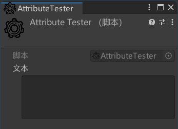

---

### `NonReorderable`

禁止在检视器中使用 ListGUI 设置列表或数组。

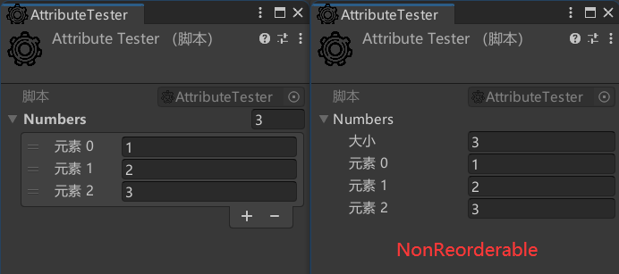

---

### `PreferBinarySerialization`

使用二进制而非 Assets 方式进行 So 的序列化，适用于 `ScriptableObject` 类型。

可以提高读写效率、存储效率与安全性，损害人可读性。

以下时机此特性失效：

- 主资产使用了其他序列化模式。
- 场景中嵌入的资源。

---

### `Property`

实现自定义特性。

---

### `Range`

```Csharp
RangeAttribute(float min, float max)
```

设置字段约束范围，允许在检视器中使用滑块设置数据类型。

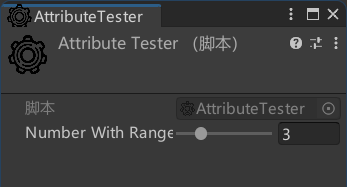

---

### `RequireComponent`

```Csharp
RequireComponent(Type requiredComponent)
RequireComponent(Type requiredComponent, Type requiredComponent2)
RequireComponent(Type requiredComponent, Type requiredComponent2, Type requiredComponent3)
```

设置组件的必需类型。

添加了此特性的脚本将自动添加必需脚本到游戏对象。

- 仅限于添加脚本时，不会影响到添加特性前就已经挂载的脚本。
- 不会重复添加已有的必需组件。

---

### `RuntimeInitializeOnLoadMethod`

```Csharp
RuntimeInitializeOnLoadMethodAttribute()
RuntimeInitializeOnLoadMethodAttribute(RuntimeInitializeLoadType loadType)
```

在加载游戏时调用初始化类方法。

这些回调方法必须是 `static` 的。

- 无参时 为加载场景时调用方法，且在 `Awake` 之前。
- loadType 确定加载场景之前还是之后调用方法
  - `BeforeSceneLoad` 场景加载前，且在 `Awake` 之前。
  - `AfterSceneLoad` 场景加载后，且在 `Start` 之前。
  - `AfterAssembliesLoaded` 加载所有程序集并初始化预加载资产时。
  - `BeforeSplashScreen` 在显示初始屏幕之前。
  - `SubsystemRegistration` 注册子系统时。

---

### `SelectionBase`

当点击场景中包含父级 GameObject 的 GameObject 时，若存在父级 GameObject 具有一个包含此特性的组件，则将选择到这个父级 GameObject 。

若存在多个父级 GameObject 都具有此组件，则遵循就近原则。

---

### `SerializeField`

强制 Unity 序列化私有字段。

---

### `SerializeReference`

指明将字段序列化为引用而不是值。

---

### `Space`

```Csharp
SpaceAttribute(float height = 8f)
```

在检视器中添加一些间距。

- `height` 以像素为单位的空白高度

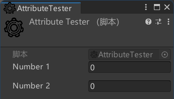

---

### `TextArea`

```Csharp
TextAreaAttribute()
TextAreaAttribute(int minLines, int maxLines)
```

允许在检视器中使用 TextAreaGUI 调整 string 类型字段。

- `minLines` 文本区域的最小行数。文本区域最小不会低于最小行数
- `maxLines` 文本区域在开始使用滚动条之前可以显示的最大行数。文本区域最大不会超过最大行数

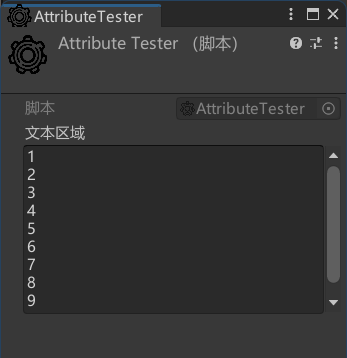

---

### `Tooltip`

```Csharp
TooltipAttribute(string tooltip)
```

允许在检视器中添加 Tooltip，将鼠标悬浮与字段上方将显示 Tooltip。

- `tooltip` Tooltip 文本

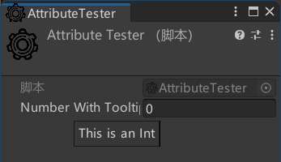

---

## UnityEditor 特性

[Unity 官方手册 | UnityEditor Attribute](https://docs.unity3d.com/ScriptReference/CallbackOrderAttribute.html)
