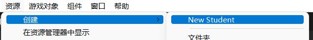

# Unity 特性

## UnityEngine 特性

[Unity 官方手册 | UnityEngine Attribute](https://docs.unity3d.com/ScriptReference/AddComponentMenu.html)

### `ColorUsage`

```Csharp
ColorUsageAttribute(bool showAlpha, [int order])
ColorUsageAttribute(bool showAlpha, bool hdr, [int order])
```

允许在检视器中使用 ColorGUI 调整颜色，仅适用于 Color 类。

- `showAlpha` 是否使用 alpha 通道
- `hdr` 是否使用 hdr


---

### `ContextMenu`

```Csharp
ContextMenu(string itemName, bool isValidateFunction, [int priority])
```

将方法添加到组件的上下文菜单。

- `itemName` 上下文菜单名称
- `isValidateFunction` 是否为验证方法
- `priority` 定义在菜单中的顺序


验证方法被要求是一个返回 bool 类型的方法，以下时机将调用验证方法：

- 打开组件上下文菜单时。
- 选择上下文菜单中的相同 `itemName` 条目时。

仅当相同 `itemName` 的验证方法返回 `true` 时才允许选择对应 `itemName` 的上下文条目。  
验证方法仅对脚本中最后一个相同 `itemName` 的方法有效。

---

### `ContextMenuItem`

```Csharp
ContextMenuItemAttribute(string name, string function, [int order])
```

为字段添加上下文菜单，其将调用指定名称的函数。

- `name` 上下文菜单名称
- `function` 函数名称


---

### `CreateAssetMenu`

```Csharp
CreateAssetMenuAttribute(string fileName,string menuName, [int order])
```

为 ScriptableObject 添加创建菜单。

- `fileName` 创建资产的文件名
- `menuName` 创建子菜单的条目名



---

### `CustomGridBrush`

```Csharp
CustomGridBrushAttribute([bool hideAssetInstances, bool hideDefaultInstance, bool defaultBrush, string defaultName])
```

将类定义为笔刷，以允许在选择笔刷时使用。

- `hideAssetInstances` 在 Tile Palette 窗口中隐藏此画笔的所有资产实例
- `hideDefaultInstance` 在 Tile Palette 窗口中隐藏画笔的默认实例
- `defaultBrush` 是否替换 Unity 内置画笔作为调色板窗口中的默认画笔
- `defaultName` 默认实例的名称

---

### `Delayed`

```Csharp
DelayedAttribute()
```

使变量延迟序列化。在编译器中改变值时，仅当手动按下 `enter` 或失去焦点时变化才会生效。

---

### `DisallowMultipleComponent`

```Csharp
DisallowMultipleComponent()
```

阻止相同类型的 MonoBehaviour 被添加到同一个 GameObject 。

---

### `ExecuteAlways`

```Csharp
ExecuteAlways()
```

使 MonoBehaviour 实例运行于播放模式与编辑模式。

默认的 MonoBehaviours 仅在播放模式下执行，并且仅当它们被挂载于用户场景的主舞台的游戏对象上时。

在不属于 GameScene 的 Object ，Unity Event 可能将不按照预期被调用：

- `Update` 仅当场景发生变化时被调用。
- `OnGUI` 仅当游戏视图接收到它不使用的「非仅限编辑器」的事件（例如 `EventType.ScrollWheel`）并且不转发到编辑器的键盘快捷键系统（例如 `EventType.KeyDown` `EventType.KeyUp`）时被调用。转发到 Game 视图的事件将排队且不能保证立即得到处理。
- `OnRenderObject` 和其他渲染回调函数当 Scene 视图或 `Game` 视图的每次重绘时被调用。

---

### `GradientUsage`

```Csharp
GradientUsageAttribute(bool hdr, [int order])
GradientUsageAttribute(bool hdr, ColorSpace colorSpace, [int order])
```

允许在检视器中使用 GradientGUI 调整渐变，仅适用于 Gradient 类。

- `hdr` 是否使用 hdr
- `colorSpace` 颜色空间


---

### `Header`

```Csharp
HeaderAttribute(string header)
```

允许在检视器中的字段上方添加标题。

- `header` 标题文本


---

### `HelpURL`

```Csharp
HelpURLAttribute(string url)
```

为类型添加文档 URL。


---

## UnityEditor 特性

[Unity 官方手册 | UnityEditor Attribute](https://docs.unity3d.com/ScriptReference/CallbackOrderAttribute.html)
