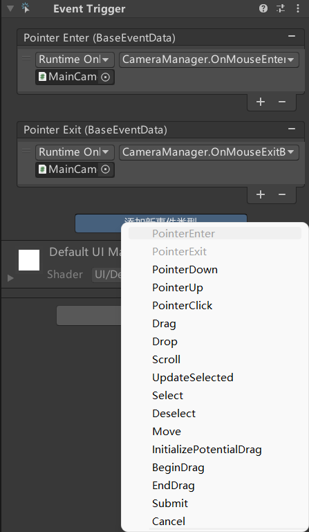

# Unity 事件系统

## 事件系统概述

**Unity 事件系统** (Event System) 是一种基于输入（无论是键盘、鼠标、触摸还是自定义输入）将事件发送到程序中的对象的方法。

- 事件系统被设计为事件系统模块之间通信的管理者和促成者。
- 事件系统由几个组件组成，这些组件协同工作以发送事件：
  - 输入模块
  - 射线投射器

事件系统的主要职责如下：

- 管理哪个游戏对象被视为已被选中。
- 管理正在使用的输入模块。
- 管理射线投射（如果需要）。
- 根据需要更新所有输入模块。

### 输入模块概述

输入模块 (Input module) 是事件系统运行的主要逻辑，它们用于：

- 处理输入。
- 管理事件状态。
- 将事件发送到场景对象。

默认提供两种输入模块：

- StandaloneInputModule  
  标准独立输入模块。
- TouchInputModule  
  触摸输入模块。

事件系统中同时只能有一个输入模块处于活动状态，并且它们必须与事件系统组件挂载于同一游戏对象。

### 射线投射器概述

射线投射器 (Raycaster) 用于找出指针指向的对象。

默认提供三种射线投射器：

- Graphic Raycaster  
  用于 UI 元素。
- Physics 2D Raycaster  
  用于 2D 物理元素。
- Physics Raycaster  
  用于 3D 物理元素。

通常 Canvas 自带 Graphic Raycaster，当场景加入其他 Raycaster，EventSystem 将会检测相应物理元素。

## 事件处理

有两种方式对事件进行处理：

- 代码实现对应接口。  
  Unity 默认提供了一系列接口（见 Unity 支持的事件），实现接口则可处理对应的事件。
- 添加 EventTrigger 组件。  
  EventTrigger 允许在 Inspector 中可视化地设置回调函数。  
  

## Unity 支持的事件

| 接口 | 接口成员 | 描述 |
| --- | --- | --- |
| IPointerEnterHandler | `OnPointerEnter()` | 当鼠标移入一个物体时调用 |
| IPointerExitHandler | `OnPointerExit()` | 当鼠标退出一个物体时调用 |
| IPointerDownHandler | `OnPointerDown()` | 当鼠标在物体上并按下时调用 |
| IPointerUpHandler | `OnPointerUp()` | 当鼠标按键释放时调用（在原先按下时的物体上执行） |
| IPointerClickHandler | `OnPointerClick()` | 当鼠标在同一个物体上点击并释放时调用 |
| IInitializePotentialDragHandler | `OnInitializePotentialDrag()` | 当发现拖动目标时调用，可以用来初始化值 |
| IBeginDragHandler | `OnBeginDrag()` | 在拖动即将开始时调用（代码挂载在被拖动物体上） |
| IDragHandler | `OnDrag()` | 在拖动进行时调用（代码挂载在被拖动物体上） |
| IEndDragHandler | `OnEndDrag()` | 在拖动完成时调用（代码挂载在被拖动物体上） |
| IDropHandler | `OnDrop()` | 在拖动完成的对象上调用 |
| IScrollHandler | `OnScroll()` | 当鼠标的滚轮滚动时调用 |
| IUpdateSelectedHandler | `OnUpdateSelected()` | 被选中物体每个刻度 (tick) 调用一次 |
| ISelectHandler | `OnSelect()` | 当对象成为所选对象时调用 |
| IDeselectHandler | `OnDeselect()` | 当选中对象选中状态取消时调用 |
| IMoveHandler | `OnMove()` | 当一个移动事件发生时调用 (形如：left, right, up, down) |
| ISubmitHandler | `OnSubmit()` | 当提交按钮 (submit button) 被按下时调用 |
| ICancelHandler | `OnCancel()` | 当取消按钮 (cancel button) 被按下时调用 |
