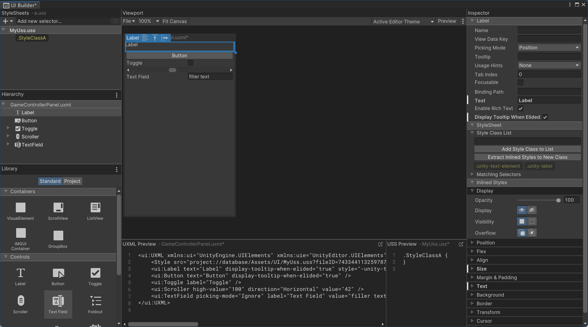

# Unity UIToolkit

UIToolkit (UITK) 是 Unity 下一代 UI 系统。前身为发布于 Unity 2018 的 UIElement，设计目标在于取代 UGUI。

UITK 使用 XML 表示界面布局，使用 CSS 描述样式。

UITK 提供了 UIBuilder 编辑器编写上述文件。

UITK 相比于 UGUI 的优越性：

- 传统 UGUI 将 UI 元素保存为 GameObject ，这意味着需要存储一系列序列化数据，带来无意义的开销。
- UITK 提供了默认信息，因此可以只保留需要修改的部分，使描述信息精简化。

## UIBuilder

菜单中选择 Create > UIDocument 即可创建界面描述文件（ UXML 文件）。



其主要由一下视图构成：

- StyleSheets
  - 用于创建或添加 USS 文件和为 USS 添加选择器。
- Hierarchy
  - 控制不同元素间的层次关系。
- Library
  - 组件库，来自内置标准组件或项目自定义拓展组件。
- Viewport
  - 预览界面。
  - 画布大小用于模拟实际展示时的显示面积，Builder 中的拖动不会影响运行时。
- Inspector
  - 检视界面，用于修改元素属性。

当开发环境的操作系统设置了缩放时，应注意对应 px 单位的转换。

## USS

Unity 样式表 (USS,Unity style sheets) 类似于 CSS，且包含 Unity 自定义的项目。

所有属性参见：

[Unity 属性参考](https://docs.unity3d.com/Manual/UIE-USS-Properties-Reference.html)

### USS 选择器

选择器决定 USS 规则的影响对象。

USS 支持多种类型的简单选择器：

| 选择器类型 | 语法          | 用途                 |
| ---------- | ------------- | -------------------- |
| C# 类名    | `Type{...}`   | 匹配指定 C# 类型     |
| USS 类     | `.class{...}` | 匹配指定 USS 类型    |
| name       | `#name{...}`  | 匹配指定 name 的元素 |
| 通配符     | `*{...}`      | 匹配任何元素         |

USS 也提供了一系列复杂选择器：

| 选择器类型 | 语法 | 用途 |
| --- | --- | --- |
| 后代选择器 | `selector1 selector2{...}` | 匹配第一个选择器的子代元素中满足第二个选择器的元素 |
| 子代选择器 | `selector1 > selector2{...}` | 匹配第一个选择器的第一代子代元素中满足第二个选择器的元素 |
| 多选择器 | `selector1selector2` | 匹配满足所有选择器的元素 |

显而易见，多选择器语法可能引发语法问题，因此使用多选择器时注意：

- 有且只有一个 C# 类名选择器，且应放在首位。

除此之外，USS 还提供了伪类选择器：

| 伪类        | 在以下情况下匹配元素                       |
| ----------- | ------------------------------------------ |
| `:hover`    | 光标位于元素上方时                         |
| `:active`   | 用户与元素交互时                           |
| `:inactive` | 用户停止与元素的交互时                     |
| `:focus`    | 元素被聚焦时                               |
| `:selected` | **不受 Unity 支持**                        |
| `:disabled` | 元素 enabled 设置为 false 时               |
| `:enabled`  | 元素 enabled 设置为 true 时                |
| `:checked`  | 元素是一个可切换元素，且当其处于打开状态时 |
| `:root`     | 元素是根元素时（可视化树中级别最高的元素） |

`:root` 伪类选择器常用于设置默认属性或全局变量：

```CSS
:root {
  --color-1: blue;
  --color-2: yellow;
}

.paragraph-regular {
  color: var(--color-1);
  background: var(--color-2);
  padding: 2px;
}

.paragraph-reverse {
  color: var(--color-2);
  background: var(--color-1);
  padding: 2px;
}
```

伪类选择器可以被链接，如：

```CSS
Toggle:checked:hover{
  ...
}
```

当满足所有选择器时，样式将生效。

### Unity 内置变量

Unity 内置了一系列变量，以定义 Unity 编辑器中元素的样式。

[Unity 内置变量参考](https://docs.unity3d.com/Manual/UIE-USS-UnityVariables.html)

---

### Display 类

决定元素的显示方式。

#### display

元素的显示性。

`flex|none`

`none` 时，元素不显示且不占用显示面积。

#### visibility

元素的可见性。

`visible|hidden`

`hidden` 时，元素不显示且但仍占用显示面积。

---

### Position 类

决定元素的位置计算。

#### position

元素的定位类型。

`relative|absolute`

- `relative` 相对位置。  
  定位将参考已有位置。
- `absolute` 绝对位置。  
  定位将根据绝对位置。一般用于弹出式悬浮窗。

---

### Flex 类

决定元素的弹性布局。

#### flex-basis

元素在 flex 布局中的基础长度，此基础长度不会代入 `flex-grow` 中计算。

具体生效模式受 `flex-direction` 影响：

- 当 `flex-direction` 为 `row` 时，`flex-basis` 成为 **横向** 基础长度。
- 当 `flex-direction` 为 `column` 时，`flex-basis` 成为 **纵向** 基础长度。

#### flex-direction

容器 flex 布局的方向。

`column|row|column-reverse|row-reverse`

#### flex-grow

元素在 flex 布局中的拉伸权重。

取值 `>0` 时，当父级容器长度大于所有同级元素长度之和时，拉伸元素以填充空闲长度，具体分配长度计算：

$$
\text{元素.flex-basis}+
\frac{\text{元素.flex-grow}}{
\sum{\text{同级子元素.flex-grow}}}
\times
\text{空闲长度}
$$

#### flex-shrink

元素在 flex 布局中的收缩权重。

取值 `>0` 时，当父级容器长度小于所有同级元素长度之和时，收缩元素以避让溢出长度，具体分配长度计算：

$$
\text{元素.flex-basis}-
\frac{\text{元素.flex-shrink}}{
\sum{\text{同级子元素.flex-shrink}}}
\times
\text{溢出长度}
$$

#### flex-wrap

容器 flex 布局的换行性。

`nowrap|wrap|wrap-reverse`

---

### transition 类

决定元素指定属性的过渡。

当监测到指定属性发生变化时，UITK 将计算插值，生成补间动画。

属性变化前后的单位应保持一致，否则过渡失败。

---

## UI Panel Settings

### Scale Mode

#### Constant Pixel Size

不考虑屏幕大小，元素大小完全按照设定的像素值。

#### Constant Physical Size

根据参考 DPI (Reference DPI) 与实际系统 DPI 进行比较，若不同，则将缩放 UI。

即将参考系统缩放。

#### Scale With Screen Size

根据参考分辨率与实际系统分辨率进行比较，若不同，则将缩放 UI。

---

## 事件监听

### 事件调度

UITK 事件系统监听来自操作系统或脚本的时间，并借助 EventDispatcher 将时间分发到 Visual Element。

事件具有如下声明周期：


- **涓滴阶段** (trickle-down) 事件从视觉元素树的根部开始向目标下降。
- **目标阶段** (target) 事件目标接受事件。
- **冒泡阶段** (bubble-up) 事件沿树上升到根。

大多数事件拥有完整的生命周期，小部分事件可能跳过其中某些阶段。

如果元素被隐藏或被禁用，它将不会接受事件，但事件仍会传播到其后代和祖先。

**事件目标** 取决于事件类型。

- 对于鼠标事件，目标一般为鼠标下方最上层的可选元素。
- 对于键盘事件，目标一般为当前获得焦点的元素。

### 事件处理

事件处理具有如下顺序：

1. 处理涓滴阶段抵达元素的回调。
2. 执行事件目标的回调。
3. 执行事件目标的 `ExecuteDefaultActionAtTarget()` 。
4. 执行冒泡阶段抵达元素的回调。
5. 执行事件目标的 `ExecuteDefaultAction()` 。

使用 `(element.RegisterCallback<SomeEvent>(MyCallback,...))` 注册回调；  
使用 `(element.UnregisterCallback<SomeEvent>(MyCallback,...))` 取消回调。

默认在冒泡阶段与目标阶段执行回调。使用 `TrickleDown.TrickleDown` 作为参数可在涓滴阶段和目标阶段执行回调。

回调函数签名：

```csharp
void MyCallback(SomeEvent evt){}
```
