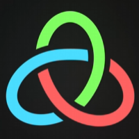
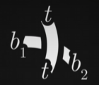

# Knot theory 纽结理论

## 概述

[什么是扭结？][wiki-theory]

为了便于研究：

- 将一条绳子的两端连接起来，形成一个闭合的环，称为结。
- 一个圆，称为平凡结。其上没有交点。
- 将一个立体空间的结投影到一个平面上，得到的图形称为结图。

---

## 变换

发生在扭结上的变换有且仅有三种（Reidemeister 移动）：

- Twist  
  
- Poke  
   
- Slide  
  

一个结可以经过一系列的变换变成另一个等价的结。

---

## 不变量

证明两个结是否等价是相当困难的。

比如，证明任意结是一个平凡结，需要从平凡结开始，穷举所有 $k$ ($k<K$) 次 R 移动，并将结果与目的结比较，以证明它是平凡结。而 $K$ 的值为：

$$
(236n)^{11}
$$

- 其中 $n$ 为扭结的交叉点数量。

但纽结中，存在一些 **不变量**。一个纽结无论经过多少次 R 移动，都不会改变这个不变量。  
这些不变量可以用于证明两个结是否是 **不等价的**。

$$
若不变量不相同，则两个结必不等价。
$$

有许多这样的不变量作为评估纽结不等价的指标。其中最简单的是 **三色性**。

等价的纽结，三色性一定相同。

三色性意味着：

- 至少使用两种颜色。
- 在交叉点处，三根线的颜色要么完全相同，要么完全不同。

> R 移动不会改变三色性。

所以：

- 易证：平凡结不具有三色性，而三叶结具有三色性，所以这两个纽结一定不等价。
- 而无论将平凡结进行多少次 R 移动，都不会具有三色性。

三色性可扩展为 $p$ 色性，其中 $p$ 为 2 以外的任何质数：

为每个绳段标号（从 0 开始计数），对于每个交叉点：

$$
\frac{b_1+b_2}{p} \text{reminder} \; {p} = \frac{t+t}{p} \text{reminder} \; {p}
$$

除此之外，还有许多不变量，如：亚历山大多项式、琼斯多项式等。

---

## 参考资料

[这个看似抽象的数学问题，其实能拯救你的生命][knot-theory-bili] ---- [@Veritasium 真理元素][up-veritasium]

[wiki-theory]: https://en.wikipedia.org/wiki/Knot_theory
[knot-theory-bili]: https://www.bilibili.com/video/BV1UB4y1f7VK
[up-veritasium]: https://space.bilibili.com/94742590
