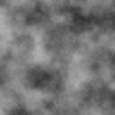
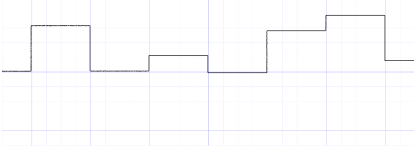
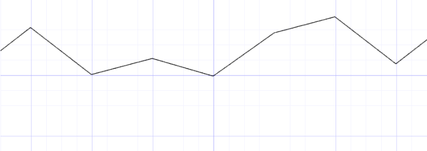
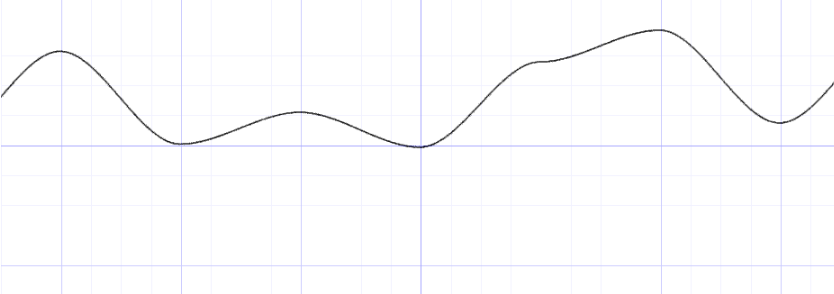

# 噪声算法——随机与平滑的奇妙结合

## 噪声

噪声是游戏开发中的常见技术，其奇妙的特性有着广泛的运用。

      

不同维度上的噪音有着类似的表现力。

| 噪声维度 | 噪声灰阶 | 应用 |
| --- | --- | --- |
| 一维 |  | 手绘质感的笔刷 |
| 二维 |  | 火焰特效 |
| 三维 |  | 我的世界的地图生成算法 |

如上所示，噪音的表现具有两大特性：

- 随机性
- 平滑性

由于计算机的特殊性，随机值的生成是可以复刻的。程序员可以通过手动设定 **种子** 来获得完全相同的两组「随机数」。或者，我们直接使用 **哈希函数** 而非 **随机函数** ，更能体现其这种性质。

因此在计算机算法中，噪音具有三个特性：

- 随机性
- 平滑性
- **哈希性**

## 一维噪声

如何构建噪声？其中的难点在于如何让离散的值变得平滑。那么就必然要用到 **插值函数** 。

如下三步展示如何将随机点转化成平滑的线。

- 生成一串随机数。



```C++
float i=floor(x);//取整数
float f=fract(x);//取小数
y=rand(i);//取得随机数y
```

> 你也可以将其理解成点的集合。

注意：设定种子不变。

- 根据权重 f 调整 y 的值。



```C++
float i = floor(x);
float f = fract(x);
y = mix(rand(i), rand(i + 1.0), f);//mix()混合函数
```

> 近朱者赤，近墨者黑

- 为权重 f 赋予平滑性。



```C++
float i = floor(x);
float f = fract(x);
y = mix(rand(i), rand(i + 1.0), smoothstep(0.,1.,f));//smoothstep()平滑函数
//smoothstep(a,b,x) 其中参数 a b 的目的在于控制权重处于 0 与 1 之间。
```

不同的语言可能有不同的 `smoothstep()` 实现。开发者也可以构建自己的 **多项式函数** 以控制平滑度。

$$
三次多项式：\\
smoothstep(x)=3x^{2} - 2x^{3} \quad (0 \leqslant x \leqslant 1)\\
\text{ } \\
五次多项式：\\
smoothstep(x)=6x^{5} - 15x^{4} + 10 x^{3} \quad (0 \leqslant x \leqslant 1)\\
$$

## 高维噪声

理解一维噪声，更高维度的噪声就不难理解了。

在一维噪声中，选取线段 2 端点进行插值：

- $fract(x)$
- $fract(x+1.0)$

在二维噪声中，选取矩形的 4 顶点进行插值：

- $fract(st)$
- $fract(st) + vec2(1.,0.)$
- $fract(st) + vec2(0.,1.)$
- $fract(st) + vec2(1.,1.)$

```C++
float noise (vec2 st) {
    vec2 i = floor(st);//取整数
    vec2 f = fract(st);//取小数

    // 获取包含目标点的最小整值立方体的 4 顶点 random 值
    float a = random(i);
    float b = random(i + vec2(1.0, 0.0));
    float c = random(i + vec2(0.0, 1.0));
    float d = random(i + vec2(1.0, 1.0));

    // 平滑插值

    // vec2 u = smoothstep(0.,1.,f);
    vec2 u = f*f*(3.0 - 2.0*f);

    // Mix 4 coorners percentages
    return mix(a, b, u.x) +
            (c - a)* u.y * (1.0 - u.x) +
            (d - b) * u.x * u.y;

    // Mix 4 coorners percentages
    // return a + (b - a) * u.x +
    //        (c - a) * u.y * (1.0 - u.x) +
    //        (d - b) * u.y * u.x;
}
```

在三维噪声中，选取立方体的 8 顶点进行插值。

n 维度的噪声中，选取 $2^n$ 个点进行插值。

上述一维与二维所使用的算法，都是在 random value 之间插值，因此被称为 **Value Noise**，其看起来非常「块状」。

上帝说，要有光。于是便有了 **梯度噪音** (Gradient noise) 。Perlin Noise 是梯度噪音的经典实现。

## Perlin 噪音

Perlin 使用随机向量取代随机值，为最终结果赋予了方向属性，以此抹消了 Value noise 的块状感。

```C#
float perlinNoise(Vector2 p)
{
  //获取包含目标点的最小整值立方体的 4 顶点坐标
  Vector2 pi = Vector2(floor(p.x),floor(p.y));
  Vector2 vertex[4] = {{pi.x,pi.y},{pi.x+1,pi.y},{pi.x,pi.y+1},{pi.x+1,pi.y+1}};

  //通过 grad 函数得出坐标对应的随机值
  float vertexRandom[4] =
  {
    grad(vertex[0],p),
    grad(vertex[1],p),
    grad(vertex[2],p),
    grad(vertex[3],p)
  };

    //平滑插值
    return mix(
        mix(vertexRandom[1],
            vertexRandom[2]),
        mix(vertexRandom[3],
            vertexRandom[4])
        );
}

//点乘
float dot(Vector2 v1,Vector2 v2){
  return v1.x*v2.x+v1.y*v2.y;
}

//求梯度值（本质是求顶点代表的梯度向量与距离向量的点积）
float grad(Vector2 vertex, Vector2 p)
{
  return dot(hash22(vertex), p);
}
```

最终会呈现如下的形态：


## 参考资料

[KillerAery's Blog#Noise](https://www.cnblogs.com/KillerAery/p/10765897.html#%E5%99%AA%E5%A3%B0)  
[TheBookOfShaders#11](https://thebookofshaders.com/11/?lan=en)
