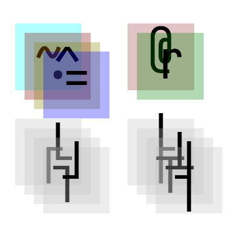
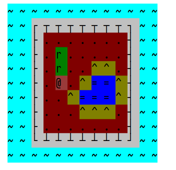

# 游戏中的量子力学——波函数坍缩

## 引言 | 唯物与唯心之边界的再考证

「上帝真的存在吗？」

我们都听过薛定谔的猫的故事——有一只猫被塞在一个外面看不到的毒气盒子里，按下按钮盒子会有一半几率释放致命毒气。那么按下按钮，这只猫会变成什么状态。

量子力学指出了一种全新的描述世界的方式，它给出的答案是：这只猫处在死亡与存活的叠加态中。除非被直接观测，否则这个结果「无法证伪」。

当我们打开盒子，必然会得到一个确定的结果。量子力学这样描述这个过程：观测会引起状态的坍缩。

---

## 传播 | 可知论的目力所及

「观测」在现实生活中，拥有更为广义的体现，它并不一定是指「亲眼所见」。

如果我们听到盒子在喵喵叫，那么我们会知道，盒子里有只活猫；

甚至，我们能通过一些细节，可以推断出盒子里有一只活猫，比如，盒子贴了一张「需要六节 AA 电池」的告示，而你看到背面的电池盒里空空如也 —— 没有电池，这个电力驱动的按钮不会正常工作。

仍用量子力学的眼光来看，我们发现这整个世界都是状态的集合：

- 盒子有没有在喵喵叫？
- 按钮边上的指示灯有没有在亮？
- 电池盒里放了几节电池？
- 告示上写的是「需要电池」还是「内置核能驱动」？

这些可观测的状态会向外「传播」，最终导致另一个存在的状态集合中 不可能状态的 坍缩。

知与未知，一体两面，而叠加的状态更是五花八门，解决问题的方法看似很简单，把盒子打开看看就好了，但如果打不开呢？

---

## 信息熵 | 一个像素到底有多大

绘画相当适合作为量子力学的研究实例——绘画的过程是灵感与记忆所交织而成的各种状态的坍缩。

如果将画板分成一个个的像素点，小学生会告诉你，这个点会有 7 种不同的状态——红橙黄绿青蓝紫。而我们程序员都知道，这个点如果采用 1 个字节 存储，那么它有 256 种状态。

这简直就是壮举，我们在一张那么大的纸上的那么多像素的那么多种状态里面选择了唯一的结果。

回忆一下，我们究竟是怎么做的？具体来说，每根线条是如何落笔的？

实际上，我们会遵循一些特定范式来找到下一个落点位置 —— 在已有的线段中找一个相对较近的位置。

为什么呢？

仍从量子力学与像素的眼光来看，实际上，我们更倾向于选择状态更少的地方进行决策，这样会降低发生冲突的风险。

信息熵 (Shannon entropy, 香农熵) 即用来描述「状态多少」的一种值。其计算公式如下：

$$
H(X) = - \sum_x P(x) \log_2{P(x)}
$$

其中

- $x$ 为变量的第 $x$ 个状态。
- $P(x)$ 为变量 $x$ 的概率。

比如，英文字母有 26 个，那么英文字母的信息熵为：

$$
\begin{align*}
H(x) &= - \sum_{26} \frac{1}{26} \log_2{\frac{1}{26}} \\
     &= - \log_2{\frac{1}{26}}\\
     &\approx 4.7
\end{align*}
$$

可见，信息熵越低，则变量的可能状态越少。

---

## 坍缩 | 信息帝国的崩塌

了解了以上的概念，我们终于能以凡人之躯尝试触碰量子之海的奇妙了。

现在，以二维的 TileMap（瓦片贴图）来举例。使用这些字符来表示不同的地块：

而这是示例图，它意味着我们拼成的结果类似于它：

我们可以使用「波函数坍缩算法」来从一系列给定的状态和规则中模拟观测过程，其主要分为以下过程：

- **约束分析**
- **坍缩**
- **传播**

**约束** 确定了 Tile 个体是如何拼接起来的。这个过程有两种不同的实现，我们暂且跳过。

### 坍缩

将状态集 **坍缩** 至一个结果是模拟过程中最复杂的部分。因为总有些奇奇怪怪的约束并未被察觉到。

但我们却能掏出那个令上帝发笑的黑盒子 —— `Math.random` ，使坍缩成为最简单的一步。

我们根据它和状态概率来随机从多状态中选择一个确定状态，从而达成坍缩。

### 传播

当一个坍缩发生在某位置，我们需要更新它周围上下左右四个块的状态集合，删除所有不再可能的状态。

直至所有坍缩结束，我们将决定下一个坍缩至一个结果的位置。如何选择？我们将选择一个拥有最小信息熵的块，随后重复第一步，直到所有块坍缩至 1。

### 约束分析

刚刚忽略了传播过程中的一个非常重要的步骤：坍缩块周围的状态集合是如何被更新的？

有两种不同的约束分析策略，我称他们分别为：

- **程序快乐型** 约束分析策略
- **美术快乐型** 约束分析策略

前者是「Programmer-friendly」，程序要求美术画出一堆这样的地块即可：

他们具有这样的特点：某些 Tile 边缘的像素是完全一致的，这使得它们能被拼接。

而后者使美术只需要产出一张范例图，约束完全交由程序分析：

在读取范例图后，约定一个固定大小的块，每次向下/右 移动一个单位，然后比较内容模式来确定是否允许拼接。

约束分析策略是相当自由的，我们可以发挥想象力构建更多的约束分析办法。实际上，约束分析仅仅为了实现一个谓词：

TileA 是否能出现在 TileB 的方向 d 上？

约束分析策略决定了开发者在动态生成的权利被出让的程度。

如果开发者变得懒惰，则意味着动态生成结果愈发地不可控。

---

## 结语 | 上帝存在吗？

让我们回到开头的问题 ——「上帝存在吗？」

这个问题有确切的答案！

答案就是 ——

「上帝的存在处于 存在 & 不存在 的叠加态中」

你可能会说我好像在放屁，但不幸的是，这就是那个我们永远也打不开的盒子。

虽然没能回答这个问题，但知道了简简单单的随手一画原来是如此的壮举，这不失为一种令人感到安慰的收获。
