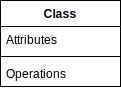
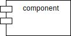

# 2. 构造元素

UML 构造元素包括：  

* 基本元素  
* 关系  
* 图  

## 2.1 基本元素

基本元素是实体抽象化的最终结果，是 UML 构建块最重要的组成部分。  
基本元素的分类如下：  

* 结构元素  
* 行为元素  
* 分组元素  
* 注释元素  

### 2.1.1 结构元素

结构元素是模型中的静态部分，用以呈现概念或实体的表现元素，是软件建模中最常见的元素，接下来是对结构化物件的简要描述：  

#### 2.1.1.1 类 (class)

类指具有相同属性、方法、关系和语义的对象的集合。  

  

#### 2.1.1.2 接口 (interface)

接口是指类或构件所提供的服务（操作），描述了类或构件对外可见的动作。  

  

#### 2.1.1.3 协作 (collaboration)

协作定义元素之间的相互作用。  

#### 2.1.1.4 用例 (use case)

构件描述物理系统的一部分。  

  

#### 2.1.1.5 构件 (component)

构件描述系统的一部分。  

  

#### 2.1.1.6 节点 (node)

一个节点可以被定义为在运行时存在的物理元素。如 PC 机、打印机等。  

  

### 2.1.2 行为元素

行为元素指的是 UML 模型中的动态部分，代表语句中的「动词」，表示模型里随着时空不断变化的部分。其分类如下：  

#### 2.1.2.1 交互

交互被定义为一种行为，包括一组元素之间的消息交换来完成特定的任务。  

  

#### 2.1.2.2 状态机

状态机由一系列对象的状态组成，一个对象在其生命周期的状态是很重要的。  

  

### 2.1.3 分组元素

可以把分组元素看成是一个「盒子」，模型可以在其中被分解。目前只有一种分组元素，即包 (package) 。结构元素、动作元素甚至分组元素都有可能放在一个包中。包纯粹是概念上的，只存在于开发阶段。  

  

### 2.1.4 注释元素

注释用于对模型中的元素进行说明、解释。  
注释是对元素进行约束或解释的简单符号。  

  

## 2.2 关系

关系是另一个最重要的构建块 UML ，它显示元素是如何彼此相关联，此关联描述的一个应用程序的功能。  
UML 定义了四种关系：  

### 2.2.1 依赖关系

依赖是两件事物之间的语义联系，其中一个事物的变化也影响到另一个事物。  

  

### 2.2.2 关联关系

关联指明一个对象与另一个对象之间的关系。  

  

### 2.2.3 泛化关系

泛化是一种一般化——特殊化的关系，是一般（父类）和该事物较为特殊的种类（子类）之间的关系，子类继承父类的属性和操作，除此之外，子类还添加新的属性和操作。  

  

### 2.2.4 实现关系

实现是类之间的语义关系，其中的一个类指定了由另一个类必须执行的约定。  
一般在两种地方会遇到实现关系：  

* 在接口和实现它们的类或构件之间。  
* 在用例和实现它们的协作之间。  

  

### 2.2.5 扩展关系

扩展是用在用例和用例之间，扩展是指扩展用例与基用例之间的关系，说明如何将扩展用例定义的行为插入基用例定义的行为序列。  

## 2.3 图

UML 图是事物集合的分类。  
UML 中分为结构图和行为图。  

### 2.3.1.1 结构图

### 2.3.1.1 类图

类图描述系统所包含的类、类的内部结构及类之间的关系。  

### 2.3.1.2 对象图

对象图是类图的一个具体实例。  

### 2.3.1.3 构件图

构件图描述代码部件的物理结构以及各部件之间的依赖关系。  

### 2.3.1.4 用例图

用例图从用户的角度出发描述系统的功能、需求，展示系统外部的各类角色与系统内部的各种用例之间的关系。  

### 2.3.1.5 协作图

协作图描述对象之间的协作关系。  

### 2.3.1.6 部署关系图

部署关系图定义系统中软硬件的物理体系结构。  

### 2.3.1.7 包图

包图展现模型要素的基本组织单元，以及这些组织单元之间的依赖关系，包括引用关系 (PackageImport) 和扩展关系 (PackageMerge) 。  

### 2.3.1.8 组合结构图

组合结构图用于描述系统中某一部分（即「组合结构」）的内部内容，包括该部分与系统其它部分的交互点，这种图能够展示该部分内容「内部」参与者的配置情况。  

### 2.3.2 行为图

#### 2.3.2.1 活动图

活动图描述系统中各种活动的执行顺序。  

#### 2.3.2.2 状态图

状态图描述一类对象的所有可能的状态以及事件发生时状态的转移条件。  

#### 2.3.2.3 通信图

通信图显示了交互中各个对象之间的组织交互关系以及对象彼此之间的链接。  

#### 2.3.2.4 顺序图

顺序图表示对象之间动态合作的关系。  

#### 2.3.2.5 定时图

定时图展示交互过程中的真实时间信息，具体描述对象状态变化的时间点以及位置特性状态的时间段。  

#### 2.3.2.6 交互概览图

是一种顺序图与活动图的混合。  
