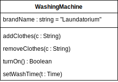

# 3. 类的可视化

在 UML 中，使用一个长方形表示类。  

  

一般，采用 Pascal 法命名类名。  

  

## 3.1 所属包

如果类包含于某个包中，则可以如下形式表示：  

```UML
包名 :: 类名
```  

这种类型的类名被称为 **路径名** (pathname)  。  


## 3.2 属性

属性是类的特性。属性描述了类的对象所具有的一系列特征值。类是现实事物的抽象，因此一个类可以具有零个到多个属性。  

一般，采用 Camel 法命名属性名。  


对于每个属性，还可以标注出其类型与缺省值（默认值）。  

```UML
属性名 : 类型 = 缺省值
```


## 3.3 对象

类实例化后成为对象。  

可以理解为类作为模板，填充具体数据后变成对象。  

一般，采用 Camel 法命名对象名。  
若有对应的类，对象需指明类名。  
且需要加下划线。  

```UML
对象名 : 类名
```

属性需有具体值或默认值。  

```UML
属性名 : 类型 = 数值
```


也可以使用以下形式表示匿名对象：  

```UML
: 类名
```


## 3.4 操作

操作（对象 / 方法）即类的行为。  

一般，采用 Camel 法命名操作名。  

操作后需加括号，属性与操作间使用分隔线隔开。  


对于操作，可以附加形参与返回值的信息。  

```UML
操作名 ( 形参名 : 形参类型) : 返回类型
```

操作信息（操作名、参数、返回值）被称为操作的 **型构** 。  



## 3.5 访问修饰符

使用符号表现类成员的可见性。  

访问修饰符 | 可见性类型
:------:|:------:
 ```+``` | public
 ```#``` | protected
 ```-``` | private
 ```~``` | package

```Java
public class Employee
{
    private int empID;

    public double calcSalary(){}
}
```


## 3.6 省略

有时表示类时并不需要完整地表现其所有的属性或操作，因此可以用 ```...``` 表示不需要出现的属性或操作。  


## 3.7 扩展

### 3.7.1 构造型

构造型是 UML 提供的扩展机制，它允许创建新的模型元素以解决具体问题。  

如果属性或者操作列表太长，可以用构造型类组织属性或操作列表。构造型用双尖括号 (guillements) ```<< >>``` 括住的关键字来表示。  


### 3.7.2 职责和约束

在操作列表框的下方，可以指明类的 **职责** 。  
**职责** (responsibility) 描述了类的属性和操作能够完成什么功能。  


约束 (constraint) 指定了属性、操作形参的定义域。  


还可以使用对象约束语言 (OCL,ObjectConstraint Language) 表现约束。  

### 3.7.3 注释

还可以用注释补充更多信息。  


