# 5. 接口

**接口** (interface) 是描述类的部分行为的一组操作，也是一个类提供给另一个类的一组操作。  

在不同的类中也许用到了相同的操作，然而这些类并不一定继承与同一个父类。  
若要复用这些代码，就需要 **接口** 。  

## 5.1 接口的表示

接口的模型表示法和类大致相同，都是用一个矩形图标来代表，和类的不同之处在于，接口只是一组操作，没有属性。  
其次，接口使用构造型 ```<<interface>>``` ，或命名时以大写字母 ```I``` 开头。  

## 5.2 接口的实现

类和接口之间的关系即实现。  

实现关系使用带空心三角形箭头的 **虚线** 表示。  



实现关系也可以更省略一些，使用实线与小圆圈表示。  



一个类可以实现多个接口，一个接口也可以被多个类实现。  

## 5.3 可见性

可见性 (visibility) 指定在给定类的属性和操作（或接口的操作）的情况下，其他类可以访问到的属性和操作的范围。  

实现关系意味着接口中的所有操作都是公有的。  
