# 4. 关系

**关系** 描述类之间如何发生连接。  

## 4.1 关联

关联 (association) 描述类之间 **在概念上有连接关系** 。  

例如，队员和球队之间的关联，可以用一个短语「队员为篮球队效力 (plays on) 」来描述这个关联。  

  

类可以在关联中扮演某种角色。可以在图中标注其所扮演的角色。  

  

关联还可以从另一个方向发生，并用箭头指明关系。  

  

多个类可以连接同一个类。  

  

### 4.1.1 关联的约束

**约束** 指两个类之间的关联规则。  

例如：一个 BankTeller （银行出纳员）为一个 Customer （顾客）服务 (Serves) ，但是服务的顺序要按照顾客排队的次序进行。  

在模型中可以通过在 Custome 类附近加上一个 ```{ }``` 来说明这个规则。  
  

可以用如下方式描述两个关联关系间的 or 关系。  
  

### 4.1.2 关联类

关联类是一个拥有关联特性的类。  
关联可以拥有自己的属性和操作，其表现上类似于类。  

关联类的可视化表示方式与一般的类相同，但是要用一条虚线将关联类和对应的关联线连接起来。  
  
Player 与 Team 类之间的 Plays on 关联对应的关联类： Constract （契约）关联类。  

Constract （契约）关联类又同时和 GeneralManager （总经理）类发生关联。  

### 4.1.3 链

将关联实例化后得到链。  
如对象一样，链在名字下加下划线。  
  

## 4.2 多重性

多重性表现类之前的多对应关系。  
类与类之间不仅仅只有一对一关系，还有一对多、一对一或多、一对零或一、一对有限间隔。  
  

```*``` 表示 **多个** 。  
```..``` 或 ```,``` 表示 **或 or** 关系。  

>   
> 一个老师教多个学生。  
>   
> 一个蛋盒包装了 12 或者 24 枚鸡蛋。  

## 4.3 限定关联

对于一对多关系，为了便于查找，需要对对象加上限定符（即关键字，ID ）。  

>   

## 4.4 自身关联

存在与自己发生关联的类，即自身关联。  

>   
> CarOccupant : 车上的人
> Drives : 司机为乘客驾驶

## 4.5 继承和泛化

泛化即继承。  
在泛化关系中，子类替代父类。  
使用带空心三角箭头的连线表示子类与父类的关系。  

>   

斜体的类名表示抽象类。  

## 4.6 依赖

一个类使用了另一个类，此即依赖关系。  
通常，依赖关系是一个类操作的型构中用到了另一个类的定义。  

依赖关系使条带箭头的虚线来表示。  

>   

