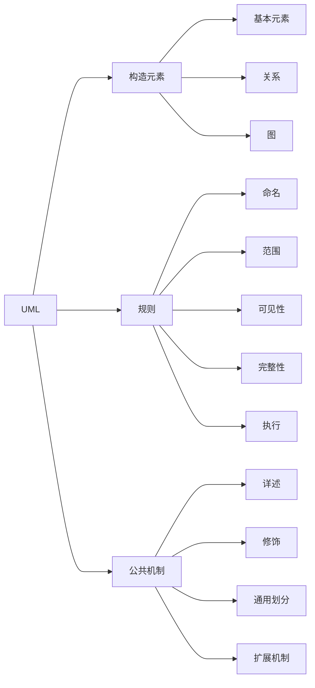

# 1. UML 架构

UML 是由构造元素、规则和公共机制几个部分构成。  
构造元素描述事物的基本成分，这些基本成分按某种规则关联在一起，组成图；同时，这些基本成分都遵循通用规则，即公共机制。  

## 1.1 视图

**视图** 用来表示被建模系统的各个方面。  
视图还把建模语言和系统开发时选择的方法或过程连接起来。  

视图包括以下类型：  

* **用例视图** (usecase view) 表示外部参与者看到的系统将提交的功能。  
* **逻辑视图** (logical view) 表示系统内部如何实现系统功能。  
* **构件视图** (component view) 构件视图表示代码构件的组织，描述了实现模块及它们之间的依赖关系。面向 **开发者**。  
* **进程视图** (process view) 表示系统的并发性，包括进程的通信和同步。面向 **开发者** 和 **系统集成者**。  
* **部署视图** (deployment view) 表示系统的物理部署。面向 **开发者** 、 **集成者** 和 **测试者** 。  

## 1.2 构造元素

构造元素包括基本元素、关系和图。这三种元素代表了软件系统或业务系统中的某个事物或事物间的关系。  

## 1.3 规则

UML 中，基本元素在使用中，应遵守一系列规则，其中，最常用的三种语义规则如下：  

### 1.3.1 命名

命名即对事物、关系和图起名。和任何语言一样，「名」即标识符。  

### 1.3.2 范围

范围指基本元素起作用的范围，相当于程序设计语言中的变量的「作用域」。  

### 1.3.3 可见性

UML 元素可能属于一个类或包中，因此，所有元素都具有可见性这一属性。  

## 1.4 公共机制

公共机制指适用于软件系统或业务系统中每个事物的方法或规则。UML 中定义了 4 种公共机制。  

### 1.4.1 规格描述

在 UML 语言中，每个元素除了都用一个图形符号表示外，还可以对图形符号的语义用详细的文字进行描述。这种对图形符号的文字描述称为 **规格描述** ，也称为 **详述** 。  

  

### 1.4.2 修饰

基本元素的符号对事物最重要的的方面提供了可视化表示，而要把元素的细节方面表示出来，就必须通过对元素进行 **修饰** 。  
例如，用具体的可视性的符号修饰元素、用斜体字表示抽象类，这些都是对元素细节的描述。  

### 1.4.3 通用划分

通用划分是一种保证不同抽象概念层次的机制。  
两种划分方式：类和对象、接口和实现。  

* 类与对象：类是一种抽象，一个模型，对象是类的实例。  
* 接口与实现：接口是一种声明、是一个合同、一个计划；实现则是完成一个计划、一个合同、执行声明。

### 1.4.4 扩展机制

扩展机制即通过一些方法对基本元素进行扩展。  
主要的扩展机制有：

* 构造型
* 标记值
* 约束  

#### 1.4.4.1 构造型

构造型就是构造一种新的UML元素。  
例如，构造一个元素 `«exception»` ,用该元素来表示软件的异常。  

构造型表示方法共三种：  

* 用符号`« »`把构造名字括起来，这是一种标准表示方法。  
* 用符号`« »`把构造名字括起来，并为元素增加一个图标。  
* 直接用图标表示  

#### 1.4.4.2 标记值

标记值是用来为事物（元素）添加新特征的。标记值的表示方法是用形如 `{标记信息}` 的字符串表示。  
标记信息通常由名称、分隔符和值组成。标记值是对元素属性的表示，因此，标记值放在UML元素中。如，`name="邓小平"`

#### 1.4.4.3 约束

约束是用来标识元素之间约束条件，是用来增加新的语义或改变已存在规则的一种机制（自由文本和 OCL 两种表示法）。  
约束的表示法和标记值法类似，都是使用花括号括起来的串来表示，不过，不能够把它放在元素中，而是放在相关的元素附近。  
