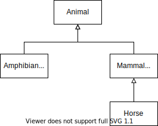
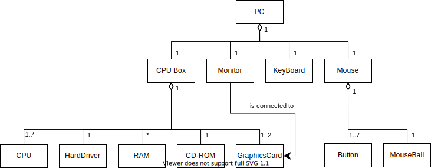
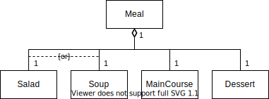
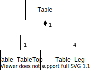

# 4. 关系

**关系** 描述类之间如何发生连接。  

## 4.1 关联

关联 (association) 描述类之间 **在概念上有连接关系** 。  

例如，队员和球队之间的关联，可以用一个短语「队员为篮球队效力 (plays on) 」来描述这个关联。  

>   

类可以在关联中扮演某种角色。可以在图中标注其所扮演的角色。  

>   

关联还可以从另一个方向发生，并用箭头指明关系。  

>   

多个类可以连接同一个类。  

>   

### 4.1.1 关联的约束

**约束** 指两个类之间的关联规则。  

例如：一个 BankTeller （银行出纳员）为一个 Customer （顾客）服务 (Serves) ，但是服务的顺序要按照顾客排队的次序进行。  

在模型中可以通过在 Custome 类附近加上一个 ```{ }``` 来说明这个规则。  
>   

可以用如下方式描述两个关联关系间的 or 关系。  
>   

### 4.1.2 关联类

关联类是一个拥有关联特性的类。  
关联可以拥有自己的属性和操作，其表现上类似于类。  

关联类的可视化表示方式与一般的类相同，但是要用一条虚线将关联类和对应的关联线连接起来。  
>   
Player 与 Team 类之间的 Plays on 关联对应的关联类： Constract （契约）关联类。  

Constract （契约）关联类又同时和 GeneralManager （总经理）类发生关联。  

### 4.1.3 链

将关联实例化后得到链。  
如对象一样，链在名字下加下划线。  
>   

### 4.1.4 多重性关联

多重性表现类之前的多对应关系。  
类与类之间不仅仅只有一对一关系，还有一对多、一对一或多、一对零或一、一对有限间隔。  
>   

```*``` 表示 **多个** 。  
```..``` 或 ```,``` 表示 **或 or** 关系。  

>   
> 一个老师教多个学生。  
>   
> 一个蛋盒包装了 12 或者 24 枚鸡蛋。  

### 4.1.5 限定关联

对于一对多关系，为了便于查找，需要对对象加上限定符（即关键字，ID）。  

>   

### 4.1.6 自身关联

存在与自己发生关联的类，即自身关联。  

>   
> CarOccupant : 车上的人
> Drives : 司机为乘客驾驶

## 4.2 继承和泛化

泛化即继承。  
在泛化关系中，子类替代父类。  
使用带空心三角箭头的连线表示子类与父类的关系。  

>   

斜体的类名表示抽象类。  

## 4.3 依赖

一个类使用了另一个类，此即依赖关系。  
通常，依赖关系是一个类操作的型构中用到了另一个类的定义。  

依赖关系使用带箭头的虚线表示。  

>   

依赖关系具有偶然性的、临时性的，是弱的关联关系。  
一般，依赖关系体现为局域变量、方法的形参或者对静态方法的调用。  

## 4.4 聚集

一个类由多个类组成，此即聚集关系。聚集是比较强的关联关系。若整体不存在，部分也可继续存在。即部分的声明周期并不依赖整体的生命周期。  

聚集关系使用带空心菱形的实线表示。  

>   

一般，依赖关系体现为成员变量，且一般使用已经存在的对象进行 setter 赋值。  

聚集具有传递性，若类 C 是类 B 的部分类，类 B 是类 A 的部分类，则类 C 是类 A 的部分类。  

有时一个聚集体可能有多种部分体组成，且这些部分体之间是「or」关系。  

使用带有 ```{or}``` 字符的虚线连接两条关系线以表示这种关系。  

>   

## 4.5 复合

复合 (Composition) 又名组成，组成关系是强依赖的聚集关系。组成关系中的每个部分体只能属于一个整体。若整体不存在，部分也将不存在。即部分的声明周期取决于整体的生命周期。  

组成关系使用带实心菱形的实线表示。  

>   

一般，依赖关系体现为成员变量。  

### 组成结构图  

在对系统建立模型时，类通常以类族的形式出现，这些类族中的类之间常常有聚集或组成关系。有时可能需要集中考察其中的某个类族。  
UML 语境图提供了这种建模特征。语境图有点像一幅大图中某个局部的 **子图** 。有时需要将一个大图中某些局部「放大」来获取详细信息。  

组成语境图 (Composite context diagram) 将每个组成部分放进矩形框中表示。  

> 一个衬衫(Shirt)的类模型，并说明了衬衫的尺寸和组成。而衬衫挂在衣架上，它们共同被放在衣柜中。  
>  
>   

## 4.6 实现

实现是指一个类实现一个或者多个接口，表示类具备了某种能力。实现是类与接口中最常见的关系。  

使用带空心三角箭头的虚线表示实现关系。  

>   
