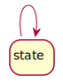

# 8. 状态图

## 8.1 状态图概念

状态图 (Statechart Diagram) 主要用于描述一个对象在其生存期间的动态行为。  
表现为一个对象所经历的状态序列，引起状态转移的事件 (Event) ，以及因状态转移而伴随的动作 (Action) 。  
一般可以用状态机对一个对象的生命周期建模，状态图用于显示状态机 (State Machine Diagram) ，重点在与描述状态图的控制流。  

## 8.2 状态图元素

### 8.2.1 状态

**状态** 是对象的声明周期中的某个条件或状况。状态是对象满足某些条件或执行了一系列事件后的结果。  

* 用圆角矩形表示状态  
* 用实心圆点表示初态
* 用嵌点圆表示终态

初态和终态都是为伪状态 (Pseudostate) ，它们没有状态变量和活动，因此是不完整的状态。  

## 8.2.2 转移

**转移** 状态图的一种常见关系。表示对象在源状态 (Source State) 被事件触发器触发 (Event Trigger) 或满足监护条件 (Guard Condition) 后执行一定动作，转换到目标状态 (Event State) 。  

使用带箭头的直线表现转移关系。  

* **事件触发器** (Event Trigger) 触发转换的事件，包括调用、改变、信号、时间四类事件。  
* **监护条件** (Guard Condition) 决定是否激活转换，一般为 bool 值。  
* **动作** (Effect) 转换激活时的操作。  

状态允许自身转移。  

## 8.2.3 子状态

状态中可以嵌套子状态。  

## 8.2.4 进入节点与退出节点

状态可以由进入节点进入，由退出节点退出。  

## 8.2.5 历史状态

**历史状态** 是一个伪状态 (Pseudostate) 。其目的是记录从组合状态中退出时所处的子状态。  

重新进入此状态时，将进入历史状态，而非初态开始。  

子状态内仍然可以嵌套状态。若历史状态能够保存到多层子状态，则称为深历史状态，用 `H*` 表示，否则是浅历史状态。  

## 8.2.6 并发状态

子状态中允许多个状态序列同时进行。  
用分隔线分隔不同序列。  

## 8.2.7 选择节点

用选择节点开启选择分支。  

