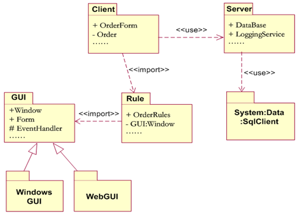

# 6. 包图

## 6.1 包图的概念

**包** 是一种常规用途的组合机制，亦即命名空间。包包含类，具有如下作用：  

* 对语义上相关的元素进行分组。如把功能相关的用例放在一个包中。  
* 提供配置管理单元。如以包为单位，对软件进行安装和配置。  
* 在设计时，提供并行工作的单元。如在设计阶段，多个设计小组，可以同时对几个相互独立包中的类进行详细设计。  
* 提供封装的命名空间，同一个包中，其元素的名称必须唯一。  

 UML 的包可以直接对应 Java 中的 package ，或 C++ 中的 namespace 。  
一个包可能含有其他包、类或者同时含有这两者。进行建模时，通常使用逻辑性的包，用于对模型进行组织；使用物理性的包，用于转换成系统中的 Java 包。  

**包图** 是描述包及其关系的图。  

## 6.2 包的表示

包使用文件夹符号表示。  

### 6.2.1 包的名称

每个包必须有一个与其他包相区别的名称。  
名称有两种：  

* **简单名** 仅一个简单的名称。  
* **全名** 包含命名空间名与简单名的名称。  

### 6.2.2 包的元素

在一个包中可以拥有各种其他元素，包括类、接口、构件、节点、协作、用例，甚至是其他包或图。这是一种组成关系，意味着元素是在这个包中声明的，因此一个元素只能属于一个包。  

因此每个包都是一个独立的命名空间。两个包可以拥有同名元素。  

### 6.2.3 包的可见性

包内的元素也可具有可见性。  

访问修饰符 | 可见性类型
:------:|:------:
 `+` | public
 `#` | protected
 `-` | private

### 6.2.4 包的构造型

和类一样，包也允许使用构造型表示包的新特征。  

包的构造型共有 5 种：  

* `<<system>>` ：表示整个系统。  
* `<<subsystem>>` ：表示正在建模的系统中某个独立的子系统。  
* `<<facade>>` ：表示包仅仅是其它包的视图，只包含对另一个包所拥有的模型元素的引用，只用作为另一个包的部分内容的公共视图，用来为其它一些复杂的包提供简略视图。  
* `<<stub>>` ：表示包是一个代理包，它服务于某个其他包的公共内容，这通常应用于分布式系统的建模中。  
* `<<framework>>` ：表示框架，框架是一个领域内的应用系统提供可扩充模板的体系结构模式。  

## 6.3 包图中的关系

包图共有两种关系。  

* 依赖关系  
* 泛化关系  

### 6.3.1 依赖关系

在依赖关系中，我们把出发端的包称为客户包，把箭头端的包称为提供者包。  

依赖关系又可以分为 4 种。  

#### 6.3.1.1 `use` 关系

`use` 关系是一种默认的依赖关系，说明客户包中的元素以某种方式使用提供者包的公共元素，也就是说客户包依赖于提供者包。  

#### 6.3.1.2 `import` 关系

`import` 关系是最普遍的包依赖类型。说明提供者包的命名空间将被添加到客户包的命名空间中。客户包中的元素能够访问提供者包的所有公共元素。  

`import` 关系会共用命名空间，这意味着可能引起命名冲突，但同时也允许省略命名空间名，仅使用元素名称。  

#### 6.3.1.3 `access` 关系

`access` 关系仅使用提供者包中的元素，而不将两个包合并。在客户包中必须使用路径名,才能访问提供者包中的所有公共元素。  

#### 6.3.1.4 `trace` 关系

`trace` 关系表示一个包到另一个包的历史发展。  

### 6.3.2 泛化关系

包间的泛化关系类似于类间的泛化关系。  

比如在抽象包中定义一些接口和抽象类，在实现包中，定义一些包含实现这些抽象类和接口的具体类。  

亦可以看作实现关系。  

## 6.4 阅读包图

1. 了解每个包的语义，它包含的元素语义。
2. 理解包间的关系。
3. 找到依赖关系复杂的包，从最复杂的包开始阅读，然后是简单的包。  

> 
>  
> 对上面的包理解如下：  
>  
> * 根据 «use» 关系可以发现 Client 包使用 Server 包， Server 包使用 System.Data.Sql Client 包，根据它们所包含的元素语义，可以得知 Client 包负责 Order （订单）的输入，并通过 Server 包来管理用户的登录 (LoggingService) 和数据库存储 (DataBase) ；而 Server 包还通过 .Net 的 SQL SERVER 访问工具包，来实现与数据库的连接和通讯。  
> * 根据 «import» 关系，从 Rule 包所包含的元素语义可知，该包负责处理一些规则，并引用一个具体的窗体 (Window) ；而 Client 包通过引用 Rule 来实现整个窗体和表单的显示、输入等，并且还将暂存 Order （订单）信息。  
> * 接着来看包的泛化关系。 GUI 有两个具体实现：一个是针对 C/S 的 WindowsGUI ，一个是实现 B/S 的 WebGUI 。  

## 6.5 创建包图

### 6.5.1 寻找包

通常把关系紧密的类分入同一个包。  

良好包结构的关键是包内高内聚，包间低耦合。  

### 6.5.2 确定包关系

### 6.5.3 标出包内元素可见性

与类内元素的可见性类似，包内元素也可标注可见性。  

## 6.6 包图建模
