# 6. 包图

## 6.1 包图的概念

**包** 是一种常规用途的组合机制。包包含类，具有如下作用：  

* 对语义上相关的元素进行分组。如把功能相关的用例放在一个包中。  
* 提供配置管理单元。如以包为单位，对软件进行安装和配置。  
* 在设计时，提供并行工作的单元。如在设计阶段，多个设计小组，可以同时对几个相互独立包中的类进行详细设计。  
* 提供封装的命名空间，同一个包中，其元素的名称必须唯一。  

 UML 的包可以直接对应 Java 中的一个包。  
一个包可能含有其他包、类或者同时含有这两者。进行建模时，通常使用逻辑性的包，用于对模型进行组织；使用物理性的包，用于转换成系统中的 Java 包。  

**包图** 是描述包及其关系的图。  



## 6.2 包的表示

包使用文件夹符号表示。  



### 6.2.1 包的名称

每个包必须有一个与其他包相区别的名称。  
名称有两种：  

* **简单名** 仅一个简单的名称。  
* **全名** 包含命名空间名与简单名的名称。  

### 6.2.2 包的元素

在一个包中可以拥有各种其他元素，包括类、接口、构件、节点、协作、用例，甚至是其他包或图。这是一种组成关系，意味着元素是在这个包中声明的，因此一个元素只能属于一个包。  

因此每个包都是一个独立的命名空间。两个包可以拥有同名元素。  

### 6.2.3 包的可见性

包内的元素也可具有可见性。  

访问修饰符 | 可见性类型
:------:|:------:
 ```+``` | public
 ```#``` | protected
 ```-``` | private

### 6.2.4 包的构造型

和类一样，包也允许使用构造型表示包的新特征。  

包的构造型共有 5 种：  

* ```<<system>>``` ：表示整个系统。  
* ```<<subsystem>>``` ：表示正在建模的系统中某个独立的子系统。  
* ```<<facade>>``` ：表示包仅仅是其它包的视图，只包含对另一个包所拥有的模型元素的引用，只用作为另一个包的部分内容的公共视图，用来为其它一些复杂的包提供简略视图。  
* ```<<stub>>``` ：表示包是一个代理包，它服务于某个其他包的公共内容，这通常应用于分布式系统的建模中。  
* ```<<framework>>``` ：表示框架，框架是一个领域内的应用系统提供可扩充模板的体系结构模式。  

## 6.3 包图中的关系

包图共有两种关系。  

* 依赖关系  
* 泛化关系  

### 6.3.1 依赖关系

在依赖关系中，我们把首端的包称为客户包，把箭头端的包称为提供者包。  

依赖关系又可以分为 4 种。  

#### 6.3.1.1 ```use``` 关系

```use``` 关系是一种默认的依赖关系，说明客户包中的元素以某种方式使用提供者包的公共元素，也就是说客户包依赖于提供者包。  

## 6.4 阅读包图

## 6.5 创建包图

## 6.6 包图建模
