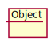
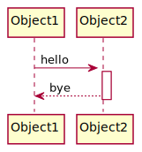
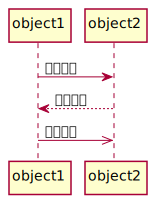
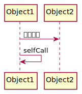
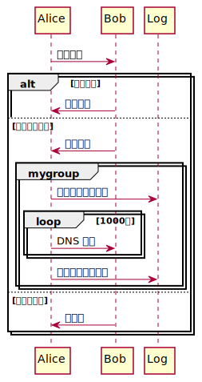
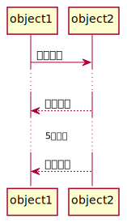
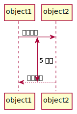

# 9. 时序图

**时序图** 是显示对象之间交互的图，这些对象是按照时间顺序排列的。

## 9.1 角色

系统角色，可以是人、系统或子系统。

## 9.2 对象

注意，相较于类，对象的名称拥有一条下划线。

## 9.3 生命线

生命线是一条向下延伸的虚线，其连接在对象上，代表对象的生命周期。

## 9.4 控制焦点

控制焦点即生命线的 **激活** 态，用窄矩形条表示。

## 9.5 消息

### 9.5.1 基础消息

**消息** 包括同步消息 (Synchronous Message) ，异步消息 (Asynchronous Message) ，同时定义了返回消息 (Return Message) 。

- **同步消息** 消息的发送者需等待对方响应。
- **异步消息** 消息的发送者不需等待对方响应。
- **返回消息** 收信方的响应消息。

### 9.5.2 自关联消息

方法的自身调用或同一对象内的方法间调用。

## 9.6 组合

### 9.6.1 判断组合

`Opt` 为选项组合，`Alt` 为抉择组合。

`Opt` 类似 `if` 语句。  
而 `Alt` 类似 `if...else` 语句。当然，`else` 是可选的。  
条件为真时执行，否则执行另一分支或不执行。

### 9.6.2 循环组合

`Loop` 形成可循环的片段，使之能够重复执行。

### 9.6.3 其他组合

以下列出了其他可选组合。

| 类型       | 名称   | 说明                                     |
| ---------- | ------ | ---------------------------------------- |
| `Alt`      | 抉择   | 包含一个指定条件的可能发生的序列。       |
| `Opt`      | 选项   | 包含一系列指定条件的选择发生的序列。     |
| `Loop`     | 循环   | 可循环执行的序列。                       |
| `Par`      | 并行   | 可并行执行的片段                         |
| `Break`    | 中断   | 若执行此片段，将终止处理序列的其余部分。 |
| `Critical` | 关键   | 不允许并行执行的片段                     |
| `Group`    | 自定义 | 自定义                                   |

## 9.7 时间控制

可以对生命线添加时间控制，如某些消息间存在一定时间的延迟，而某些消息需要持续一定时间。  

### 9.7.1 延迟

### 9.7.2 锚定时间

