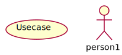

# 7. 用例图

用例能够帮助分析员从用户的观点收集需求。  

## 7.1 用例概念

用例图：从用户观点出发，对系统建立模型。  

### 什么是用例？  

> 用例是系统的一组使用场景。  
> 每个场景描述了一个事件的序列。  
> 每个序列由一个人、另一个系统、一个硬件设备或者某段时间的流逝所发起。  
> 发起事件序列的实体为 **参与者** (actor) 。  
> 事件序列的结果是由发起这个序列的参与者或者另一个参与者对系统某种形式的使用所引起的。  

用户常常不能清晰地阐明他们的需求。  
让用户参与前期的系统分析与设计可以避免这种情况。  

## 7.2 用例元素

* 用例用椭圆表示。
* 角色用美术风格迥异，美工看了抓狂的小人表示。  
* 用例中允许使用包。  

## 7.3 用例关系

用例图包含如下关系：  

* **关联** 参与者与用例之间的关系。  
* **泛化** 参与者之间或用例之间的关系，即继承。  
* **包含** 用例之间的关系，相当于整体与部分。  
* **扩展** 用例之间的关系，指附加的部分，但扩展用例对基用例不可见。  

假设你现在正着手设计一台饮料自动销售机。
为了获得用户的使用观点，你会见了许多潜在的用户以了解这些用户将如何与这台机器交互。  

> 自动饮料销售机的主要功能是允许一个顾客能够购买一罐饮料，很可能用户立刻就能告诉你一些有关的场景（换句话说就是用例）。你可以给这组场景加上一个标签「买饮料」。在正常的系统开发中，与用户交谈的过程中就能发现这些场景。  

图中的角色如下：

* 顾客  
* 供应商  
* 信息采集者  
* 男孩 （继承自顾客）

图中的用例如下：  

* 购买  
* 补货  
* 采集信息  
* 打开柜门  
* 关闭柜门  
* 根据销售信息补货 （扩展自补货）  

图中的包：  

* Soda Machine

一些关系：  

* 顾客可以购买
* 供应商补货  
* 信息采集者采集销售信息  
* 采集信息与补货都包含打开、关闭机器的操作  
