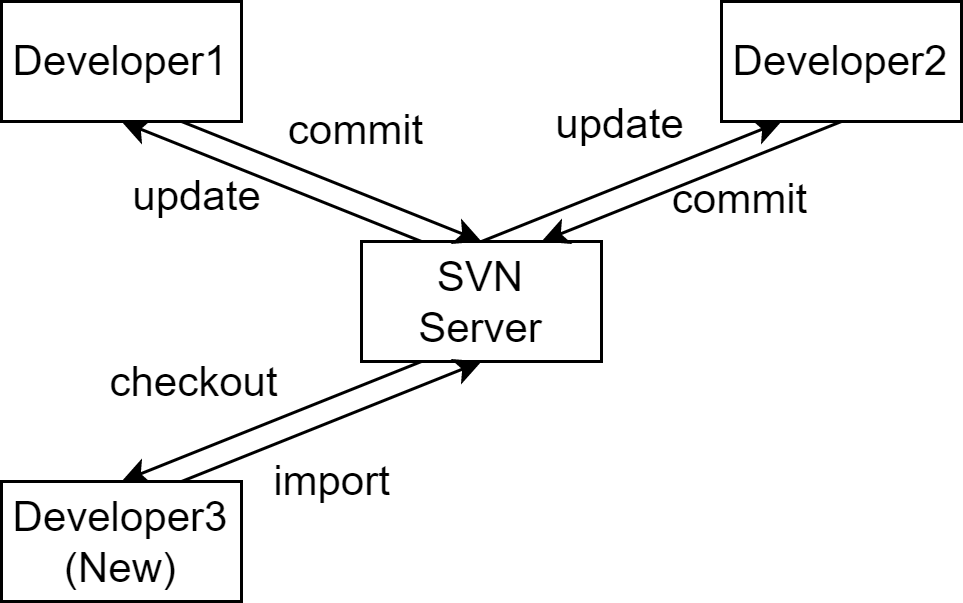

# Svn Note

Svn(Subversion) ，是一个免费且开源的集中式版本控制系统。

其具有如下特征：

- 服务端的 **仓库** (repository) 负责存储所有版本。
- 客户端的 **工作副本** (working copy) 负责存储用户工作相关版本。

## 主要操作



本章仅包含了 UI 环境下常用的命令。

### `import`

向 **仓库** 导入文件和目录。

### `checkout`

签出仓库至客户端。默认将包含最新版本的数据。

### `update`

从仓库将工作副本更新到最新版本。

### `commit`

将工作副本更新提交到仓库。

### `add`

向 **本地版本控制** 添加文件或目录。

- 将在下一次 `commit` 中提交更新至仓库。

### `delete`

从 **本地版本控制** 中删除文件或目录。

- 将在下一次 `commit` 中提交更新至仓库。

### `status`

在 **工作副本** 中检查文件和目录的修改。

输出状态关键字包含：

- `?` 目标不在版本控制中。
- `A` 新增目标。
- `C` 文件与仓库中的文件存在冲突。
- `D` 目标在本地副本中被删除。
- `M` 文件在本地副本中被修改。

### `diff`

查看文件修改细节。

## 仓库与工作副本

svn 的版本号依存于仓库整体版本。


这意味着，在一般语境中：

「文件 a 的版本号 5」

指

「仓库版本号 5 中的文件 a」

对于工作副本中的文件，svn 将对其记录两项信息：

- 文件的工作版本号 (working revision)。
- 最近一次由仓库更新的时间戳。

依据此信息 svn 可判断工作副本的四种状态：

- **当前未修改的**
  - 文件在工作副本中未被修改, 且在工作版本号之后尚未有人提交过该文件的修改。
  - 对文件执行 `commit` 和 `update` 都不会产生任何效果。
- **当前已修改的**
  - 文件在工作副本中已被修改, 并且在一次更新以来尚未有人向仓库提交过该文件的修改。
  - 执行 `commit` 将会成功地把修改提交到仓库中, 而 `update` 不会产生任何效果。
- **过时未修改的**
  - 文件在工作副本中尚未被修改, 但是在上一次更新之后有人往仓库提交了该文件的修改。
  - 对文件执行 `commit` 不会产生任何效果, 执行 `update` 将把仓库中的最新修改合并到文件中。
- **过时且已修改的**
  - 文件在本地工作副本和仓库都被修改了。
  - 对文件执行 `commit` 会由于文件已过时而失败。 首先应该更新文件, 使用 `update` 尝试把仓库的修改合并到本地。
  - 如果 svn 不能自动地以一种合理的方式完成合并, 就会把冲突交由用户解决。

## 最佳实践

### 推荐的仓库布局

```java
// Single proj repo
├─ trunk
├─ branches
└─ tags
// Multiply proj repo
├─ project-A
│  ├─ trunk
│  ├─ branches
│  └─ tags
└─ project-B
    ├─ trunk
    ├─ branches
    └─ tags
```

- trunk **主线**
  - 开发主线。
- branches **分支**
  - 开发分支，主线的某个分叉。
- tags **标签**
  - 某条开发线的稳定版快照。
